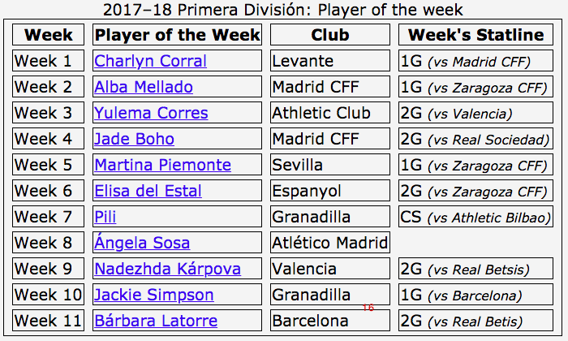

## Empty Cells

We can actually hide empty cells. 

`empty-cell: show | hide`

Similar to:

```css
td:empty, th:empty {
  visibility: none;
  }
  ```

* ignored if border-collapse: separate
* applies to elements with diplay of table-cell
* property of table or the cells themselves

### Example

```css
table, th, td {border: 1px solid;}
table {
  border-collapse: separate; 
  empty-cells: hide;
}
```


## Table Layout 


`table-layout: auto | fixed`
 
* fixed renders faster

## Vertical align


`vertical-align: baseline | sub | super | text-top |  text-bottom | middle | top | bottom | <percentage> | <length>`

**baseline**
Aligns the baseline of the cell with the baseline of all other cells in the row that are baseline-aligned.

**top**
Aligns the top padding edge of the cell with the top of the row.

**middle**
Centers the padding box of the cell within the row.

**bottom**
Aligns the bottom padding edge of the cell with the bottom of the row.

* applied to thead, tfoot, tbody, tr, td, th, but not table.
* negative values are ok
* additional values (sub, super, text-top, text-bottom, `<length>`, and 

## Display property 

`display: table | table-cell`

```
display: table;
display: table-row-group;
display: table-header-group;
display: table-footer-group;
display: table-row;
display: table-cell;
display: table-column-group;
display: table-column;
display: table-caption;
```
```css
.parent {
  display: table;
}
.child {
  display: table-cell;
  vertical-align: baseline;
}
```


