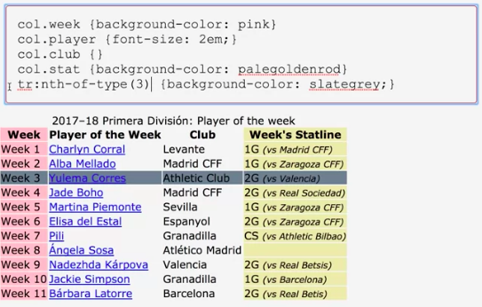
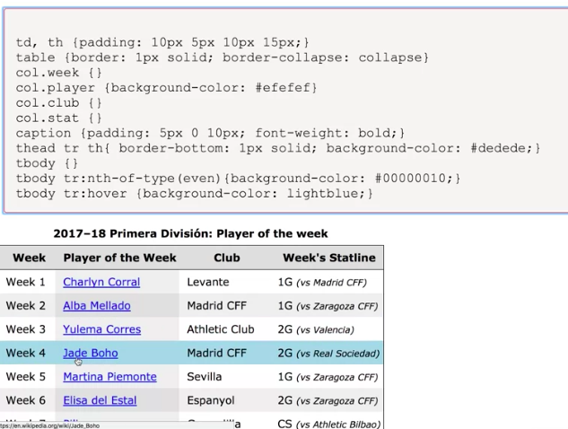

# Columns

Syntax 

```html
<table>
  <caption>
    2017–18 Primera División: Player of the week
  </caption>
  <colgroup>
    <col class="week"/>
    <col class="player"/>
    <col class="club"/>
    <col class="stat"/>
  </colgroup>
<thead>....
```


or 

