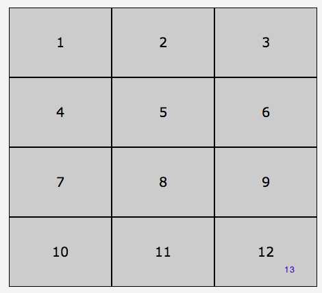
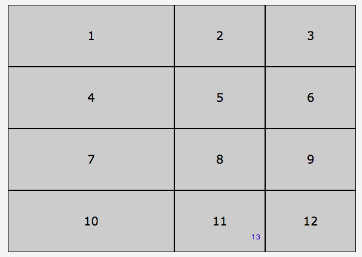
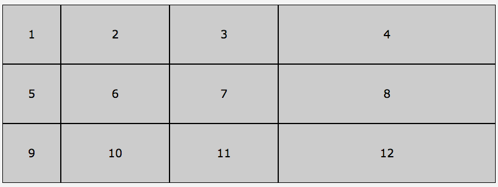
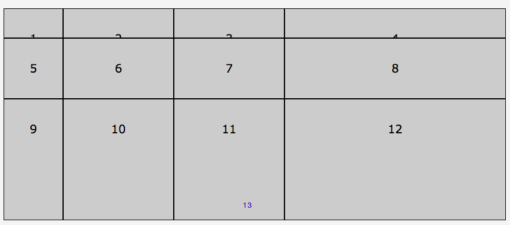

# Columns & Rows

Defines the columns and rows of the grid with a space-separated list of values representing the track size

```
grid-template-columns: none | <track-list> | <auto-track-list>
grid-template-rows: none | <track-list> | <auto-track-list>
```

* `<track-list>` = `<line-name>?` [ `<track-size>` | `<track-repeat>` ]
* `<track-size>` - can be a length, a percentage, or a fraction of the free space (fr) in the grid
* `<line-name>` - ident or string

`grid-template-columns: 200px 1fr max-content minmax(min-content, 1fr);`

Here are different ways to declare template-columns and rows:

The first one says: i wanna have 3 columns, each of them 150px, 

```
grid-template-columns: 
  150px 150px 150px;  /* or */
  repeat(3, 150px);
```


If we decided to have the first 275px and the next two - 150px, we say:

```
grid-template-columns: 
  275px repeat(2, 150px);
```



Make the first column 100px, make the next two - 1fr, and the fourth column make it - 2fr

```
grid-template-columns: 
  100px repeat(2, 1fr) 2fr;
```



We can have the same with rows

```css
ol { 
  display: grid;
  grid-template-columns: 100px repeat(2,1fr) 2fr;
grid-template-rows: 50px 1fr 2fr;
  list-style-type: none;
}
```


```
grid-template-rows: 
  150px 150px 150px;
  repeat(3, 150px);
  275px repeat(2, 150px);
  100px 1fr 2fr;
  ```

Mix units!!!
That's the power of grid! Or,at least one of the powers.

