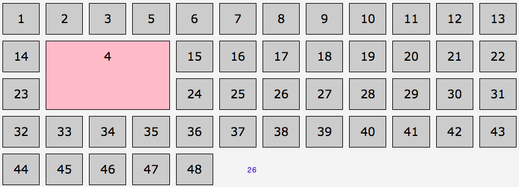

# Grid Lines

Lines are red, items are blue 


Whwen we place an item, we say basucally at which grid line does it start and at which grid line does it end. Both of the directions - a row and a colunm. 

## Item positioning properties 

```css
.myItem {
    grid-row-start: 2; /*starts at the second line*/
    grid-row-end: 4; /*stops at the forth row grid-line*/
    grid-column-start: 2; /*starts at the second column*/
    grid-column-end: 5; /*stops at the fifth column grid-line*/
  }
  ```
  ```css
  .myItem {
    grid-row: 2 / 4;
    grid-column: 2 / 5; /*shorthand*/
  }
  ```
```css
.myItem {
    grid-area: 2 / 2 / 4 / 5; /*shorthand: grid-row start/grid-column start/ grid-row end/grid-column end*/
  }
  ```

### Example

```css
ol { 
  grid-template-columns: repeat(12, 1fr);
}
.myItem { background-color: pink;
  grid-row-start: 2;
  grid-row-end: 4;
  grid-column-start: 2;
  grid-column-end: 5;
}
```


