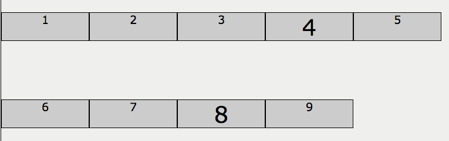
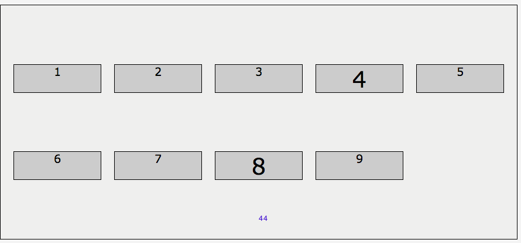

# Aligning the grid

Defines how the items are aligned with respect to the grid if the size of all the items combined is not the same size as the container.
Aligns all the columns, and all the rows. 

```
justify-content: baseline | center | end | flex-end | flex-start | 
   left | normal | right | space-around | space-between | space-evenly | start | 
   stretch | safe | unsafe
```
```
align-content: baseline | center | end | flex-end | flex-start | 
  left | normal | right | space-between | space-evenly | start | 
  stretch | safe | unsafe
```
Tip: auto track sizes (and only auto track sizes) can be stretched by the align-content and justify-content properties

### Example

Here we have space between rows

```css
.parent { 
  grid-template-columns: repeat(5, 150px);
  grid-template-rows: auto;
  place-items: stretch;
  align-content: space-evenly;
} 
```


Here we have spae also between columns

```css
.parent { 
  grid-template-columns: repeat(5, 150px);
  grid-template-rows: auto;
  place-items: stretch;
  align-content: space-evenly;
  justify-content: space-evenly;
} 
```


