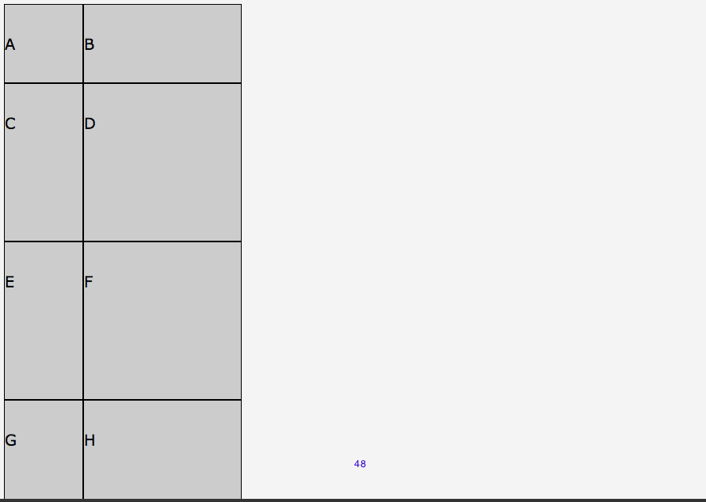
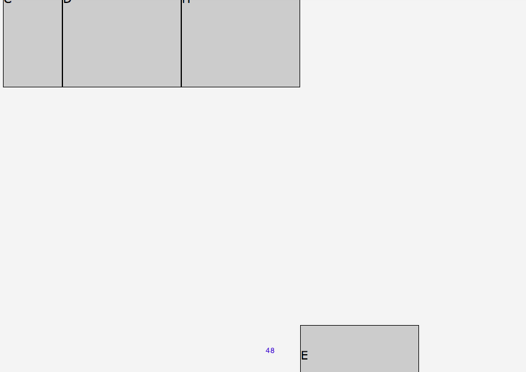
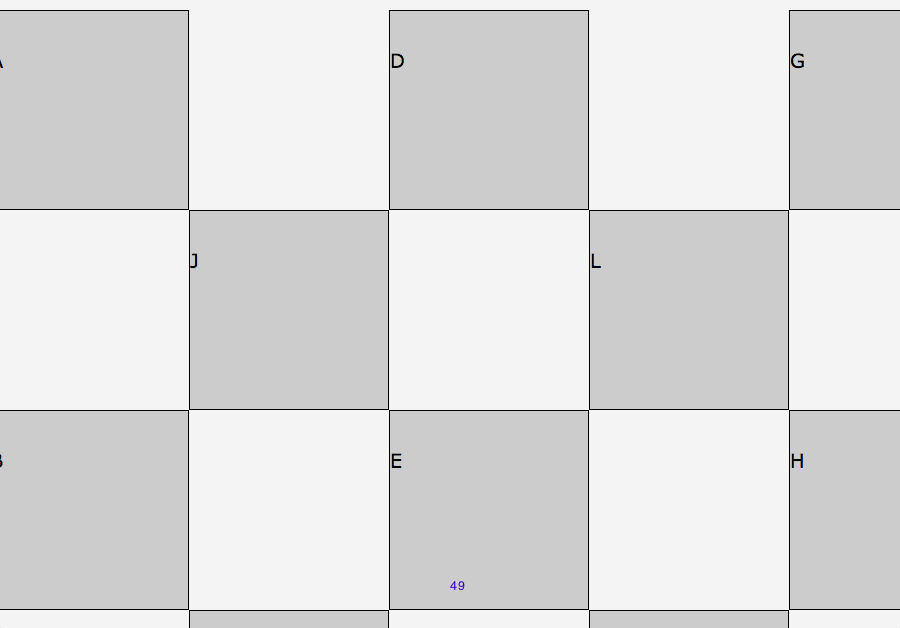

## Implicit Track Sizing

When items are placed outside of the tracks defined by grid-template-rows, grid-template-columns, and grid-template-areas, implicit grid tracks by added. These properties size those tracks

```
grid-auto-columns: 
grid-auto-rows:
grid-auto-flow:
```
### Example Automatic flow

```css
#grid {
    display: grid;
    grid-template-columns: 100px;
    grid-auto-columns: 200px;
    grid-template-rows: 100px;
    grid-auto-rows: 200px;
  }
  #A { grid-column: 1; grid-row: 1; }
  #B { grid-column: 2; grid-row: 1; }
  #C { grid-column: 1; grid-row: 2; }
  #D { grid-column: 2; grid-row: 2; }
  ```
  

  If we declare E additionally, we'll have it separately, it will be in the empty area. 

  ```css
  #grid {
    display: grid;
    grid-template-columns: 100px;
    grid-auto-columns: 200px;
    grid-template-rows: 100px;
    grid-auto-rows: 200px;
  }
  #A { grid-column: 1; grid-row: 1; }
  #B { grid-column: 2; grid-row: 1; }
  #C { grid-column: 1; grid-row: 2; }
  #D { grid-column: 2; grid-row: 2; }
  #E { grid-column: 4; grid-row: 5; }
  ```


## White space

Sometimes we want empty areas.

### Example

We can create a chess board

```css
#grid {
    display: grid;
    grid-auto-columns: 200px;
    grid-auto-rows: 200px;
  }
  #a { grid-column: 1; grid-row: 1; }
  #b { grid-column: 1; grid-row: 3; }
  #c { grid-column: 1; grid-row: 5;}
  #d { grid-column: 3; grid-row: 1; }
  #e { grid-column: 3; grid-row: 3; }
  #f { grid-column: 3; grid-row: 5; }
  #g { grid-column: 5; grid-row: 1; }
  #h { grid-column: 5; grid-row: 3; }
  #i { grid-column: 5; grid-row: 5;}
  #j { grid-column: 2; grid-row: 2; }
  #k { grid-column: 2; grid-row: 4; }
  #l { grid-column: 4; grid-row: 2;}
  #m { grid-column: 4; grid-row: 4; }
  ```

  

