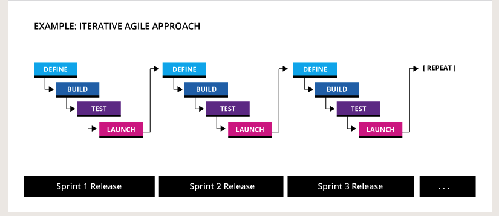

# Glossary

## A

**A/B testing**
A testing method that compares two different versions of a web page (a "control" and a variant) to identify which performs better.

**Agile**

refers to an iterative method of managing design and development.  In an agile `workflow`, requirements evolve from `sprint to sprint`, and teams work in a `collaborative structure`. In an agile project, code is shipped and features are released `continually`.

**AJAX**
AJAX stands for Asynchronous JavaScript and XML. Is a method where data is exchanged with a server allowing parts of a web page to be updated without the need to reload the entire page.

**Algorithm**

a detailed sequence of steps which, when followed, will accomplish a task.

**ALT Tag**
ALT is an abbreviation for “alternative descriptive text” that is added to the image tag. ALT text plays an important role in optimizing websites for ADA compliance and SEO ranking.

**API**

“Application Program Interface” -  a mechanism that allows different computers and applications communicate with one another. It provides a method of accessing or manipulating data from a system, usually provided by the system's implementors. A "system" could be anything. Examples include applications like PayPal, Shopify, and Salesforce, but it could also be a custom application that stores shipping rules, product inventory and prices. Developers create APIs so that data that exists in their system can be made available in other places. For example, if you want data that exists in your CRM to display on your website, your website developer would check to see if there is an API that would allow the information to be accessed. 

**Application**

Also known as an app, these are programs designed to perform functions. This includes mobile apps.

## B

**Back-End Development (Application Engineers)**

`back-end developers` are engineers who take working proofs of concepts (prototypes) and write all the `code` that makes them fully `functional` and `populated with real data`. For websites, a back-end developer will connect your `website` to some sort of `content management system` that lets content owners manage and update `website content` themselves. They will also build in any `integrations` that pull or push `data` to and from other sources, such as a `database` or a `third party system`. A back end-developer will specialize in one or more programming languages.

**Backup**
A saved version of your site that you can restore.

**Bounce Rate**
Bounce Rate is the percentage of visitors who arrive on a specific page and leave without visiting a second page.

Bounce Rate is an indicator of user experience, showing if your website is meeting the visitor’s expectations: a low bounce rate indicates users find the content interesting and continue reading and interacting with the site. Note that benchmark bounce rates vary depending on the nature of the website, for example, blogs will generally have a higher bounce rate than a retail site.

Bounce rates are generally increased by poor user experiences such as obstructive popups and advertising, streaming video or music, poor speed performance / slow loading times, false user expectations based on misleading page title and description.

**Browser**

Web Browser is a software with graphical interface for web pages displaying and web navigation  — such as Chrome, Firefox, or Safari. 

**Bug**

An error or flaw in the website or app that keeps it from running as expected.

## C

**Cache**
The storage of certain elements to help with faster load times from repeat website visitors. Often developers will tell you to clear your browser’s cache if they make a change on the website that you can’t see — most likely your cache is holding onto an older version and hasn’t made room for the new one yet. 

**Cookies**
Cookies are small pieces of data that a server sends to your browser when you visit a website. From your browser, these cookies will collect and store information and send it information back to the server. Typical use of cookies are: session management (e.g. logged in / out, items in cart), personalization (e.g. language preference) and tracking (e.g. user behavior analyzes)

**Click Through Rate (CTR)**
Ratio of clicks on an element to the number of impressions. An impression is counted when an element is displayed on a user’s screen. For example, if you run an advertisement on a web page, and that page is viewed 1000 times, that would count as 1000 impressions. If your ad is clicked 20 times, that would give a Click Through Rate (CTR) of 20/1000 or 2%.

**CMS**
“Content Management System.” The program that you use to create and maintain your website’s content. These are usually designed for non-developers for ease-of-use.

**CSS**
“Cascading Style Sheet.” Code that tells browsers how to display a webpage for the end user. This programming formats fonts, colors, and other visual elements. 

**CTA**
“Call to Action.” The buttons on your website that drive certain conversions or goals such as donations, newsletter signups, or user registrations.

## D

**Database**
A collection of data stored in a computer in such a way that a program or a webpage can easily find, select, and/or manipulate the desired data. Typically, databases are organized by fields, records and files. A field is one piece of data, a record is a collection of fields, and a file is a collection of records.

**Debugging**
Remember those bugs we talked about? Well, debugging is the process of identifying and dealing with them. Debugging is a multistep process: the developer locates the problem, isolates the source and then either gets to work fixing it or comes up with a workaround. The debugging process ends with testing and, if necessary, further fixes.

**Deployment**
Deployment is a key step in the web development process. Once a website or an app has been developed and tested, it’s ready to go live; in other words, it’s ready to be deployed. There are several different stages to deploying a website.

**Design Thinking**

In simple terms, it is a framework that puts user needs at the core of any product development.

1. *Empathize*: this stage involves gathering insights about users and trying to understand their objectives, wishes and needs.
2. *Define*: the phase is all about identifying the challenge. What difficulties do users face? What is the biggest user problem? What users actually need?
3. *Ideate*: this step, as you may have already guessed, is dedicated to thinking about the way you can solve the problems you have identified, with the help of your product. The product team, designers and software engineers, brainstorm and generate multiple ideas.
4. *Prototype*: the fourth stage brings you to turning your ideas into reality. By creating prototypes, you test your ideas fitness.
5. *Test*: you present the prototype to customers and find out if it solves their problem and provides users with what they need. Note that this is not the end of the journey and you cannot put a full stop here: you will get feedback from users, adjust the product functionality and test it again. This is a continuous process similar to the build-measure-learn approach in the lean startup methodology.

**Development Environment**
the set of processes and programming tools used to create the program or software product.

**Doctype**
an instruction to the web browser about what version of HTML the page is written in.

**Domain Name**
Domain Name is the unique name that will identify your website on web. In other words, it is your web address

## E

## F

**Favicon**
Short for “favorite icon,” it’s the icon that appears in your website’s browser tab.

**File Transfer Protocol (FTP)**
FTP is a standardized protocol used to transfer files between computers. In the world of websites, it is most often used to upload or download website files to and from a web server.

**Front End Development**
Front-end developers write the code that controls how a website looks and interacts when it's displayed in a browser. The primary tools of a front-end developer include HTML (code that makes content render on a page), CSS (coded stylesheets that apply color, typography, style and layout to the HTML) and JavaScript (code that handles advanced interactivity). 

**Functional Programming**
a style of programming that emphasizes the evaluation of expressions rather than the execution of commands.

## G

**GIF**
GIF stands for Graphical Interchange Format. It refers to a type of image file and its extension (.GIF). It is a common image file used in the web thanks to its lossless compression and support of animations.

**Git**
An absolute staple in the web development world, Git is a version control system where developers can store and manage their code. As a web developer, you’ll make constant changes to your code whenever you’re in the process of creating something, be it an app or a website. Git enables you to track these changes and reverse them if necessary, and also to work together with other teams and manage multiple projects at once.

## H

**Hexadecimal Color Code (Hex Color)**
Hexadecimal Color Code is a sequence of six digits where each pair of characters represents the intensity of red, green and blue that compose the color.

Other computer readable color codes are: RGB, HSL and CMYK.

**Hosting or Web Hosting**
Hosting is a server space that you rent from web hosting company to hold your website’s files.

Hosting companies offer different packages depending on the expected visitor’s traffic, number of files that make up your website and speed of data transfer. 

**Hyperlink**
Hyperlink is a link that targets another location or file, typically activated by clicking on a highlighted word or image on the screen.

**HTML**
“Hypertext Markup Language.” The coding language used to build a website in terms of both form and function.

## I

## J

**jQuery**
jQuery is an open source library of functions built using Javascript. jQuery provides a broad range of functions many of which help provide more animation rich user interfaces on web pages. Today, many website slideshows for example, are built using jQuery.

## K

**Key Performance Indicator (KPI)**
A Key Performace Indicator, or KPI, is a mesurement used to determine the effectiveness of some process. 

## L

**Landing page**
A landing page is a web page that a user arrives at after clicking on a search engine result. Landing pages are important because if the user does not find what they are looking for immediately, they will leave the website in disappointment. Many website owners build specific landing pages for particular keywords in the interests of addressing the visitors needs as quickly as possible when they arrive at the site. This is particularly true for Pay Per Click campaigns where is costs money to get the visitor to the website.

## M

**Markup**
Markup is the textual description of data that provides information about the data type. It is the codes and characters that change a text document into a HTML or other Markup Language document. Text is marked up with elements, delineated by tags that are keywords contained in pairs of angle brackets.

**Media query**
A CSS feature that allows you to adapt your site's styles to different screen/device widths (the basis of responsive web design).

**Meta Tag**
Additional information on web pages or elements, such as the way a piece of content should display in Google search results, the photo credit for an image, or the main keywords associated with a plugin. This is huge for SEO.

**Mobile-first**
Mobile-first is an approach to web design and development that prioritizes mobile devices. Rather than building a website with desktop in mind and then considering how it might look on a mobile device, with a mobile-first approach, the website is first built for the small screen. Mobile-first means adopting either responsive or adaptive design (both are included in this glossary!).

**MVP**
When working in web development, you may hear talk of “MVP” — or minimum viable product. The minimum viable product is the most pared-down version of a product that can be released to market. When adopting an MVP approach, developers will first focus on the core features and functions that are absolutely crucial. Then, once the product has been released and user feedback has been gathered, they will continue to build the complete set of features.

## N

**Navigation**
Links on a homepage that break down the other pages of a website. This can be both in the menu at the top of a site or in a footer (preferably both).

## O

**Open Source**
describes a program whose source code is made available for use or modification as users or other developers see fit.

**Operating system**
An operating system, or OS, is a type of software that enables the user to run applications on a device. Say you have a Samsung Galaxy smartphone; the operating system in this case is Android. Any apps that have been built for the Android OS can run on your Samsung. The iPhone, on the other hand, uses the iOS operating system and can only run apps that have been built with this in mind.

## P

**Page Template**
The layout for a webpage — pages that have similar structures share the same template. Pages that are radically different use separate templates.

**Pixel**
The smallest controllable element of a picture represented on a screen.

**Plugin**
Modules or software that can be added (“plugged in”) to a system for added functionality or features.

**Progressive Enhancement**
is a strategy for web design that emphasizes core webpage content first. This strategy then progressively adds more nuanced and technically rigorous layers of presentation and features on top of the content as the end-user's browser/internet connection allow. The proposed benefits of this strategy are that it allows everyone to access the basic content and functionality of a web page, using any browser or Internet connection, while also providing an enhanced version of the page to those with more advanced browser software or greater bandwidth.

**Proxy Server**
A server that acts as a middle man in a connection between two computers. A proxy server can be used to improve performance by saving the results of various requests, and consequently loading such data faster when it is requested again. A proxy server can also be used to filter out content by checking what information is requested, and potentially blocking that information from reaching the user who requests it.

## Q

## R

**Redirects**
Automatic forwards from one URL to another — usually from an old website URL to the same page on a new website (these are called 301 Redirects). Other redirects may pivot between two domains (e.g., idealist.com redirects to idealist.org), a shortened URL to the full URL (e.g., bit.ly URLs), and geotargeted URLs.

**Resolution**
Essentially how large an image or graphic can be rendered on a display. Oftentimes developers talk about the resolution of photos as photos at a low resolution won’t display as well if they need to be sized for the full width of a desktop screen. Resolutions are measured in pixels (e.g., the resolution of a MacBook Air screen is 1440 x 900 pixels).

**Responsive Design**
Websites that accommodate the screen on which they’re being viewed. This became a huge trend in website design when browsing on mobile and tablet devices became more popular, which has led many developers to opt for a “mobile-first” approach — optimizing a website design for phone and tablet use first and then making sure it looks good on a laptop/desktop.

**RSS**
RSS stands for Really Simple Syndication and it’s is a simple, standardized content distribution method that can help you stay up-to-date with your favorite newscasts, blogs, websites, and social media channels. Instead of visiting sites to find new posts or subscribing to sites to receive notification of new posts, find the RSS feed on a website and read new posts in an RSS reader. 

## S

**SAAS Platforms**
“Software As A Service.” The most basic of cloud platforms; allows users to share files and collaborate on projects through their browser. Some SAAS platforms include Google Drive and Dropbox. Other cloud options are Platform as a Service (PAAS; Facebook, Twitter, etc.) and Infrastructure as a Service (IAAS; Amazon Web Services, Microsoft Azure).

**Search Engine**
Search Engine is a software that searches for items in a database based on parameters established by the user (keywords). On the web, it is used to find particular websites.

**Search Engine Optimization (SEO)**
Search Engine Optimization is the practice of improving the rankings of your website in a search engine organic results, increasing quality and quantity of traffic to your site.

**Semantic Markup**
Semantic HTML or semantic markup is HTML that introduces meaning to the web page rather than just presentation. For example, a 
 tag indicates that the enclosed text is a paragraph. This is both semantic and presentational because people know what paragraphs are and browsers know how to display them.

On the flip side of this equation, tags like <b> and <i> are not semantic, because they define only how the text should look (bold or italic) and do not provide any additional meaning to the markup

Examples of semantic HTML tags include the header tags <h1> through <h6>, <blockquote>, <code> and <em>. There are many more semantic HTML tags that can be used as you build a standards-compliant website.

**Server**
Computers running software that allows users to access your website — this is what houses the hosting. A computer or device on a network responsible for distributing data to other computers or devices on a network that request data, also a computer or device on a network that manages resources.

**Sitemap**
Outline of all pages on a website, organized in hierarchical order

**SDK (software development kit)**
a set of programs used by a computer programmer to write application programs.

**SQL**
Stands for Structured Query Language. SQL was originally called SEQUEL (Structured English Query Language) and was designed in 1974-75 by an IBM research center. In 1979, the Oracle corporation introduced SQL as a commercial database system. Today, SQL is the ANSI standard language used to get data from and manipulate databases.

## U

**UI (User Interface)**
Design is the design of how things on screen look. Color, layout, typography, style, and animation effects all exist within the domain of UI design. UI designers will have a solid understanding of the principles of graphic design and website usability.

**Usability Testing**
Usability testing is the process of carrying out experiments to find out specific information about a design. It is part three of the "Usability Evaluation Toolbox". In usability testing, representative users work on typical tasks using the website (or a prototype) and the evaluators use the results to see how the user interface supports the users in doing their tasks.

**UX**
“User Experience.” A user’s interaction with an interface with a focus on how satisfying and successful the experience is. The function to complement UI’s form.

## W

**Widgets**
Applications that allow for specific interactive functions to be performed on a website.

**Wireframe**
The bare bones structure of a website. No fonts, colors, or images, this layout is the first step to making sure that the foundation is sound before content is added.

## XML

Extensible Markup Language (XML) is a markup language that defines a set of rules for encoding documents in a format that is both human-readable and machine-readable. It is a syntax/format, establishing rules. XML is a markup language used for writing custom markup languages. In other words, XML describes how to write new languages (it’s sometimes referred to as a “meta” language because of this). It also serves as a basic syntax that allows different kinds of computers and applications to share information without having to go through multiple conversion layers..

## Y

## Z

**Zip**
Zip is a compressed file format.