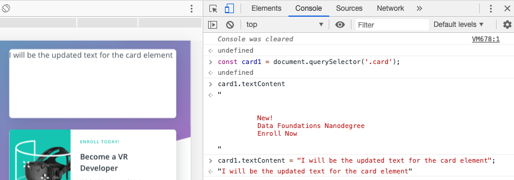
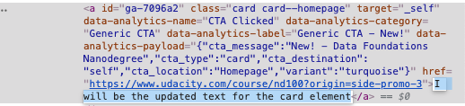

# Update Existing Page Content

WE'll look at:

- `.innerHTML` to get the `HTML content` and set the `HTML content` of an element
- `.textContent` to get and set the `text content` of an element
- `.innerText` also to get and set the `text content` of an element

We'll learn it throught the project (repo name: "udacity-create-content-with-js"). Let's start.

Let's store the first `.card` element in a `variable` for easy access:

```js
const nanodegreeCard = document.querySelector('.card');
```

Now that we've stored the first card element in the `nanodegreeCard` variable, we can use `nanodegreeCard` to refer to this element instead of having to use `document.querySelector('.card')` to select the element every time we need access to it.

**An Element's Inner HTML**

Every `element` inherits `properties` and `methods` from the `Element Interface`. This means that every element has an `.innerHTML` property. This property, as it's rightly named, represents the `markup` of the element's content. We can use this property to:

- get an element's (and all of its descendants!) HTML content
- set an element's HTML content


If we'll use `.innerHTML` property for the first element that has a class `card` we'll see:


Actually, `.innerHTML` property returns a `string`. If you look at this in the console, it looks like a `string`. Technically, however, what it returns is called a `DOMString`.

💡 **Innie vs Outie** 💡

The `.innerHTML` property sets or returns the HTML content *inside* the selected element (i.e. between the tags).

There's also the rarely used `.outerHTML` property. `.outerHTML` represents the HTML element itself, as well as its children.

```js
<h1 id="pick-me">Greetings To <span>All</span>!</h1>

const innerResults = document.querySelector('#pick-me').innerHTML;
console.log(innerResults); // logs the string: "Greetings To <span>All</span>!"

const outerResults = document.querySelector('#pick-me').outerHTML;
console.log(outerResults); // logs the string: "<h1 id="pick-me">Greetings To <span>All</span>!</h1>"
```

**An Element's Text Content**

*Getting element's text content:*

So `.innerHTML` will get/set an element's `HTML content`. If we just want the `text content`, we can use the fantastically named `.textContent` property!

The `.textContent` property will:

- set the text content of an element and all its descendants
- return the text content of an element and all its descendants

Let's check it out!


So, `.textContent` property only displays the `text` of the `element`. 

> Check out the `.textContent's documentation page on MDN`: [textContent docs](https://developer.mozilla.org/en-US/docs/Web/API/Node/textContent)


*Setting element's text content:*

Setting an element's text content is easy, just set it like you would any other `property`:

```js
nanodegreeCard.textContent = "I will be the updated text for the nanodegreeCard element!";
```



We'll see that the text is appearing on the card from the right. We can also check it in the `elements panel` 



---
**QUESTION:**

```html
<h1 id="test">Ice Cream Flavors</h1>
```

Given the HTML above, what will be the `.textContent value` after running this code:

```js
const myElement = document.querySelector('#test');
myElement.textContent = 'The <strong>Greatest</strong> Ice Cream Flavors';
```

*Options:*

- Ice Cream Flavors
- The Gratest Ice Cream Flavors
- The <strong>Gratest</strong>Ice Cream Flavors
- running this code will cause an error

*Answer:*

It'll return "The <strong>Gratest</strong>Ice Cream Flavors".  Passing any text that looks like HTML to the `.textContent` property will still be displayed as `text`. It will not be displayed as `HTML` when the element is rendered.

---

We just saw that passing text that contains `HTML characters` to `.textContent` will not display the content as HTML. Instead, it will still display everything as text - even the HTML characters!

If you'd like to update an `element`, **including its HTML**, then you need to use the `.innerHTML property`:


```js
myElement.textContent = 'The <strong>Greatest</strong> Ice Cream Flavors'; // doesn't work as expected

myElement.innerHTML = 'The <strong>Greatest</strong> Ice Cream Flavors';  // works as expected
```

**An Element's Text Content - Version 2!**

We can't close this section out without looking at the `.innerText` property!

Like the `.textContent` property, the `.innerText` property can be used to get/set an element's text content, but there are some **important differences** between the two properties.

- `.textContent` sets/gets the text content of an element...pretty clear and simple. This property returns all of the text *regardless* of CSS.

- `.innerText`, on the other hand, is a little tricker. This property returns the text as it would *be seen visually*.


> **Note:** This is an important distinction! If CSS is used to hide any text inside that element, `.innerText` *will not* return that text, while `.textContent` *will* return it. And it's not just the hiding/showing nature of CSS that `.innerText` adheres to, `.innerText` will also honor changes to things like capitalization.

The `.textContent` property has been a standard for quite a long time. Conversely, `.innerText` property is a relatively new addition to the HTML specification. It has been around for a while but was not fully supported by all browser because it was not a part of the HTML specification.

Between `.textContent` and `.innerText`, you probably want to use .textContent since that will return all of the text no matter what. Rarely will you actually want only the visible text.


**Update Existing Content Recap**

In this section, we looked at multiple ways to change page content:

- `.innerHTML`
- `.textContent`
- `.innerText`

We saw that to set HTML content for an element, out of the three properties list above, we can only use `.innerHTML`. Using `.textContent` will erroneously include the HTML characters as plain text inside the element.

We also looked at the difference between `.textContent` and `.innerText`. `.textContent` completely ignores any CSS styling and returns all of the element's HTML just as it's listed in the HTML. On the other hand, the `.innerText` property will take CSS styling into consideration and will return the text that is visibly rendered on the page.

**Further Research**

- [innerHTML on MDN](https://developer.mozilla.org/en-US/docs/Web/API/Element/innerHTML)
- [textContent on MDN](https://developer.mozilla.org/en-US/docs/Web/API/Node/textContent)
- [innerText on MDN](https://developer.mozilla.org/en-US/docs/Web/API/HTMLElement/innerText)
- [Article: The poor, misunderstood innerText](http://perfectionkills.com/the-poor-misunderstood-innerText/)
- [Article: innertext vs. textcontent](https://kellegous.com/j/2013/02/27/innertext-vs-textcontent/)


## Add a New Page Content

**The `.createElement()` method**

The `.createElement()` method is a method on the `document` object.

```js
// creates and returns a <span> element
document.createElement('span');

// creates and returns an <h3> element
document.createElement('h3');
```

Here's the `.createElement()` documentation page on MDN: [createElement docs](https://developer.mozilla.org/en-US/docs/Web/API/Document/createElement)


**Adding Content To The Page**

You may have noticed that using `document.createElement()` to create an element didn't actually add that newly created element anywhere on the page! Creating an element...just creates it. It doesn't add it to the DOM. Since the element isn't added to the DOM, it doesn't appear in the page (if you remember, the DOM is the parsed representation of the page). So, now that we can create brand new elements, we need to be able to add them to the DOM so that they'll show up on the page.

We can use the `.appendChild()` method to add an element to the page! Before we see how this element works, let's quickly define the word "append". There are several different definitions of the word, but I like the wording of the Cambridge Dictionary's the best:

> *to add something to the end of a piece of writing*

> *definition of the word "append"* [(source)](https://dictionary.cambridge.org/us/dictionary/english/append)

Now, to use the `.appendChild()` method, it needs to be **called on another element**, not the `document` object!

```js
// create a brand new <span> element
const newSpan = document.createElement('span');

// select the first (main) heading of the page
const mainHeading = document.querySelector('h1');

// add the the <span> element as the last child element of the main heading
mainHeading.appendChild(newSpan);
```

I like the Cambridge Dictionary's version because it clearly states how the content is added *at the end*. The `.appendChild()` method is called on **one element**, and is passed the `element` to append. The `element` that is about to be appended is added as the **last child**. So, in the example above, the `<span>` element will appear in the `DOM` as a `child` of the `<h1>`...but it will *appear at the end*, after all text and any other elements that might be in the `<h1>`.

Here's the `.appendChild()` documentation page on MDN: [appendChild docs](https://developer.mozilla.org/en-US/docs/Web/API/Node/appendChild)

> *⚠️ **.appendChild() Needs An Element!** ⚠️*
> This is stated above, but I wanted to call this out, specifically. When you're using the `.appendChild() method`, it must be called on an *existing* element. To be clear, you can't call this on the `document` object, so the following will result in an error:

```js
const newSpan = document.createElement('span');

// causes an error
document.appendChild(newSpan);
```

**Creating Text Nodes**

Just like you created new elements with the `.createElement()` method, you can also create new *text nodes* using the `.createTextNode()` method. Take a look at the following code that:

- creates an paragraph element
- creates a text node
- appends the text node to the paragraph
- appends the paragraph to the tag

```js
const myPara = document.createElement('p');
const textOfParagraph = document.createTextNode('I am the text for the paragraph!');

myPara.appendChild(textOfParagraph);
document.body.appendChild(myPara);
```

However, since you already know about the `.textContent` property, the code below will provide the exact same result:

```js
const myPara = document.createElement('p');

myPara.textContent = 'I am the text for the paragraph!';
document.body.appendChild(myPara);
```

> Therefore, instead of creating a new text node and appending it to an element, it's faster and easier to just update the element's text with the `.textContent` property.

For more info, check out the documentation: [createTextNode() docs](https://developer.mozilla.org/en-US/docs/Web/API/Document/createTextNode)


**Inserting HTML In Other Locations**

By definition, the `.appendChild()` method will add an element as the *last child* of the `parent element`. It's impossible to put it as the first child or anywhere else...it has to be the *last child*. Wouldn't it be nice if there were a little flexibility in where we could add the child element?

Enter the `.insertAdjacentHTML()` method! The `.insertAdjacentHTML()` method has to be called with two `arguments`:

- the location of the HTML
- the HTML text that is going to be inserted

The `first argument` to this `method` will let us insert the new HTML in one of `four different locations`

- `beforebegin` – inserts the HTML text as a previous sibling 
- `afterbegin` – inserts the HTML text as the first child 
- `beforeend` – inserts the HTML text as the last child 
- `afterend` – inserts the HTML text as a following sibling

A visual example works best, and MDN's documentation has a fantastic example that I'll modify slightly:

```html
<!-- beforebegin -->
<p>
    <!-- afterbegin -->
    Existing text/HTML content
    <!-- beforeend -->
</p>
<!-- afterend -->
```

Here's how we'd call `.insertAdjacentHTML()`:

```js
const mainHeading = document.querySelector('#main-heading');
const htmlTextToAdd = '<h2>Skydiving is fun!</h2>';

mainHeading.insertAdjacentHTML('afterend', htmlTextToAdd);
```

Check out the documentation page for more information: [insertAdjacentHTML docs](https://developer.mozilla.org/en-US/docs/Web/API/Element/insertAdjacentHTML)


**Add New Page Content Recap**

In this section, we learned how to create new DOM elements and add them to the page. We looked at the following methods:

- `.createElement()` to create new elements
- `.appendChild()` to add a child element to a parent element as its last child
- `.createTextNode()` to create a text node
- `.insertAdjacentHTML()` to put HTML text anywhere around an element

> **Some important things to note are:**

> - if an element **already exists** in the DOM and this element is passed to `.appendChild()`, the `.appendChild()` method will move it rather than duplicating it
> - an element's `.textContent` property is used more often than creating a text node with the `.createTextNode()` method
> - the `.insertAdjacentHTML()` method's second argument has to be text, you can't pass an element. 

**Further Research**
- [createElement on MDN](https://developer.mozilla.org/en-US/docs/Web/API/Document/createElement)
- [createTextNode on MDN](https://developer.mozilla.org/en-US/docs/Web/API/Document/createTextNode)
- [appendChild on MDN](https://developer.mozilla.org/en-US/docs/Web/API/Node/appendChild)
- [insertAdjacentHTML on MDN](https://developer.mozilla.org/en-US/docs/Web/API/Element/insertAdjacentHTML)

## Remove Page Content

In this quick section, you're going to learn how to remove content from the page. Specifically, we'll look at these new methods:

- `.removeChild()`
- `.remove()`

In the process, you'll also learn about these two properties:

- `.firstElementChild`
- `.parentElement`

**Removing a Child Element**

We can use the `.removeChild()` method to...wait for it...remove a child element. Basically, this is exactly the opposite of the `.appendChild()` method. So just like the `.appendChild()` method, the `.removeChild()` method requires:

- a parent element
- the child element that will be removed

```js
<parent-element>.removeChild(<child-to-remove>);
```

Here's the `.removeChild()` documentation page on MDN: [removeChild docs](https://developer.mozilla.org/en-US/docs/Web/API/Node/removeChild)


**A drawback (and workaround!) with the `.removeChild()` Method**

Just like the `.appendChild()` method, there's a (somewhat minor) drawback to the `.removeChild()` method. Both methods:

- require access to parent to function

However, we don't actually need to have the parent element because there is a workaround! Just like the `.firstElementChild` property can be called on a parent element to access its first element, every element also has a parentElement property that refers to its parent! So if we have access to the child element that we're about to add or remove, you can use the `parentElement` property to "move focus" to the element's parent. Then we can call `.removeChild()` (or `.appendChild()`) on that referenced parent element.

```js
const mainHeading = document.querySelector('h1');

mainHeading.parentElement.removeChild(mainHeading);
```

Let's walk through this code.

```js
const mainHeading = document.querySelector('h1');
```

The preceding code will select the first `<h1>` on the page and stores it in the mainHeading variable. Now to the next line:

```js
mainHeading.parentElement.removeChild(mainHeading);
```

This starts with the `mainHeading` variable. It calls `.parentElement`, so the focus of the next code is directed at the parent element. Then `.removeChild()` is called on the parent element. Finally, `mainHeading` itself is passed as the element that needs to be removed from its parent.

So an element uses itself to remove itself from its parent. Pretty cool, huh?

**Removing a Child Element (Part 2!)**

We went through all of those steps selecting an element, using `DOM traversal techniques` like `.parentElement` and `.firstElementChild`, so that we can remove a child element. I showed you this way so that you can get some exposure and practice to moving around in the DOM.

Now, you might be glad (or frustrated! haha) to find out there's an easier way to do all this! We can move the `child element` directly with the `.remove()` method:


```js
const mainHeading = document.querySelector('h1');

mainHeading.remove();
```

Here's the `.remove()` documentation page on MDN: [.remove() docs](https://developer.mozilla.org/en-US/docs/Web/API/ChildNode/remove)


**Remove Page Content Recap**

In this short section, we learned two ways to remove an element from the page. You learned about:

- `.removeChild()`
- `.remove()`

The difference is that with `.removeChild()` must be called on the `parent` of the element being removed and must be passed the `child` to be removed, while `.remove()` can be called **directly** on the element to delete.

We also learned about the following helpful properties:

- `.firstChild`
- `.firstElementChild`
- `.parentElement`

> The difference between `.firstChild` and `.firstElementChild`, is that `.firstElementChild` will always return the **first element**, while `.firstChild` might return whitespace (if there is any) to preserve the formatting of the underlying HTML source code.

**Further Research**

- [removeChild on MDN](https://developer.mozilla.org/en-US/docs/Web/API/Node/removeChild)
- [remove on MDN](https://developer.mozilla.org/en-US/docs/Web/API/ChildNode/remove)
- [firstChild on MDN](https://developer.mozilla.org/en-US/docs/Web/API/Node/firstChild)
- [firstElementChild on MDN](https://developer.mozilla.org/en-US/docs/Web/API/ParentNode/firstElementChild)
- [parentElement on MDN](https://developer.mozilla.org/en-US/docs/Web/API/Node/parentElement)


## Style Page Content

In this section, we'll be looking at controlling page and element styling using the following properties and methods:

- `.style.<prop>`
- `.cssText()`
- `.setAttribute()`
- `.className`
- `.classList`

---

**QUESTION**

Put these in the correct order of CSS specificity. Put the least-specific option at the top and the most-specific option at the bottom.

*answer: *

| LEVEL OF SPECIFICITY |              CSS RULE           |
|:--------------------:|:-------------------------------:|
| Least specific       | rules in a stylesheet           |
| More specific        | rules in a <style> tag          |
| Most specific        | rules in a tag's style attribute|

---

> **CSS Specificity**

> To be successful in this section, it will help to have an understanding of how `CSS Specificity` works. According to the MDN, "specificity" is:

> the means by which `browsers` decide which `CSS property values` are the most relevant to an element and, therefore, will be applied.

> Basically, **the closer the style rule is to an element, the more specific it is**. For example, a rule in a style attribute on an element will override a style rule for that element in a CSS stylesheet. There is also the specificity of the type of selector being used. An _ID_ is more specific than a class.

> If you'd like to learn more about CSS Specificity, check out the following links:
- [Specificity on MDN](https://developer.mozilla.org/en-US/docs/Web/CSS/Specificity)
- [Article: CSS Specificity: Things You Should Know](https://www.smashingmagazine.com/2007/07/css-specificity-things-you-should-know/)

