# The Document Object Model

The words **"the DOM"** are used all over developer documentation sites and tutorials on writing interactive JavaScript code. But what is it? Perhaps you've used even used the `DOM` and still aren't quite sure what it is. Is it the browser? Is it a special part of JavaScript?

The HTML specification contains a set of rules for how we should process the recieved data. Fex: the text contained within the angle brackets (`<html>`) has sesial meaning in HTML and is set to be the **tag**.

As a result whenever we encounter or a `tag`, the browser meets a **tocken**. In this case it is the **StartTag HTML** token, next we'll get the **StartTag head** token and so on.

> **Note:** A *programming token* is the basic component of source code . Characters are categorized as one of five classes of tokens that describe their functions (constants, identifiers, operators, key words, and separators) in accordance with the rules of the programming language.

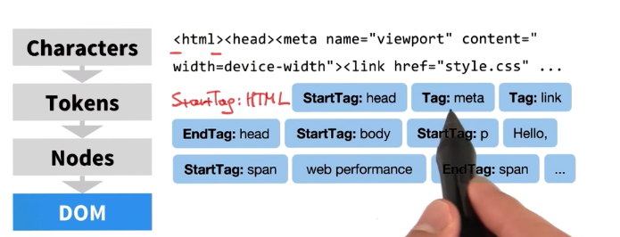

This entire process is done by the tokenizer. And while the tokenizer is doing this work, there is another process that is `consuming these tokens` and `converting` them to the `node objects`.

Fex: we conver the first `HTML token` and create the `HTML node`, then the next token and so on. 

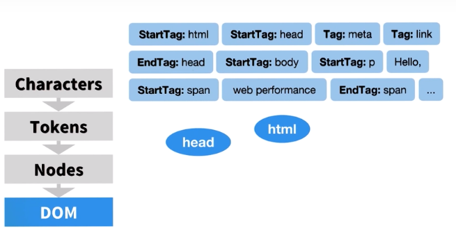

Notice that the tokenizer emits `start` and `end` tokens, which tells us the relationships between the `nodes`. `The StartTag head token` comes before `EndTag HTML token`, which tells us that the `head token` is a `child` of HTML. Similarly, the `meta` and `link` nodes are children of the `head` node and so on.

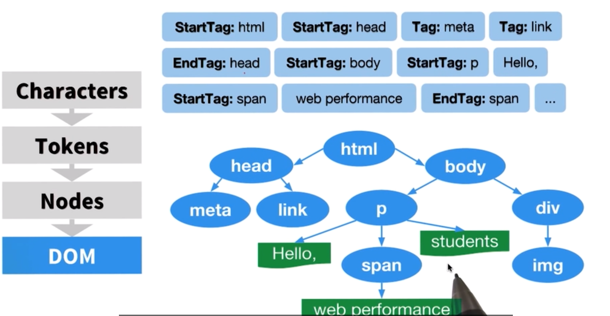

Eventually, once we consume all of the tokens, we arrive at the Documens Object Model, which is **the tree stucture that captures the content and properties of the HTML and all the relationships between the nodes**. 

> **Note,** that these objects contain all of their properties. Fex: the `image tag` in the HTML has a `source attribute` and the node in the DOM would also have the same property. **The DOM is the full parse representation of the HTML markup.**

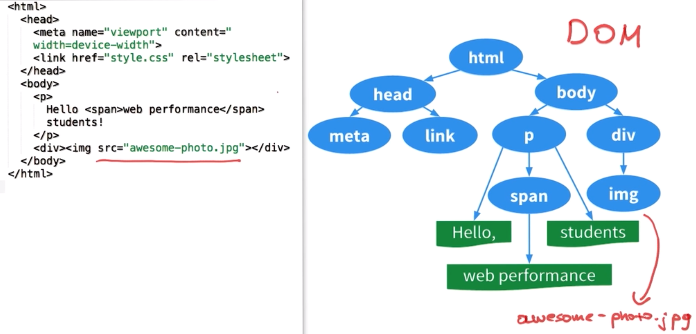


To recap, the following steps happen:

- HTML is received
- `HTML tags` are converted to `tokens`
- `tokens` are converted to `Nodes`
- `Nodes` are converted to the `DOM`


When you request a website, no matter what backend language is powering that website, it will respond with HTML. The browser receives a stream of HTML. The bytes are run through a complicated (but fully documented) parsing process that determines the different characters (e.g. the start tag character `<,` an attribute like `href`, a closing angle bracket like`>`). After parsing has occurred, a process called tokenization. Tokenization takes one character at a time and builds up tokens. The tokens are:

- DOCTYPE
- start tag
- end tag
- comment
- character
- end-of-file

Let's take a break for a second. At this state, the browser has received the bytes that've been sent by a server. The browser has converted the bytes to tags and has read through the tags to create a list of tokens.

This list of tokens then goes through the tree construction stage. The output of this stage is a tree-like structure - this is the DOM!

So the `DOM` is a **model** (representation) of the relationships and attributes of the HTML document that was received. Remember that DOM stands for "Document Object Model". Something that I've found to be true as I've been learning is that to break something down, just read the thing backwards:

Document Object Model

...would become…

Object Model of the Document!

Remember that a `JavaScript object` is a tree-like structure that has properties and values. So the DOM can be accessed using a special `object` provided by the browser: **document**.

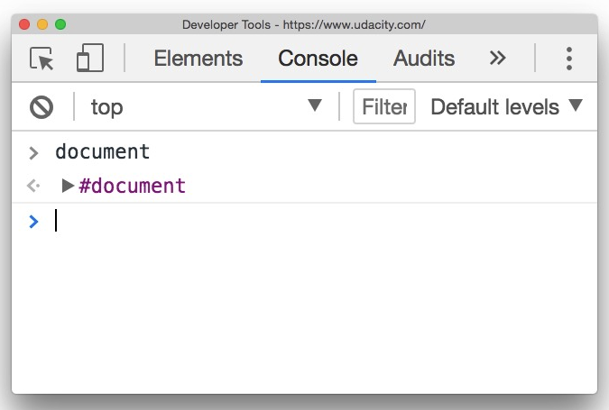

The `document` object is provided by the browser and is a representation of the HTML document. This object is not provided by the JavaScript language. ECMAScript is the language specification that JavaScript is based on, and it only references the document object model in one place, in its "Global Object" section:

> In addition to the properties defined in this specification the global object may have additional host defined properties. This may include a property whose value is the global object itself; for example, in the HTML document object model the window property of the global object is the global object itself. ([source])(https://www.ecma-international.org/ecma-262/#sec-global-object).

Basically, this says that the `document` object is not part of JavaScript, but is expected to already exist and be freely accessible to JavaScript code.

The DOM is standardized by the W3C. There are a number of specifications that make up the DOM, here are few:

- Core Specification
- Events Specification
- Style Specification
- Validation Specification
- Load and Save Specification

**The DOM Recap**

The DOM stands for **"Document Object Model" and is a tree-like structure that is a representation of the HTML document, the relationship between elements, and contains the content and properties of the elements.**

The DOM is *not*:

- part of the JavaScript language

The DOM is:

- constructed from the browser
- is globally accessible by JavaScript code using the `document` object

**Further Research**

- [DOM Introduction](https://developer.mozilla.org/en-US/docs/Web/API/Document_Object_Model/Introduction)
- [Section 8.2 Parsing HTML documents](https://html.spec.whatwg.org/multipage/parsing.html#parsing) from the W3C's HTML Documentation
- [DOM Specification](https://www.w3.org/TR/?tag=dom#w3c_all) on W3C
- [HTML Document Object Model mentioned in the ECMAScript Specification](https://www.ecma-international.org/ecma-262/#sec-global-object) - the language specification used by JavaScript


## Selecting Page Elements With CSS Selectors

**Select An Element By ID**

Let's take a look at how we can use JavaScript and the `DOM` to gain access to specific elements using their `ID attribute`.

Remember the `document` object from the previous section? Well, we're going to start using it! Remember the `document` object is an `object`, just like a `JavaScript object`. This means it has `key/value pairs`. Some of the `values` are just pieces of `data`, while others are `functions` (also known as `methods`!) that provide some type of functionality. The first `DOM method` that we'll be looking at is the `.getElementById()` method:

```js
document.getElementById();
```

If we ran the code above in the console, we wouldn't get anything, because we did not tell it the ID of any element to get! We need to pass a string to `.getElementById()` of the ID of the element that we want it to find and subsequently return to us:

```js
document.getElementById('footer');
```

One thing to notice right off the bat, is that we're passing `'footer'`, not `'#footer'`. It already knows that it's searching for an ID (its name _is_ "getElementById", for a reason!).

If you'd like to read more about this method, check out its documentation page on[ MDN:](https://developer.mozilla.org/en-US/docs/Web/API/Document/getElementById)

> **Note:** That's right! Passing `document.getElementById()` an unknown ID returns null.

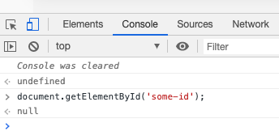


**Selecting By ID Recap**

In this section, we learned how to select a DOM element by its ID:

- `.getElementById()`

There are a couple of important things to keep in mind about this method:

- it is called on the `document` object
- it returns a *single* item

```js
// select the element with the ID "callout"
document.getElementById('callout');
```

**Further Research**
- [.getElementById()](https://developer.mozilla.org/en-US/docs/Web/API/Document/getElementById) on MDN

## Select Page Elemens By Class Or Tag

As I'm sure you remember from learning both HTML structure and CSS styling, an ID should be unique - meaning two or more elements should never have the same ID. Since IDs are unique, and since there will be only one element in the HTML with that ID, `document.getElementById()` will only ever return at most one element. So how would we select multiple DOM elements?

The next two DOM methods that we'll be looking at that both return multiple elements are:

- `.getElementsByClassName()`
- `.getElementsByTagName()`

**Accessing Elements By Their Class**

The first method we'll look at is `.getElementsByClassName()`:

```js
document.getElementsByClassName();
```

Similarly to `.getElementById()`, if we ran the code above in the console, we wouldn't get anything, because we did not tell it the class to search for! Also just like `.getElementById()`, `.getElementsByClassName()` is expecting that we call it with a string of the class we want it to search for/return:

```js
document.getElementsByClassName('brand-color');
```
If you'd like to read more about this method, check out its documentation page on [MDN:](https://developer.mozilla.org/en-US/docs/Web/API/Document/getElementsByClassName)

> **Beware of the S!**

> I know we haven't looked at `.getElementsByTagName()` just yet, but there's something different about `.getElementById()` compared with both `.getElementsByClassName()` and `.getElementsByTagName()` that I want to point out because it can be easy to miss; both `.getElementsByClassName()` and `.getElementsByTagName()` have an extra **"s"** in their name.

> The method's name is `.getElementsByClassName()`, not `.getElementByClassName()`. Notice the word right in the middle, it's *"Elements"* not *"Element"*. If you think about it, this actually makes a lot of sense! Since both `.getElementsByClassName()` and `.getElementsByTagName()` could return multiple items, their method names tell us that directly. Now compare this with `.getElementById()` that will only ever return at most one element. Its name has the singular *"Element"* in it.

**Accessing Elements By Their Tag**

After looking at both `.getElementById()` and `.getElementsByClassName()`, the new `.getElementsByTagName()` method should seem quite easy on the eyes:

```js
document.getElementsByTagName('p');
```

Let's use this [MDN documentation page to try out using this method:](https://developer.mozilla.org/en-US/docs/Web/API/Document_Object_Model/Introduction)

### Example

Fex: we wanna search for the `pre` tags. We'll get the list of the 6 `pre` tags in our case. 

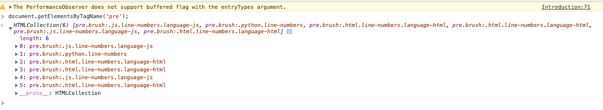

If we wanna to see where each one of these `pre` tags are in the DOM, we can right-click on one of them and choose *"Reveal in elements panel"*, and we'll jump to the correct location in the elements panel.

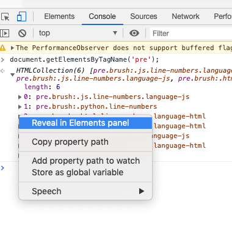

And then from the correct location in the elements panel we can right-click and choose *"Scroll into view"*  - and that will scroll the page into view to show us that element. 

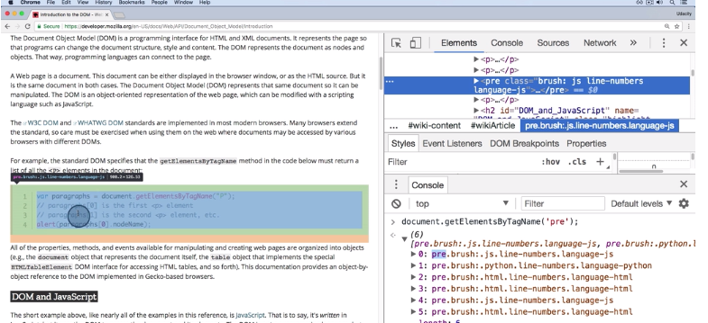

> **Note:** Envoking the `.getElementsByClassName()` function returns some items. And this is actually not an `array` (how it may seem for the first time), it is actually an **HTML Collection** 

In the [documentation](https://developer.mozilla.org/en-US/docs/Web/API/Document/getElementsByClassName) we see that it returns elements that are a live `HTML Collection`. 

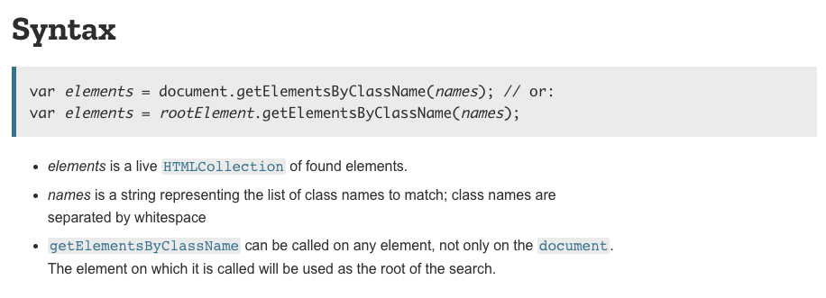


We just learned that `.getElementsByClassName()` returns an **array-like data structure of elements**. But what exactly _is_ an **element**?

**Selecting Multiple Elements At Once Recap**

In this section, we learned two ways to select multiple DOM elements:

- `.getElementsByClassName()`
- `.getElementsByTagName()`

There are a few important things to keep in mind about these two methods:

- both methods use the `document` object
- both return *multiple* items
- the list that's returned is *not* an array

```js
// select all elements that have the class "accent-color"
document.getElementsByClassName('accent-color');

// select all "span" elements
document.getElementsByTagName('span');
```

**Further Research**
- [.getElementsByClassName()](https://developer.mozilla.org/en-US/docs/Web/API/Document/getElementsByClassName) on MDN
- [.getElementsByTagName()](https://developer.mozilla.org/en-US/docs/Web/API/Element/getElementsByTagName) on MDN

## Nodes, Elements, and Interfaces

**The Node Interface**

What is the `Node`? Capital "N" in the Node is like a blueprint for a building.


This blueprint can have the `data` about the building, which we'll call `properties`. And it has a list of building's capabilities, which we'll call `methods`. Some properties might be the color of the building, the number of doors it has or the number of windows it has. Some methids might be an alarm system that's guiding the house or the sprinkler system that's watering the grass. 

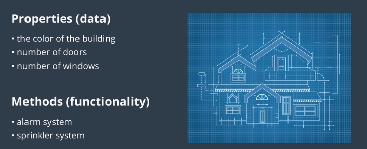

Let's say that this blueprint is a model for lots of real buildings. Another word for this blueprint is **interface**. And `interface` tells us `properties` and `methods` that are applied to the individual items. 

Now, capital "N" `Node` is the interface with the properties and methods. The lowercase "n" in `nodes` are the real objects built from the interface (blueprint).

> *⚠️ **Interface vs User Interface** ⚠️*

> The word `"interface"` might be an unclear word right now, and that's ok. I do want to make sure that you're not connecting this `"interface"` with a `user interface` (`UI`) or a `graphical user interface` (`GUI`).

> Our use of `"interface" `is not related to either a `UI` or a `GUI`. Our use of `"interface"` is a technical, computer science word for **a list of properties and methods that are inherited**.

Node (with a capital "N"!) is a blueprint that contains information about all of the properties and methods for real nodes (with a lowercase "n"!). If you're not used to them, the words **"interface"**, **"property"**, and **"method"** can be kind of cryptic at first. Just remember that:

- interface = blueprint
- properties = data
- methods = functionality

Let's check out Node on MDN: [Node Interface on MDN](https://developer.mozilla.org/en-US/docs/Web/API/Node)

So the Node Interface is a blueprint for all of the properties (data) and methods (functionality) that every real node has after it's been created. Now, the Node Interface has a lot of properties and methods, but it's not very specific...I mean, what _is_ a node???

Just like "blueprint for a Building" is not as specific as "blueprint for a house" or "blueprint for a skyscraper". These are more-specific blueprints. And these more-specific blueprints would probably have their own properties and methods that are specific to *just* houses or *just* skyscrapers.

This brings us to the "Element Interface".

**Element Interface**

Just like the Node Interface, the Element Interface is a blueprint for creating elements: [Element Interface on MDN](https://developer.mozilla.org/en-US/docs/Web/API/Element)

One really important thing about the `Element Interface` is that it is a **descendent** of the `Node Interface`

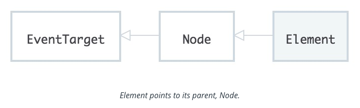

Since `Element` is pointing at `Node`, this indicates that the `Element Interface` inherits all of the `Node Interface's` `properties` and `methods`. This means that any `element` (lowercase "e"!) that was created from the `Element Interface` is also a descendent from the `Node Interface`...which means the `element` (lowercase "e"!) is also a **node** (lowercase "n"!).

> Do you remember the `.getElementsByClassName()` method on the document object that we looked at previously? While reviewing the Element interface, you might've noticed that it also has a `.getElementsByClassName()` method! The Element Interface inherits from the Node Interface, not the Document Interface (yep, there's a Document Interface!). The Element Interface has its own `.getElementsByClassName()` that does the exact same thing as the one on the `document` object.

> This means that you can use the `document` object to select an element, then you can call `.getElementsByClassName()` on that element to receive a list of elements with the class name that are descendents of that specific element!

```js
// selects the DOM element with an ID of "sidebar"
const sidebarElement = document.getElementById('sidebar');

// searches within the "sidebar" element for any elements with a class of "sub-heading"
const subHeadingList = sidebarElement.getElementsByClassName('sub-heading');
```

To check out all of the different interfaces, check here: [Web API Interfaces](https://developer.mozilla.org/en-US/docs/Web/API)

**Recap**

Hopefully this was an enlightening lesson on a number of fronts! You learned about interfaces, properties, and methods; an interface is like a blueprint, properties are like bits of information or data, and methods are functionality.

We also looked at a couple of specific interfaces:

- Node Interface
- Element Interface

We saw that both of these interfaces have properties and methods. We also saw how the Element Interface inherits all of the properties and methods from the Node interface.

**Further Research**
- [Node Interface](https://developer.mozilla.org/en-US/docs/Web/API/Node)
- [Element Interface](https://developer.mozilla.org/en-US/docs/Web/API/Element)
- [list of Web API Interfaces](https://developer.mozilla.org/en-US/docs/Web/API)


## More Ways To Access Elements

We've been looking at the:

- `.getElementById()`
- `.getElementsByClassName()`
- and `.getElementsByTagName()`

Now these DOM methods are standardized. However, not all browsers support every standard. They do *now*, for these three methods, but there are hundreds of other methods with varying levels of support.

That's why almost every method on MDN has a Browser compatibility table that lists when each browser started supporting that specific method.

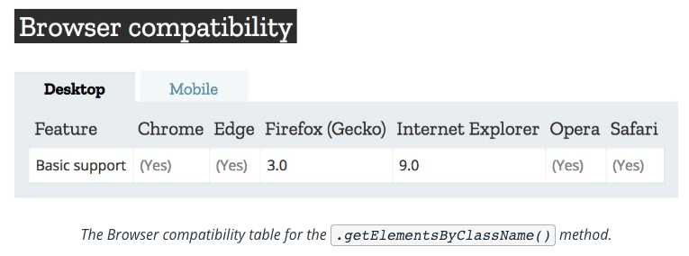

Thankfully, all browsers have pretty much aligned to support the official standard.

However, back in the day, that wasn't the case. You had to write different code to perform the same action in different browsers. Then you had to write code to check which browser you were in to run the correct code for that browser. Let me tell you, it was a bit of a nightmare.

Several JavaScript libraries came along to help mitigate these issues. Let's take a brief look at the [jQuery library](https://jquery.com/).

One of the main purposes of the `jQuery Library` was to abstract the way the differences between different browsers. As a developer you'd write jQuery specific methods and then jQuery would determine which browser it was running in and use the right code for that browser. Now because jQuery made it so easy to write code that ran correctly in multiple browsers, it skyrocketed in pupularity.  

Since every browser tries to support the official standarts now, jQuery uses gradually diminished and has been replaced by native DOM methods. However, out of jQuery's popularity, new DOM methods were created. 

You've already learned the DOM methods to select by ID, class, and tag, too:

- `.document.getElementById()`
- `.document.getElementsByClassName()`
- `.document.getElementsByTagName()`

Three different methods that do almost the exact same thing. Wouldn't it be awesome if there were a way to do element selecting similar to how CSS does it?

**The querySelector Method**

We can use the `.querySelector()` method to select elements just like we do with CSS. We use the `.querySelector()` method and pass it a string that's just like a CSS selector:

```js
// find and return the element with an ID of "header"
document.querySelector('#header');

// find and return the first element with the class "header"
document.querySelector('.header');

// find and return the first <header> element
document.querySelector('header');
```

Check out the `.querySelector()` method on [MDN:](https://developer.mozilla.org/en-US/docs/Web/API/Document/querySelector)

> *⚠️ **.querySelector() Returns A Single Element** ⚠️*
> I want to point out one potentially tricky thing - the `.querySelector()` method only returns one element. This makes sense if you use it to search for an element by ID. However, even though `.getElementsByClassName()` and `.getElementsByTagName()` both return a list of multiple elements, using `.querySelector()` with a class selector or a tag selector will still only return the first item it finds.


### Examples

- Write the `.querySelector()` code to find the first item with an ID of: fanciful-butterfly.

```js
document.querySelector('#fanciful-butterfly');
```

- Write the `.querySelector()` code to find the first paragraph element that also has a class of: callout

```js
document.querySelector('p.callout');
```

**The querySelectorAll Method**

The `.querySelector()` method returns only *one* element from the DOM (if it exists). However, there are definitely times when you will want to get a `list of all elements` with a certain `class` or `all of one type of element `(e.g. all `<tr>` tags). We can use the `.querySelectorAll()` method to do this!

```js

// find and return a list of elements with the class "header"
document.querySelectorAll('.header');

// find and return a list of <header> elements
document.querySelectorAll('header');
```

Here's the `.querySelectorAll()` method on [MDN:](https://developer.mozilla.org/en-US/docs/Web/API/Document/querySelectorAll)


