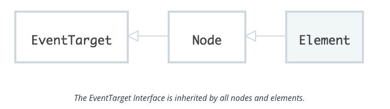
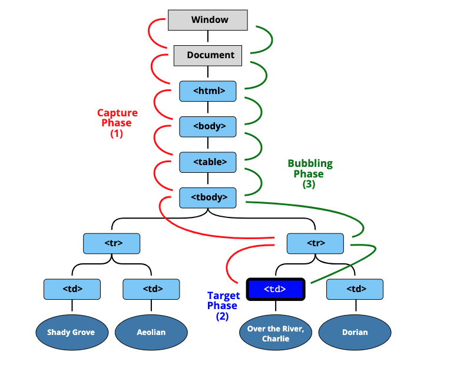

# Intro

**Lesson Overview**

To recap, we'll be looking at :

- **Events** - what they are
- **Responding to an event** - how to listen for an event and respond when one happens
- **Event Data** - harness the data that is included with an event
- **Stopping an event** - preventing an event from triggering multiple responses
- **Event Lifecycle** - the lifecycle stages of an event
- **DOM Readiness** - events to know when the DOM itself is ready to be interacted with

**Seeing An Event**

There is a hidden world of events going on right now on this very page! It's really hard to actually *see* into this hidden world, though. So how can we know that events really *are* being announced? If they are being announced, how come they're not easy for us to see?

Fortunately, the Chrome browser has a special `monitorEvents()` function that will let us see different events as they are occurring.

Check out the documentation on the Chrome DevTools site: [monitorEvents documentation](https://developers.google.com/web/tools/chrome-devtools/console/events#monitor_events)

The `monitorEvents` function will keep spitting out all of the events that are happening on the targeted element until the end of time...that, or until you refresh the page. Alternatively, the Chrome browser *does* offer an `unmonitorEvents()` function that will turn off the announcing of events for the targeted element:

```js
// start displaying all events on the document object
monitorEvents(document);

// turn off the displaying of all events on the document object.
unmonitorEvents(document);
```

One last little bit of info on `monitorEvents` is that this is for development/testing purposes only. It's not supposed to be used for production code.

# Respond to Events

**An Event Target**

Do you remember the `Node Interface` and the `Element interface` from the first lesson? Do you remember how the `Element Interface` is a descendant of the `Node Interface`, and therefore inherits all of `Node's` properties and methods?

Well there was one piece that I totally skipped over then but am addressing now. The `Node Interface` inherits from the `EventTarget` Interface.



The [EventTarget page](https://developer.mozilla.org/en-US/docs/Web/API/EventTarget) says that `EventTarget`:

> is an interface implemented by objects that can receive events and may have listeners for them.

and

> Element, document, and window are the most common event targets, but other objects can be event targets too…

As you can see from the image above, the EventTarget is at the top of the chain. This means that it does not inherit any properties or methods from any other interfaces. However, every other interface inherits from it and therefore contain its properties and methods. This means that each of the following is an "event target";

- the `document` object
- a paragraph element
- a video element
- etc.

I want to drive home that both the *document* object and *any DOM element* can be an event target. And again, why is this?...because both the Element Interface and the Document Interface inherit from the EventTarget Interface. So any individual element inherits from the Element Interface, which in turn inherits from the EventTarget Interface. Likewise, the document object comes from the Document Interface, which in turn inherits from the EventTarget Interface.

If you take a look at the EventTarget Interface, you'll notice that it doesn't have any properties and only three methods! These methods are:

- `.addEventListener()`
- `.removeEventListener()`
- `.dispatchEvent()`

The one that we'll be looking at for the rest of this course will be the `.addEventListener()` method.

**Adding An Event Listener**

We've taken a brief look at this hidden world of events. Using the `.addEventListener()` method will let us *listen* for events and respond to them! I just said *"listen for events"*. There are several ways to "phrase" this, so I want to give some examples:

- listen for an event
- listen to an event
- hook into an event
- respond to an event

...all of these mean the same thing and are interchangeable with one another.

Let's use some pseudo-code to explain how to set an event listener:

```js
<event-target>.addEventListener(<event-to-listen-for>, <function-to-run-when-an-event-happens>);
```

So an event listener needs three things:

1. an event target - this is called the **target**
2. the type of event to listen for - this is called the **type**
3. a function to run when the event occurs - this is called the **listener**

The `<event-target>` (i.e. the *target*) goes right back to what we just looked at: everything on the web is an event target (e.g. the `document` object, a `<p>` element, etc.).

The `<event-to-listen-for>` (i.e. the *type*) is the event we want to respond to. It could be a click, a double click, the pressing of a key on the keyboard, the scrolling of the mouse wheel, the submitting of a form...the list goes on!

The `<function-to-run-when-an-event-happens>` (i.e. the *listener*) is a function to run when the event actually occurs.

Let's transform the pseudo-code to a real example of an event listener:

```js
const mainHeading = document.querySelector('h1');

mainHeading.addEventListener('click', function () {
  console.log('The heading was clicked!');
});
```

Let's break down the snippet above:

- the target is the first `<h1>` element on the page
- the event type to listen for is a `"click"` event
- the listener is a function that logs `"The heading was clicked!"` to the console

> Check out the documentation for more info: [addEventListener docs](https://developer.mozilla.org/en-US/docs/Web/API/EventTarget/addEventListener)

**Add Event Listener to the Project**

Running code in a browser's developer tools is fantastic for testing. But that event listener will only last until the page is refreshed. As with all *real* JavaScript code that we want to send to our users, our event listener code needs to be in a JavaScript file.

Let's try adding an Event Listener to our project's files!

**app.js**
```js
document.addEventListener('click', function(){
    console.log("you've clicked the document");
})
```

Now, let's change the "EventListener" a bit. Let's say that I wanna change the `heading` on the page. So if we wanna select the DOM element, we have to use the DOM selection methods like a "query selector" or "get element by ID". 

To change the `heading style` the first thing I need to do is *select the element out of the DOM*.

```js
document.addEventListener('click', function(){
    const mainHeading = document.querySelector('h1')
})
```

Now, let's change its style. 

```js
document.addEventListener('click', function(){
    const mainHeading = document.querySelector('h1');
    mainHeading.style.backgroundColor = "red";
})
```

So far, we've only looked at the `"click"` event and a couple of other ones. When we used the `monitorEvents()` function in the previous section, we saw a number of different event types (e.g. `dblclick`, `scroll`, `resize`).

How do you know what events are even out there to listen for? The answer is easy - documentation! To see a full list of all of the possible events you can listen for, check out the Events documentation: [list of events](https://developer.mozilla.org/en-US/docs/Web/Events)

**Recap**

In this section, you learned all about events, the `EventTarget Interface`, and how to add `event listeners`. We used the `.addEventListener()` method to attach listeners to:

- the `document`
- a Node
- an Element

...basically anything that inherits from the `EventTarget Interface`. We also saw that there are three main parts to an event listener:

1. an event target - the **target**
2. the type of event to listen for - the **type**
3. a function to run when the event occurs - the **listener**

**Further Research**
- [addEventListener on MDN](https://developer.mozilla.org/en-US/docs/Web/API/EventTarget/addEventListener)
- [EventTarget Interface](https://developer.mozilla.org/en-US/docs/Web/API/EventTarget)
- I[ntroduction to events](https://developer.mozilla.org/en-US/docs/Learn/JavaScript/Building_blocks/Events)

# Remove an Event Listener

We say that we can use an event target's `.addEventListener()` method to start listening for specific events and respond to them. Let's say you only want to listen for just the first click event, respond to it, and ignore all other click events. The `.addEventListener()` event will listen for and respond to *all* click events.

(The newest version of the `.addEventListener()` specification *does* allow for an object to be passed as a third parameter. This object can be used to configure how the `.addEventListener()` method behaves. Of note, there is an option to listen for only a single event. However, this configuration object is not widely supported just yet).

To remove an event listener, we use the `.removeEventListener()` method. It sounds straightforward enough, right? However, before we look at `.removeEventListener()`, we need to take a brief review of object equality. It seems like an odd jump, but it'll make sense in just a moment.

**Are Objects Equal in JavaScript**

Equality is a common task in most programming languages, but in JavaScript, it can be a little bit tricky because JavaScript does this thing called **type coercion** where it will try to convert the items being compared into the same type. (e.g. string, number,). JavaScript has the double equality (`==`) operator that *will allow type coercion*. It also has the triple equality (`===`) symbol that will prevent type coercion when comparing.

Hopefully, this is all review. But let's talk about *just* object equality, which includes objects, arrays, and functions. 

Try giving this quiz a shot:

---
QUESTION 

Will the following equality test result in true or false?

```js
{ name: 'Richard' } === { name: 'Richard' }
```

OPTIONS: 
- true
- false

ANSWER: "false" (Potentially) Counterintuitively, these two objects are not equal.

---

> **Note:** Even though two objects look exactly the same, that doesn't mean they're identical. So **the same information doesn't indicate equality**. When working with the JS objects and equality, you need to think about, **are they two separate objects, or are they different names referring to the same object**? 

---
QUESTION:

Given this code:

```js
var a = {
    myFunction: function quiz() { console.log('hi'); }
};
var b = {
    myFunction: function quiz() { console.log('hi'); }
};
```

Does the following code evaluate to `true` or `false`?

```js
a.myFunction === b.myFunction
```

OPTIONS: 
- true
- false

ANSWER: "false". This is the same thing as { name: 'Richard' } === { name: 'Richard' }; both of the myFunction functions are different functions. They look the same, but they are distinct entities.

---

OR 

---
QUESTION:

Given this code:

```js
function quiz() { ... }

var a = {
    myFunction: quiz
};
var b = {
    myFunction: quiz
}
```
Does the following code evaluate to `true` or `false`?

```js
a.myFunction === b.myFunction
```

OPTIONS: 
- true
- false

ANSWER: "true".  Both of the myFunction functions are referring to the same, exact quiz function.

---

Ok, so why do we care about any of this object/function equality? The reason is that the `.removeEventListener()` method requires you to pass *the same exact listener function* to it as the one you passed to `.addEventListener()`.

Let's see some pseudo-code for the `.removeEventListener()`:

```js
<event-target>.removeEventListener(<event-to-listen-for>, <function-to-remove>);
```

So an event listener needs three things:

- an event target - this is called the **target**
- the type of event to listen for - this is called the **type**
- the function to remove - this is called the **listener**

Remember, the *listener* function must be the *exact* same function as the one used in the `.addEventListener()` call...not just an identical looking function. Let's look at a couple of examples.

This code will successfully add and then remove an event listener:

```js
function myEventListeningFunction() {
    console.log('howdy');
}

// adds a listener for clicks, to run the `myEventListeningFunction` function
document.addEventListener('click', myEventListeningFunction);

// immediately removes the click listener that should run the `myEventListeningFunction` function
document.removeEventListener('click', myEventListeningFunction);
```

Now, why does this work? It works because both `.addEventListener()` and `.removeEventListener`:

- have the same *target*
- have the same *type*
- and pass the *exact same listener*

Now let's look at an example that would *not* work (it does *not* remove the event listener):

```js
// adds a listener for clicks, to run the `myEventListeningFunction` function
document.addEventListener('click', function myEventListeningFunction() {
    console.log('howdy');
});

// immediately removes the click listener that should run the `myEventListeningFunction` function
document.removeEventListener('click', function myEventListeningFunction() {
    console.log('howdy');
});
```

This code does *not* successfully remove the event listener. Again, why does this not work?

- both `.addEventListener()` and `.removeEventListener` have the same *target*
- both `.addEventListener()` and `.removeEventListener` have the same *type*
- `.addEventListener()` and `.removeEventListener` have their own distinct *listener* functions...t**hey do not refer to the exact same function** (**this is the reason the event listener removal fails!**)

---
QUESTION:

Assuming that `myForm` is a `<form>` element, will the `<form>` element have a `submit` event listener after running the following code, or not?

```js
myForm.addEventListener('submit', function respondToSubmit(){...});
myForm.removeEventListener('submit', function respondToSubmit(){...});
```
OPTIONS:

- the element will have no event listeners
- the element will still have an event listener

ANWSER: "the element will still have an event listener". Since both `.addEventListener()` and `.removeEventListener` provide their own `respondToSubmit()` function and do *not* refer to the same function, the event listener removal fails, and the `<form>` will still have an event listener attached to it.

---


**Recap**

In this section, you learned about how to remove event listeners. You took a dive into object equality and how that plays a huge part in removing an event. Lastly, we also looked at how you can find out what event listener a DOM element has by using the DevTools.

**Further Research**

- [removeEventListener on MDN](https://developer.mozilla.org/en-US/docs/Web/API/EventTarget/removeEventListener)
- [Easily jump to event listeners](https://developers.google.com/web/updates/2015/05/easily-jump-to-event-listeners)
- [Equality comparisons and sameness](https://developer.mozilla.org/en-US/docs/Web/JavaScript/Equality_comparisons_and_sameness)
- [Article: Object Equality in JavaScript](http://adripofjavascript.com/blog/drips/object-equality-in-javascript.html)
- [EventTarget Interface](https://developer.mozilla.org/en-US/docs/Web/API/EventTarget)


# Phases of an Event

There are three different **phases** during the **lifecycle of an event**. They are:

- the **capturing** phase
- the **at target** phase
- and the **bubbling** phase

And they actually follow the order above; first, it's *capturing*, then *at target*, and then the *bubbling* phase.

1. Most event handlers run during the **at target** phase, such as when you attach a click event handler to the button. The event arrives at the button (its **target**), and there's only a handler for it right there, so the event handler gets run.

2. But sometimes you have a collection of items -- such as a list -- and want to have one handler cover every item (and still have the option of individual handlers for some items.) By default, if you click on a child item and a handler doesn't intercept the click, the event will **"bubble"** upward to the parent, and keep bubbling until something handles it or it hits the document.

3. **Capturing**, on the other hand, lets the parent intercept an event before it reaches a child.

Let's dig into these phases to see how they affect when events fire and the order they fire in!

