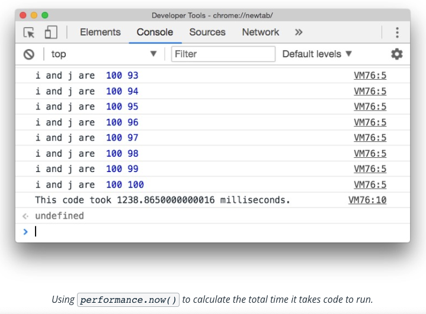
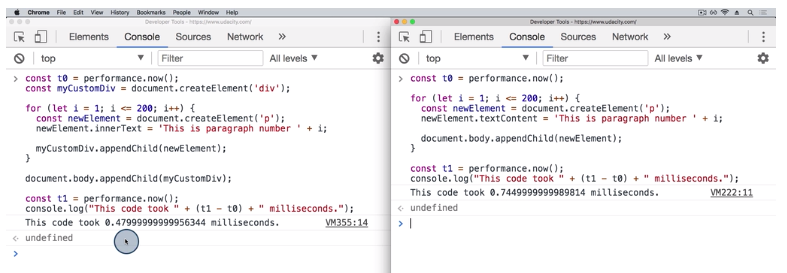
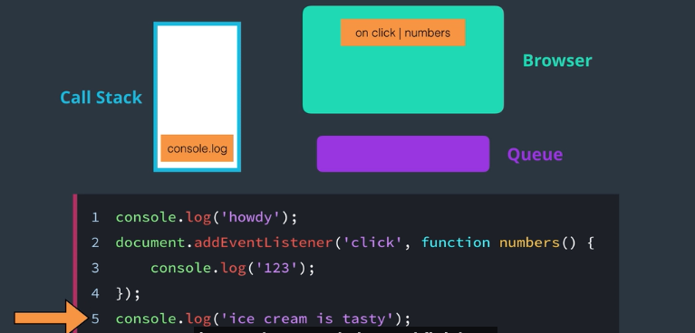
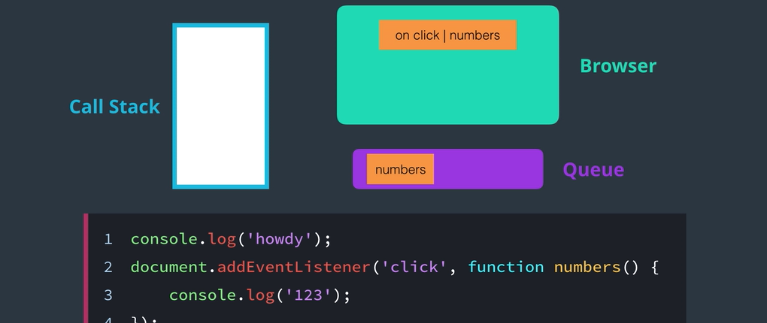
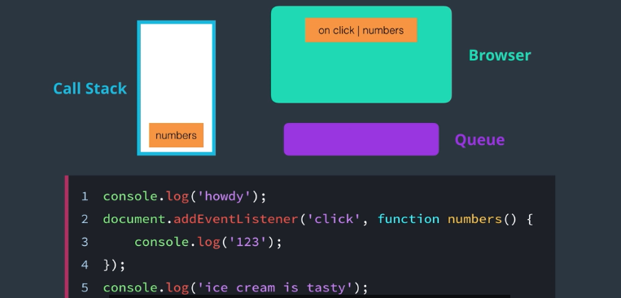

# Add Page Content Efficiently

**Using A Loop To Add Content**

In the last lesson, we used a `for loop` to create two hundred paragraphs, add event listeners to them, and add them to the page. Let's take another look at the `for loop`, but this time without all of the event listener stuff:

```js
for (let i = 1; i <= 200; i++) {
    const newElement = document.createElement('p');
    newElement.textContent = 'This is paragraph number ' + i;

    document.body.appendChild(newElement);
}
```

Let's quickly recap the code to see where we can make improvements.

This code:

- creates a paragraph element
- adds some text to the paragraph
- adds the paragraph to the page

...and it does this two hundred times.

Since we want two hundred things done, the best way to do this is with a `for loop`, so that code is inescapable. However, the code *inside* the `for loop` is not all that efficient, and there are quite a few things we could do to improve this code. We could:

- create some parent container element *outside* of the loop
- we could append all new paragraph elements to this parent container
- we append this parent container to the `<body>` element instead of appending each time through the loop

Let's see all of these changes:

```js
const myCustomDiv = document.createElement('div');

for (let i = 1; i <= 200; i++) {
  const newElement = document.createElement('p');
  newElement.innerText = 'This is paragraph number ' + i;

  myCustomDiv.appendChild(newElement);
}

document.body.appendChild(myCustomDiv);
```

This looks a lot better, right? Right!...but how do we *know* it is? How can we *prove* it's better?

We can test the time it takes to actually run this code!

**Testing Code Performance**

The standard way to measure how long it takes code to run is by using `performance.now()`. `performance.now()` returns a timestamp that is measured in milliseconds, so it's extremely accurate. How accurate? Here's what the its documentation page says:

> a*ccurate to five thousandths of a millisecond (5 microseconds)*

That's incredibly precise!

If you've ever used a timing procedure in another programming language, then you might've heard of Epoch time (also called Unix time or POSIX time). These tools tell you the time that has passed since 1/1/1970 (the first of January). The browser's `performance.now()` method is slightly different in that it starts measuring from the time the page loaded. Detailed information can be found on its documentation page: [performance.now() on MDN](https://developer.mozilla.org/en-US/docs/Web/API/Performance/now)

These are the steps to use `performance.now()` to measure the speed of your code:

1. use `performance.now()` to get the an initial start time for the code
2. run the code you want to test
3. execute `performance.now()` to get another time measurement
4. subtract the initial time from the final time

Adding two hundred paragraphs to the page is actually going to be relatively quick, so let's slow things down by using a set of nested `for` loops that just count from one to a hundred...one hundred times!

```js
for (let i = 1; i <= 100; i++) { 
  for (let j = 1; j <= 100; j++) {
    console.log('i and j are ', i, j);
  }
}
```

Next, we'll add in the `performance.now()` code to measure how long these loops take:

```js
const startingTime = performance.now();

for (let i = 1; i <= 100; i++) { 
  for (let j = 1; j <= 100; j++) {
    console.log('i and j are ', i, j);
  }
}

const endingTime = performance.now();
console.log('This code took ' + (endingTime - startingTime) + ' milliseconds.');
```




Let's go back to our original code of adding two hundred paragraphs to the page to see how long that code takes to run. Actually, the code from the left side runs a little bit faster, so it's more efficient. 



**Using a Document Fragment**

So far, we've made a number of improvements to the code. However, there is still one thing that seems not so great; we have to create a extraneous `<div>` element *just to hold all the `<p>` tags so we can add them all at once* and then we append this `<div>` to the `<body>` element. So in the end, we have an extra `<div>` that isn't really needed. It was just around because we wanted to add each new `<p>` to it instead of to the `<body>`.

Why are we doing this? The browser is constantly working to *make the screen match the DOM*. When we add a new element, the browser has to run through a `reflow` calculation (to determine the new screen layout) and then `repaint` the screen. This takes time.

If we had added each new paragraph to the body element, then the code would've been a lot slower, because this would cause the browser to go through the `reflow` and `repaint` process *for each paragraph*. We really only want the browser to do this once, so we need to attach each new paragraph to something, but we don't want to have an extra, unneeded element to get added to the DOM.

This is exactly why we have the **DocumentFragment**! According to the documentation, a **DocumentFragment**:

> *represents a minimal document object that has no parent. It is used as a lightweight version of Document that stores a segment of a document structure comprised of nodes just like a standard document.*

So it's like creating another lightweight DOM tree. But the beneficial part of this is what it says next:

> *The key difference is that because the document fragment isn't part of the active document tree structure, changes made to the fragment don't affect the document, cause reflow, or incur any performance impact that can occur when changes are made.*

In other words, changes made to a DocumentFragment happen off-screen; there's no reflow and repaint cost while you build this. So this is exactly what we need!

We can use the `.createDocumentFragment()` method to create an empty `DocumentFragment` object. This code should be very familiar to you, because it looks so very similar to `document.createElement()`.

```js
const myDocFrag = document.createDocumentFragment();
```

Let's rewrite our code to use a DocumentFragment instead of the `<div>`.

```js
const fragment = document.createDocumentFragment();  // ← uses a DocumentFragment instead of a <div>

for (let i = 0; i < 200; i++) {
    const newElement = document.createElement('p');
    newElement.innerText = 'This is paragraph number ' + i;

    fragment.appendChild(newElement);
}

document.body.appendChild(fragment); // reflow and repaint here -- once!
```

**Recap**

In this section, we took a brief dive into the performance implications of the code we write. We looked at a specific chunk of code and came up with ways that we could improve its performance simply by rearranging when the code was running (moving initialization code out of the `for loop`).

We also looked at how to measure how long it takes code to run using `performance.now()`.

Lastly, we looked at using a `DocumentFragment` to prevent performance issues and to prevent adding unnecessary elements to the DOM.

**Further Research**

- [performance.now() on MDN](https://developer.mozilla.org/en-US/docs/Web/API/Performance/now)
- [Performance Interface on MDN](https://developer.mozilla.org/en-US/docs/Web/API/Performance)
- [DocumentFragment Interface on MDN](https://developer.mozilla.org/en-US/docs/Web/API/DocumentFragment)
- [createDocumentFragment docs on MDN](https://developer.mozilla.org/en-US/docs/Web/API/Document/createDocumentFragment)

# Reflow & Repaint

We mentioned `Reflow` and `Repaint` in the last section, now it's time to take a closer look.

**Reflow** is the process of the browser laying out the page. It happens when you first display the DOM (generally after the DOM and CSS have been loaded), and happens again every time something could change the layout. This is a fairly expensive (slow) process.

**Repaint** happens after reflow as the browser draws the new layout to the screen. This is fairly quick, but you still want to limit how often it happens.

Why did adding a little CSS change cause a `reflow`? What if adding a class changed the position of the element or caused it to float? The br`owser won't know for certain (and a complete calculation of the impact of a change could take longer than doing the reflow!)

Let's take a realistic example. Say you're writing the next great blogging platform, and you want to have a "remove spam" button for the administrator. Your HTML looks like this:

```html
<div id="comments">
  <div class="comment"> <!-- some content --> </div>
  <div class="comment"> <!-- some content --> </div>
  <div class="comment"> <!-- some content --> </div>
</div>
```

When we run the spam filter, we discover comments one and two have to be removed.

If we simply call `.removeChild()` for each of the two `comments` that need to be removed, that's one reflow and one repaint for each change (so a total of 2 reflows and 2 repaints). We could rebuild the whole thing in a `DocumentFragment` and replace `#comments` -- that's the time to rebuild (possibly involving reading files or data), plus at least one reflow and one repaint.

Or we could *hide* `#comments`, delete the spam, and show it again -- that's surprisingly fast, to the cost of one reflow and two repaints (and little else). It's fast because hiding doesn't change the layout, it just erases that section of the screen (1 repaint). When you make the changed section visible again, that's a reflow and a repaint.

> *In general, if you have to make a group of changes, hide/change all/show is a great pattern to use if the changes are relatively contained.*

**Virtual DOM**

By the way, this is why React and other "virtual DOM" libraries are so popular. You don't make changes to the DOM, but make changes to another structure (a "virtual DOM") and the library calculates the best way to update the screen to match. The catch is you then have to rework your code to use whatever library you're adopting, and sometimes you can do a better job updating the screen yourself (because you understand your own unique situation).

**Recap**

In this section, we took a brief look at what reflow and repaint are and saw how they can impact the performance of a website.

Reflow is the process of calculating the dimensions and position of page elements. This is a computationally intensive (slow) tasks. Repaint is the process of drawing the pixels to the screen. This is faster than reflow, but is still not a fast process. You want to make sure that your code causes the fewest number of reflows as possible.

**Further Research**

- [Website Performance Optimization](https://www.udacity.com/course/website-performance-optimization--ud884) free course by Udaicty
- [Minimizing browser reflow](https://developers.google.com/speed/docs/insights/browser-reflow) from PageSpeed Tools Guides
- [Avoid Large, Complex Layouts and Layout Thrashing](https://developers.google.com/web/fundamentals/performance/rendering/avoid-large-complex-layouts-and-layout-thrashing) from Google's Web Fundamentals Guides
- [Performance Analysis Reference](https://developers.google.com/web/tools/chrome-devtools/evaluate-performance/reference#rendering) from Google's Web Fundamentals Guides
- Article [Reflows & Repaints: CSS Performance Making Your JavaScript Slow?](http://www.stubbornella.org/content/2009/03/27/reflows-repaints-css-performance-making-your-javascript-slow/)

# The Call Stack

**Single Threading**

You might've heard that JavaScript is **single-threaded** but what does that mean? According to Wikipedia, single-threading is:

> *the processing of one command at a time [(source)](https://en.wikipedia.org/wiki/Thread_(computing)#Single_threading)*

Ok, so JavaScript can "process" one command at a time. The opposite of single-threading, is multithreading. There are numerous pros and cons to both which we won't be getting into (feel free to check out the [Wikipedia article on Threading](https://en.wikipedia.org/wiki/Thread_(computing)#Single_threading) for more info about the pros and cons). We're going to take a look at JavaScript's single-threaded model and how/why we should write our code to take advantage of it.

Let's look at some code:

```js
function addParagraph() {
    const para = document.createElement('p');
    para.textContent = 'JavaScript is single threaded!';
    document.body.appendChild(para);
}

function appendNewMessage() {
    const para = document.createElement('p');
    para.textContent = "Isn't that cool?";
    document.body.appendChild(para);
}

addParagraph();
appendNewMessage();
```

Keeping JavaScript's single-threaded nature in mind (meaning it can only perform one task at a time), let's break down this code into the order it will run:

- the `addParagraph()` function is declared on line 1
- the `appendNewMessage()` function is declared on line 6
- `addParagraph()` is called on line 13
  - execution moves into the function and executes all three lines in order
  - now that the function is finished, execution returns to where it was called
- the `appendNewMessage()` function is called on line 14
  - execution moves into the function and executes all three lines in order
  - now that the function is finished, execution returns to where it was called
- the program ends because all lines of code have been executed

Hopefully, the order that this code executed in wasn't surprising. There are a couple of things I particularly want you to pay attention to:

- First, is the *run-to-completion nature of the code*. When `addParagraph()` is invoked on line 13, *all of the code in the function gets executed*: it doesn't just execute some lines and leave other lines to be executed later. The entire block of code is run. 
- A second thing I want to point out is that `addParagraph()` is invoked, runs, and finishes before `appendNewMessage()` is invoked (including a possible reflow and repaint); JavaScript doesn't execute multiple lines/functions at the same time (this is single-threading...processing one command at a time!).

I have a question for you - once `addParagraph()` has been invoked and it runs the lines of code inside the `addParagraph()` function, how does it know to go back to `appendNewMessage()`? How does it keep track of that?

What if we changed this code slightly to create nested functions:

```js
function addParagraph() {
    const para = document.createElement('p');
    para.textContent = 'JavaScript is single threaded!';

    appendNewMessage();
    document.body.appendChild(para);
}

function appendNewMessage() {
    const para = document.createElement('p');

    para.textContent = "Isn't that cool?";
    document.body.appendChild(para);
}

addParagraph();
```

Notice that the call to `appendNewMessage()` is located inside the `addParagraph()` function. First, `addParagraph()` is invoked. Then `appendNewMessage()` is invoked on line 5. Once `appendNewMessage()` has finished running, execution returns and finishes running the last line of code in the `addParagraph()` function...but how does it know how to do that? How does the JavaScript engine know where it left off and how to get back to it?

**The Call Stack**

The JavaScript engine keeps a call stack (basically a list) of the functions that are running. When a function is invoked, it is added to the list. When all of the code inside a function has been run, then the function is removed from the call stack. The cool part about a call stack is that a function doesn't have to complete before another function is added to the call stack.

Let's see how this works!

---
QUESTION:

How many items (frames) will be on the stack when the code reaches the "stop here" comment?

```js
function quiz () {
  var y = 'yes';
  questions();
  fun();
}
function questions () {
  var y = 'no';
  return 7;
}
function are () {
  return 3;
}
function fun () {
  are();
  // stop here
}

quiz()
```

Assume there is no `"<main>"`/default frame.

OPTIONS: 
- 0
- 1
- 2
- 3
- 4

ANSWER: '2'. When `// stop here` is reached, both `quiz` and `fun` are on the stack.

---

**The Call Stack Recap**

In this section, we looked at how JavaScript is a **single-threaded programming language**, which means it *can only execute one thing at a time*. We looked at how JavaScript keeps track of what functions are running by using the **Call Stack**.

**Further Research**
- [Call stack](https://developer.mozilla.org/en-US/docs/Glossary/Call_stack) on MDN
- [Call stack](https://en.wikipedia.org/wiki/Call_stack) on Wikipedia

# The Event Loop

**Code Synchronicity**

In the previous section on the `Call Stack`, we used the terms:

- run-to-completion
- single-threaded

Another term for this is **synchronous**. By definition, "synchronous" means:

> *existing or occurring at the same time*

All of the code we've been looking at runs in order, at the same time. Functions are added to the call stack, and then removed from the call stack when they've completed. However, there is some code that is not synchronous - meaning that the code is written just like any other code, but it is executed at some later point in time. Does this sound familiar at all? You've just been working with it:

```js
const links = document.querySelectorAll('input');
const thirdField = links[2];

thirdField.addEventListener('keypress', function handleKeyPresses(event) {
    console.log('a key was pressed');
});
```

...event listeners! *Most* of this code is synchronous like you're used to. But the event listener's function `handleKeyPresses` is not invoked immediately, it's invoked at some later point in time.

Have you ever wondered about that? Where does the code go? What about the "call stack" that we learned about? Is it hidden in the call stack somewhere?

Let's look at this code snippet:

```js
console.log('howdy');
document.addEventListener('click', function numbers() {
    console.log('123');
});
console.log('ice cream is tasty');
```

The code will run in this order:

1. `'howdy'` will be logged to the console
2. `'ice cream is tasty'` will be logged to the console

The string `'123'` will only be logged if there's a click. If the page is never clicked, then this code might not ever run! But where is it? Where did the `numbers` function holding the `console.log('123');` code go?

**Running Code Later**

But the same questions exist for this code as it does for the `.addEventListener()` code:

- where does the function go to wait?
- how does the function get run when it needs to?

This happens because of the **JavaScript Event Loop**!


**The JavaScript Event Loop**

The simplest explanation of JavaScript's **concurrency model** uses two rules: 
- If some JavaScript is running, let it run until it is finished (`"run-to-completion"`). 
- If no JavaScript is running, *run any pending event handlers*.

Since most JavaScript is run in response to an `event`, this is known as `an event loop`: *Pick up the next event, run its handler, and repeat.*

There are three parts you have to think about around the event loop:

- the Call Stack
- Web APIs/the browser
- an Event Queue


Not all of the code that we write is 100% *JavaScript* code. Some of the code is interacting with the Web APIs (also known as "browser APIs"). There are many more examples, but both `.addEventListener()` and `setTimeout()` are Web APIs.

Let's look back at this code:

```js
console.log('howdy'); // 1
document.addEventListener('click', // 2
  function numbers() {
    console.log('123');
});
console.log('ice cream is tasty'); // 3
```

First, the browser runs this block of code to completion -- that is, steps 1, 2, and 3. Step 2 passes an event handler (`numbers`) to the browser for future use: the browser will hold this function until there's a click event.

What happens if someone clicks before this block of code is done? When there is a click event and there is code already running, the `numbers` function can't just be added directly to the `Call Stack` because of JavaScript's *run-to-completion nature*; we can't interrupt any code that might currently be happening. So the function is placed in the `Queue`. When all of the functions in the `Call Stack` have finished (also known as *idle time*), then the `Queue` is checked to see if anything is waiting. If something is in the `Queue`, then it's run, creating an entry on the `call stack`.

> **IMPORTANT:** The key things to remember here are: 1) current synchronous code runs to completion, and 2) events are processed when the browser isn't busy. Asynchronous code (such as loading an image) runs outside of this loop and sends an event when it is done.

So, we have the `Call Stack`, the `Browser` and the `Queue`. 

1. We start at the first line of the code. 


2. The `console.log()` is run and added to the `Call Stack`


3. When it finishes it's removed from the call stack

4. Now onto the event listener. It's added to the call stack because the code is being evaluated,


5. But then it's handed over to the browser. The browsers internals are invisible to us but when the browser is clicked, it knows to run the `numbers` function. 


6. And that's it. The code moves onto the last line, 


7. It runs `console.log('ice cream is tasty') and finishes. 



8. !!! **but** Whenever the `browser` IS clicked, the `numbers` function is moved to the queue where waits untill the call stack is empty. 




9. Then `numbers` function is moved to the `call stack` and invoked. 



10. Invoking the `numbers` function will invoke another `console.log('123'), 


11. when it's finished i's removed from the list, 


12. and the `numbers` function is finished and removed


---
QUESTION:

What is the order that the iceCream function goes through if the `<footer>` is clicked?

```js
const pageFooter = document.querySelector('#page-footer');

pageFooter.addEventListener('click', function iceCream () {
    const footerDetails = document.querySelector('#details');

    footerDetails.textContent = 'Everyone should eat ice cream!';
});
```

ANSWER: order: browser-queue-call stack. When this code is run, the `iceCream` function is given to the `browser`. When the `<footer>` is clicked, the code moves to the `Queue`. Then, when the `Call Stack` is empty, `iceCream` is moved over to the `Call Stack` and invoked.

---

**Recap**

This section uncovered how JavaScript works under the hood; We looked at how `JavaScript`, the `DOM`, and `Web APIs` all fit together.

Specifically, we looked at how JavaScript is a *single-threaded* programming language, which means it can only execute one thing at a time. We looked at how JavaScript keeps track of what functions are running by using the `Call Stack`. We also looked at how *asynchronous* code is handled.

*Asynchronous* code makes use of the JavaScript `Event Loop`. Any `asynchronous code` (like `setTimeout` or the function passed to `.addEventListener()`) **is handled by the browser**. When this `asynchronous code` is ready to be executed, it's moved to the **queue** where it waits until the **Call Stack** is empty. Whenever the **Call Stack** is empty, code moves from the **Queue** over to the **Call Stack** and gets executed.

Knowing how `JavaScript` and the `Event Loop` work can help us write code that is more efficient.

**Further Research**

- [Concurrency model and Event Loop](https://developer.mozilla.org/en-US/docs/Web/JavaScript/EventLoop)
- [Events and Handlers Overview](https://developer.mozilla.org/en-US/docs/Web/Guide/Events/Overview_of_Events_and_Handlers)
- [What the heck is the event loop anyway? by Philip Roberts on YouTube](https://www.youtube.com/watch?v=8aGhZQkoFbQ)

# setTimeout

**Running Code Later**

Similarly to `.addEventListener()` code being run at some later point, there is the `setTimeout()` function that will run code at a point later in time. The `setTimeout()` function takes:

- a function to run at some later time
- the number of milliseconds the code should wait before running the function

Let's check out an example:

```js
setTimeout(function sayHi() {
    console.log('Howdy');
}, 1000);
```

If we ran this code, the string `'Howdy'` would appear in the console in about 1,000 milliseconds or in just about 1 second.

Since `setTimeout()` is an API provided by the browser, the call to `setTimeout()` gives the `sayHi()` function over to the browser which it starts a timer. After the timer is finished, the `sayHi()` function moves to the Queue. If the Call Stack is empty, then the `sayHi()` function is moved to the Call Stack and executed.

**`setTimeout()` with Delay of 0**

An interesting aspect to `setTimeout()` is that we can pass it a delay of `0` milliseconds.

```js
setTimeout(function sayHi() {
    console.log('Howdy');
}, 0);  // ← 0 milliseconds!
```

You might think that since it has a delay of `0` milliseconds, that the `sayHi` function would run immediately. However, it still goes through the JavaScript Event Loop. So the function is handed off to the browser where the browser starts a timer for `0` milliseconds. Since the timer ends immediately, the `sayHi` function will move to the Queue, and then to the Call Stack once the Call Stack has finished executing any currently-running tasks.

So why is this helpful? Well, this technique can help us to convert potentially long-running code to one that's broken up to allow for the browser to handle user interactions!

**Break Up Long-Running Code**

Do you remember back to a previous section when we wrote JavaScript code to add two hundred paragraphs to the page? Now, instead of adding *two hundred* paragraphs to the page, what if we added *twenty thousand*? That's a lot of elements to create, append, and insert into the page!

Now keep in mind how reflow and repaint affect an app's performance. We want to write our JavaScript code to take into consideration reflow and repaint and to cause the fewest number of these.

However, we also want to make sure our app is responsive to user interaction. While JavaScript is running, the page is "busy" and the user won't be able to interact with the page (e.g. clicking a button, filling out a form). Remember that this is because JavaScript runs *synchronously*. So it will run to completion (creating, appending, and inserting all twenty thousand elements), and it does this *before* it is able to respond to any actions the user has taken. The function creates all of these elements and adds the to the page will be in the Call Stack until it's completely finished.

One way to give the user a chance to interact with the page is to break up the adding of the content into chunks. Let's do this with `setTimeout()`:

```js
let count = 1

function generateParagraphs() {
    const fragment = document.createDocumentFragment();

    for (let i = 1; i <= 500; i++) {
        const newElement = document.createElement('p');
        newElement.textContent = 'This is paragraph number ' + count;
        count = count + 1;

        fragment.appendChild(newElement);
    }

    document.body.appendChild(fragment);

    if (count < 20000) {
        setTimeout(generateParagraphs, 0);
    }
}

generateParagraphs();
```

This code starts off by setting a `count` variable to `1`. This will keep track of the number of paragraphs that have been added. The `generateParagraphs()` function will add 500 paragraphs to the page each time it's invoked. The interesting thing is that there's a `setTimeout()` call at the end of the `generateParagraphs()` function. If there less than twenty thousand elements, then it `setTimeout()` will be used to call the `generateParagraphs()` function.

If you try running this code on a page, you can still interact with the page while the code is running. It doesn't lock up or freeze the page. And it doesn't lock up or freeze because of the `setTimeout()` calls.

**`setTimeout()` Recap**

The browser-provided `setTimeout()` function takes another function and a delay, and invokes the function after the delay has passed.

Knowing how the JavaScript Event Loop works, we can use the `setTimeout()` method to help us write code that allows the browser to handle user interactions.

**Further Research**

- [setTimeout docs on MDN](https://developer.mozilla.org/en-US/docs/Web/API/WindowOrWorkerGlobalScope/setTimeout)
- [Concurrency model and Event Loop](https://developer.mozilla.org/en-US/docs/Web/JavaScript/EventLoop)
- [What the heck is the event loop anyway? by Philip Roberts on YouTube](https://www.youtube.com/watch?v=8aGhZQkoFbQ)
- [Scheduling: setTimeout and setInterval](https://javascript.info/settimeout-setinterval)

