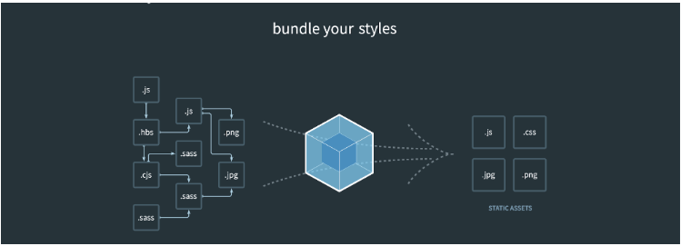
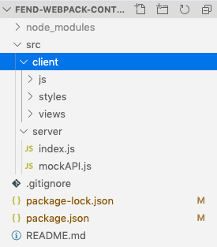
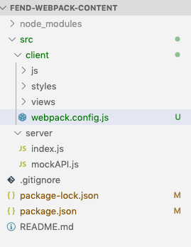

# Why we need build tools for front end projects

As a front-end developer you have a ton of different `libraries` and `technologies` that you have to manage all the time. On a professional scale, professional websites require so many assets, and so many different technologies to be used all the time, it gets really hard to manage cos we actually have to decide at what time all of those libraries are going to run. We can't just throw everything onto the page and hope that it all runs at the right time. 

**General principles that all build tools have in common, and how Webpack fits into that role**

`Build tools` will manage all our `assets` so that we don’t have to be combining them all into a single file (or sometimes a few files). We create a `set of rules `for the build tool to follow, telling it specifically how we want each type of asset handled, and then it follows our rules, takes all the assets and bundles them into a single large file, which has everything loading in the correct order and is much easier for us to deal with. Typically, files with names like `bundle` or `main` are the result of a build tool combining many assets into one.

What does it look like to write these `rules` for a `build tool`? `Rules` are written into `config files`. Just to give you a glimpse of where we’re headed, here is an example `webpack config file`. Don’t worry, this should look like gibberish right now, but we’re just going to take a look at a few things.


```js
module.exports = {
  entry: './src/index.js',
  output: {
    path: path.join(__dirname, 'dist'),
    filename: 'main.js',
  },
  module: {
       rules: [
          {
                test: /\.js$/,
                exclude: /node_modules/,
                loader: "babel-loader",
          },
          {
                test: /\.html$/,
                use: [{ loader: "html-loader"}],
                },
                {
                    test: /\.scss$/,
                    use: [ 'style-loader', 'css-loader', 'sass-loader' ]
                }
       ]
 },
  plugins: [
    new HtmlWebPackPlugin({
           template: "./src/html/index.html",
           filename: "./index.html",
    })
  ]
}
```

One thing to notice is that we’re in `javascript` land! You can see that this `config file` is 100% normal javascript. `Webpack` is entirely built with js.

You can also see a whole section here in the middle titled `“rules”`. Not surprisingly, this is where we declare the `rules` that will govern our different `assets`. You might also have noticed that each `rule` targets a certain `type of file with regex`.

> **Build tools** *allow developers to automate their process for handling website assets, saving them lots of time and headache*. 

**some comon names of build tools:**

- Grunt
- Gulp
- Brunch
- Webpack
- Bower
- NPM

---
> **Interview Question**
> Explain what role build tools play in modern frontend development.

---


# Getting Started with Webpack

The webpack documentation describes itself this way:

> *At its core, webpack is a static module bundler for modern JavaScript applications.*

But…what does that really mean?

This image from the Webpack website is a good visual.



The idea here is that on the left you have all the various `asset file formats` you will probably come across in a project. You might not recognize all the extensions, but just imagine that these are all your `images`, `stylesheets`, `javascripts` and more.

`Webpack` takes all the `assets` on the left and “bundles” or combines them into fewer files that are much easier to manage. Notice that multiple `.js` files on the left became one `.js` file on the right - that’s because the two files were combined into one large `.js file`.

**These tasks would be performed by webpack:**

- running Typescript files
- configure a develoopmant server
- Base64 encoding image files
- adding dynamic css references to html
- run a linter


---
**Interview Question**

Tell us how you have addressed an issue caused by conflicting asset files (or if you haven't experienced this first hand, tell us about a situation where this could happen). Examples could be styles conflicting with a third party stylesheet, or a bug caused by the order of javascript files.

situation: Multiple assets emit different content to the same filename

---

---
**Interview Question**

What information can go into a package.json file? Name everything you can think of.

*Things that must be in your answer*: 

- Npm scripts Dependencies (should mention dev dependencies vs general dependencies) 
- App information (name, version, license, etc..) 

*Potential answers for this question:* 

- Github repo name 
- Starting point 
- NPM privacy

The `package.json` file is kind of a manifest for your project. It can do a lot of things, completely unrelated. It’s a central repository of configuration for tools, for example. It’s also where npm and yarn store the names and versions of the package it installed. 
There are no fixed requirements of what should be in a package.json file, for an application. The only requirement is that it respects the JSON format, otherwise it cannot be read by programs that try to access its properties programmatically.

If you’re building a `Node.js` package that you want to distribute over npm things change radically, and you must have a set of properties that will help other people use it. We’ll see more about this later on.

This is another `package.json`:

```js
{
  "name": "test-project"
}
```

It defines a name property, which tells the name of the app, or package, that’s contained in the same folder where this file lives.

Here’s a much more complex example, which I extracted this from a sample Vue.js application:

```js
{
  "name": "test-project",
  "version": "1.0.0",
  "description": "A Vue.js project",
  "main": "src/main.js",
  "private": true,
  "scripts": {
    "dev": "webpack-dev-server --inline --progress --config build/webpack.dev.conf.js",
    "start": "npm run dev",
    "unit": "jest --config test/unit/jest.conf.js --coverage",
    "test": "npm run unit",
    "lint": "eslint --ext .js,.vue src test/unit",
    "build": "node build/build.js"
  },
  "dependencies": {
    "vue": "^2.5.2"
  },
  "devDependencies": {
    "autoprefixer": "^7.1.2",
    "babel-core": "^6.22.1",
    "babel-eslint": "^8.2.1",
    "babel-helper-vue-jsx-merge-props": "^2.0.3",
    "babel-jest": "^21.0.2",
    "babel-loader": "^7.1.1",
    "babel-plugin-dynamic-import-node": "^1.2.0",
    "babel-plugin-syntax-jsx": "^6.18.0",
    "babel-plugin-transform-es2015-modules-commonjs": "^6.26.0",
    "babel-plugin-transform-runtime": "^6.22.0",
    "babel-plugin-transform-vue-jsx": "^3.5.0",
    "babel-preset-env": "^1.3.2",
    "babel-preset-stage-2": "^6.22.0",
    "chalk": "^2.0.1",
    "copy-webpack-plugin": "^4.0.1",
    "css-loader": "^0.28.0",
    "eslint": "^4.15.0",
    "eslint-config-airbnb-base": "^11.3.0",
    "eslint-friendly-formatter": "^3.0.0",
    "eslint-import-resolver-webpack": "^0.8.3",
    "eslint-loader": "^1.7.1",
    "eslint-plugin-import": "^2.7.0",
    "eslint-plugin-vue": "^4.0.0",
    "extract-text-webpack-plugin": "^3.0.0",
    "file-loader": "^1.1.4",
    "friendly-errors-webpack-plugin": "^1.6.1",
    "html-webpack-plugin": "^2.30.1",
    "jest": "^22.0.4",
    "jest-serializer-vue": "^0.3.0",
    "node-notifier": "^5.1.2",
    "optimize-css-assets-webpack-plugin": "^3.2.0",
    "ora": "^1.2.0",
    "portfinder": "^1.0.13",
    "postcss-import": "^11.0.0",
    "postcss-loader": "^2.0.8",
    "postcss-url": "^7.2.1",
    "rimraf": "^2.6.0",
    "semver": "^5.3.0",
    "shelljs": "^0.7.6",
    "uglifyjs-webpack-plugin": "^1.1.1",
    "url-loader": "^0.5.8",
    "vue-jest": "^1.0.2",
    "vue-loader": "^13.3.0",
    "vue-style-loader": "^3.0.1",
    "vue-template-compiler": "^2.5.2",
    "webpack": "^3.6.0",
    "webpack-bundle-analyzer": "^2.9.0",
    "webpack-dev-server": "^2.9.1",
    "webpack-merge": "^4.1.0"
  },
  "engines": {
    "node": ">= 6.0.0",
    "npm": ">= 3.0.0"
  },
  "browserslist": [
    "> 1%",
    "last 2 versions",
    "not ie <= 8"
  ]
}
```

there are lots of things going on here:

- **name** sets the application/package name
- **version** indicates the current version
- **description** is a brief description of the app/package
- **main** set the entry point for the application
- **private** if set to true prevents the app/package to be accidentally published on npm
- **scripts** defines a set of node scripts you can run
- **dependencies** sets a list of npm packages installed as dependencies
- **devDependencies** sets a list of npm packages installed as development dependencies
- **engines** sets which versions of Node this package/app works on
- **browserslist** is used to tell which browsers (and their versions) you want to support

All those properties are used by either npm or other tools that we can use.

[more detailed here](https://flaviocopes.com/package-json/) 
[and here](https://dev.to/easybuoy/understanding-the-package-json-file-3fdg)
[and the docs](https://docs.npmjs.com/files/package.json)

---


# Install Webpack

> Remember that if you ever get stumped or break your code, you can always check out a fresh start from the git repo. You can check out a specific git branch from a repo with this command:
> `git clone --single-branch --branch <branchname> <remote-repo>`

This course is created, the most recent stable version of `Webpack` is version `4`. `Webpack 4` comes with some significant changes from previous versions, so you will find different information out there if you read an older tutorial.

One of the new things about version `4`, is that `webpack` declared a few `default settings` that are automatically in place when you install `webpack`. So, you might not even need a `webpack config file`. Our `app` won’t be following all the default settings, so we will need a custom `config file`, but it’s just a cool thing that `webpack` changed.

So, first things first, we need to `install webpack`. It is an `npm package`, so we run our usual `npm install command`, and while we’re at it, we’ll install the `CLI tool` as well. A `CLI tool` is a pretty common thing you’ll see accompanying developer tools. Its a `terminal program` that allows you to run `commands` from the `command line` and you install it like a normal `npm package`, so we will install both of these at the same time:

`npm i webpack webpack-cli`

> Remember that *npm i* is just shorthand for *npm install*.

You have been successful when you see `webpack` and `webpack-cli` added to your `package.json` dependencies.


One of the things that's unique to `webpack`, and one of the things that it does that othe build tools don't - is that it's going to build a **dependency tree** for us. That `dependency tree` is going to start in one file and then as `Webpack` goes through that file, it's gonna look for other dependancies that that file requires. 

> Webpack has knowledge of the entire stucture of our application. 

In order to build any map like that Webpack gonna need a starting place that we call **entry point**. To setup pur own `entry point` or to setup a `customized configs` that are outside of that `default Webpack settings` that thy've created in `Webpack4 version`, we're gonna use the file called `webpack.config.js`. 


**our project starting files** 



2. First in our `client` folder let's create `webpack.config.js` file. 




With this file we'll actually be able to override all those `default values`. 
2. Let's add some necessary `require statements` and `module.exports` to `config` file. 

**webpack.config.js**

```js
const path = require('path')
const webpack = require('webpack')

module.exports = {
    
}
```

3. add a new webpack `npm script` to your `package.json`

`"build":"webpack"`

**package.json**

```js
{
  "name": "example-project",
  "version": "1.0.0",
  "main": "index.js",
  "scripts": {
    "test": "echo \"Error: no test specified\" && exit 1",
    "start": "node src/server/index.js",
    "build": "webpack", // add here
  },
  "keywords": [],
  "author": "",
  "license": "ISC",
  "description": "",
  "dependencies": {
    "express": "^4.17.1",
    "webpack": "^4.41.6",
    "webpack-cli": "^3.3.11"
  }
}
```

4. try running webpack (you should get a Webpack error in terminal, but you'll see it trying to run)

`npm run build`

---
**Interview Question**

At work, a project requires the use of a technology that is completely new to you. What steps would you take to learn the required technology?

1. Identify & articulate a real problem to solve
2. Create a knowledge roadmap
3. Start with basic concepts
3. Find some tutorials on real projects, try them
4. Play with YouTube, copy some projects
5. Get your hands dirty and practice
6. Go deep

> Companies want to understand your process, and they really want to know that you are confident and capable of picking up new languages quickly. Most importantly with questions like this, show that you have a process for learning and let your hard work learning code shine to highlight just how quickly you pick up these topics.

---

# Webpack Entry Point

`The Entry Point` is a first major concept of Webpack, and what it's gonna do is to give us a starting place for Webpack to begin to build its dependancy tree.

So, what we need to do is setup that `entry point` for Webpack in our `webpack.config.js` file. 

Now we need to add an `NPM script` that allows us to run Webpack. To do this we need to go to our `package.json` file and add ` "build": "webpack"` in the scripts. This `script` is just goingg to run the `webpack command`. Nom, we gonna add more to the actual command later. 

**package.json**

```js
{
  "name": "example-project",
  "version": "1.0.0",
  "main": "index.js",
  "scripts": {
    "test": "echo \"Error: no test specified\" && exit 1",
    "start": "node src/server/index.js",
    "build": "webpack", // add here
  },
  "keywords": [],
  "author": "",
  "license": "ISC",
  "description": "",
  "dependencies": {
    "express": "^4.17.1",
    "webpack": "^4.41.6",
    "webpack-cli": "^3.3.11"
  }
}

```

Now, in our `webpack.config.js` file we are going to add `an enrty`. Webpack in Version 4, has a default entry, but in our case we need a custom entry. 

`Webpack` is going to make a map of our `app assets` and all of their `dependencies`, but it needs somewhere to start. *The default location* for the webpack entry point is `./src/index.js` - but because we are already set up with `express` and have a slightly different file structure, that file doesn't exist! Instead, we need to tell `webpack` to use a *custom entry point*. For us, that will be:

`’./src/client/index.js’`

**webpack.config.js**

```js
const path = require('path')
const webpack = require('webpack')

module.exports = {
    entry: './src/client/index.js',  //add enrty here 
}
```

That is gonna be the starting poing where `webpack` will begin to buid our tree from. Now, that we have this `enrty point` declaired, we can go and run webpack in the terminal - `npm run build`. 

When we do that we'll see the error, but in this case the error is a good error. And we are getting this error cos we can't resolve `src`. 

`ERROR in Entry module not found: Error: Can't resolve './src' in '/Users/anastasia/Desktop/coding/fend-webpack-content'`

Really, what this is telling us in a not so great way, is that the `client/index.js` file *doesnt't exist* and we need to create it. 

Let's create a new file called `index.js` inside the `src/client` filder.  

[webpack-enrty-point](./webpack-enrty-point.png)

Once we have that we'll be able to run webpack and successfully see it bult. 

We should see in terminal that `main.js` file was created and that it is `0` bytes. This means that webpack was successful.

If we go to our `index.js` file we wanna something to show up. 

**client/index.js**
```js
alert("I EXIST")

```

Now we should see that reflected in our new built file. When that runs we can now see that `main.js` file was created and that it is `17` bytes. 

If we now go to ouf folder structure, we'll see a new folder - `dist`. It's been generated by webpack. 


[webpack-enrty-point-2](./webpack-enrty-point-2.png)

Inside the `dist` folder we now have `main.js` file, which is exactly what webpack said that it build and if we take a liik through it  - *all the code inside has been generated by webpack.* 


---

**Interview Question**

Without using build tools, what are the strategies available to you for loading assets in a particular order?


answer: have several scripts in index.html ???

---

# Output and Loaders

We have setup webpack just enough to be performing the most basic function of webpack - creating a dist folder with a `main.js` file from our entry point. And all of that is great - but none of it is useful yet.

What’s wrong? Let’s take a look:

1. The distribution folder has no connection whatsoever to our app(view). If you start the `express server`, our app is still functioning exactly the same way it did in part `0`.
2. The `main.js` file of our distribution folder contains none of the javascript or other assets we wrote for our webpage.


In short - there are some things wrong with our distribution folder. So it’s time to take a look at customizing the webpack output. The `“output”` of webpack is - no surprise here - the distribution folder. It is where webpack drops or “outputs” the neat bundles of assets it creates from the individual files we point it to.
So we are going to solve the issues above by setting up our `webpack output`, along with a few other tasks required to make it all work.

> Well, the `src` folder - it's all the folders that **you** create, all of the asset files that **you** write, and all of those files that you are going to edit. 

> The `dist` folder - is for giving out to all of the web pages as thy're run, so  *your website that's running for a client or for a user on the browser*, is going to reference the `dist` folder, not the `src` folder. 

> When you go to edit a file and you wanna that change to be seen on the web page, you can change it in the `build file` (in the dist), you'll see the change immediately, but **it won't be permanent**, and if you wanna have the change permanently, then **you need to change the `src files` and rebuild** in order to have those changes into the `build folder`. 

So, in our `index.html` (the view ) we see that the `assets` that we are bringing in  - are the `styles` and `js` files that we've created and there is a `direct reference` to those files in the source, but that's not what we need anymore. 

```html
 <script>
         <script type="text/javascript" src="/js/nameChecker.js"></script>
        <script type="text/javascript" src="/js/formHandler.js"></script>
        <link rel="stylesheet" href="/styles/resets.css">
        <link rel="stylesheet" href="/styles/base.css">
        <link rel="stylesheet" href="/styles/header.css">
        <link rel="stylesheet" href="/styles/form.css">
        <link rel="stylesheet" href="/styles/footer.css">
```

**index.html**

```html
<!DOCTYPE html>
<html lang="en" dir="ltr">
    <head>
        <meta charset="utf-8">
        <title>Test</title>
        <script>
         <script type="text/javascript" src="/js/nameChecker.js"></script>
        <script type="text/javascript" src="/js/formHandler.js"></script>
        <link rel="stylesheet" href="/styles/resets.css">
        <link rel="stylesheet" href="/styles/base.css">
        <link rel="stylesheet" href="/styles/header.css">
        <link rel="stylesheet" href="/styles/form.css">
        <link rel="stylesheet" href="/styles/footer.css">
    </head>

    <body>

        <header>
            <div class="">
                Logo
            </div>
            <div class="">
                navigation
            </div>
        </header>

        <main>
            <section>
                <form class="" onsubmit="return handleSubmit(event)">
                    <input id="name" type="text" name="input" value="" onblur="onBlur()" placeholder="Name">
                    <input type="submit" name="" value="submit" onclick="return handleSubmit(event)" onsubmit="return handleSubmit(event)">
                </form>
            <section>

            <section>
                <strong>Form Results:</strong>
                <div id="results"></div>
            </section>
        </main>

        <footer>
            <p>This is a footer</p>
        </footer>

    </body>
</html>

```

Now we actually need to `reference` the `dist folder` for all of those. So we are going to add a new `reference` to the `dist main.js` file. 

```html
<script type="text/javascript" src="../../../dist/main.js"></script>
```

And we can just get rid of other scripts. 

**index.html**

```html
<!DOCTYPE html>
<html lang="en" dir="ltr">
    <head>
        <meta charset="utf-8">
        <title>Test</title>
        <script type="text/javascript" src="../../../dist/main.js"></script> <!--have just one line here-->
    </head>

    <body>

        <header>
            <div class="">
                Logo
            </div>
            <div class="">
                navigation
            </div>
        </header>

        <main>
            <section>
                <form class="" onsubmit="return handleSubmit(event)">
                    <input id="name" type="text" name="input" value="" onblur="onBlur()" placeholder="Name">
                    <input type="submit" name="" value="submit" onclick="return handleSubmit(event)" onsubmit="return handleSubmit(event)">
                </form>
            <section>

            <section>
                <strong>Form Results:</strong>
                <div id="results"></div>
            </section>
        </main>

        <footer>
            <p>This is a footer</p>
        </footer>

    </body>
</html>
```
 
 Our `html file` is now referencing the correct `distribution file`, but we still have a problem with this code that we need to address and that issue is that our `index.js` (in client folder) file is not taking in any of the JavaScript that we've already built. So, it fact it has no connection to the files that we have in `client/js folder`. In our `client/js folder` we have two files that we need to bring into the `client/index.js` file. 

To do this a common thing that developers will choose to do is to add a tool called **Babel**. `Babel` is a specialised tool that translates one version of JS to another. And it will allow us to use newer versions of JS and the syntax for them, even though the browser doesn't run those natively. 

In the end it will allow us to do is run `import statements` inside of our `index.js` file, in order to bring in the other JS files that we've written.

So, in the next step we gonna install via npm `Babel` and some of the `presets` that Babel needs in order to work with webpack, just in order to be setup. 

`npm i -D @babel/core @babel/preset -env babel-loader` 

or 

`npm install --dev @babel/core @babel/preset -env babel-loader`

it means that we're installing it to `development`. This means that all of the packages that we're installing right now are not for the `production side` of our application, they don't need to be present when we are actually serving our app to users, instead these are just going to be available during the development process. 

`Babel` requires a configuration file. At the root level of our project let's add a new file `.babelrc`. And add some preset configurations. 

**babelrc** file

```js
{
    'presets': ['@babel/preset-env']
}
```

Now we can use Babel to import all of our JS files, and we have access to ES6 syntax, so we can use `import`. 

**index.js**

```js
import { checkForName } from './js/nameChecker'
import { handleSubmit } from './js/formHandler'

console.log(checkForName);

alert("I EXIST")
console.log("CHANGE!!");
```

So, now we have the reference to our `nameChecker` as well as `formHandler` functions. In the files with our functions we need **export** the function, this what allows us to import the file to the `index.js` 

**nameChecker,js**

```js
function checkForName(inputText) {
    console.log("::: Running checkForName :::", inputText);
    let names = [
        "Picard",
        "Janeway",
        "Kirk",
        "Archer",
        "Georgiou"
    ]

    if(names.includes(inputText)) {
        alert("Welcome, Captain!")
    }
}

export { checkForName } //export function 
```

Babel is the this that allows us to use ES6, it's taking this ES6 syntax and turning it into normal JS for our browsers. 

> But in order to use Babel there is one more thing that we need to do and it takes us into our next webpack concept - `loaders`. 

If we come back to our `webpack.config.file` we gonna all **rules** here - these are **loaders** and JS webpack uses `loaders` and `plug-ins` to achieve the `bundling` of all of our assets. 

Here is an example of the `loader` and in particular `babel loader`. 

```js
module.exports = {
    entry: './src/client/index.js',
    mode: 'development',
    devtool: 'source-map',
    stats: 'verbose',
    module: {
        rules: [
            {
                test: '/\.js$/',
                exclude: /node_modules/,
                loader: "babel-loader"
            }
        ]
    },

}
```

This is the first time when we gonna use `rules` in Webpack. We use `regex` - ` test: '/\.js$/',` - to isolate the type of a file that we are going to run this `loader` on. In this case we are looking for anything that ends in `.js`. 

So, when webpack generates the `dependency tree` it's gonna have the whole bunch of different types of files that are in the `dependency tree`. Our rule is saying that any of those asset files that end in `.js`, need to be treated or run through this particular `loader`.  

So, when we import a file to `client/index.js`, it becomes a dependancy that webpack will search through and find. 

It might seem strange that we have to add ANOTHER library before we’re even finished setting up the first library - but believe me, that’s how it goes. Babel itself is also not an easy tool to use necessarily, it requires a bit of setup but it is widely used throughout the javascript world to translate new ES syntax into vanilla js that can run on browsers etc. They describe their tool like this:

Babel is a toolchain that is mainly used to convert ECMAScript 2015+ code into a backwards compatible version of JavaScript in current and older browsers or environments.

>I have personally found it helpful to have babel even on projects that don’t have Webpack. Sometimes I’ll install it just for the convenience … like the convenience of no semicolons or being able to use import/export syntax.

---

**Interview Question**

What is the difference between source code and built code?