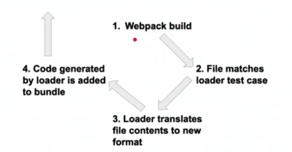
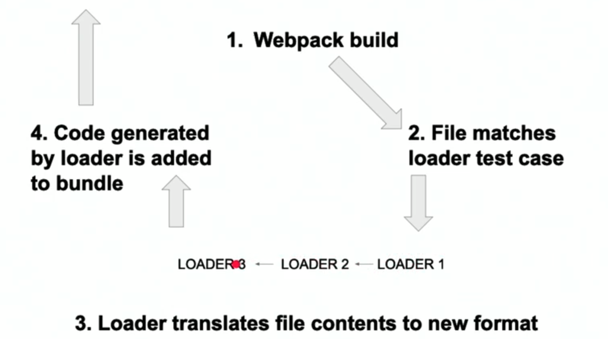

# Sass Basics

`Sass` is the awesome collection of extra syntax for CSS that will help you to write better, more concrete and efficiend styles. 

Why we need `Webpack` in order to write `CSS` and `Sass`? What's so different about `Sass` in order to run our styles? 

It'll be clearer when we realize the `structure` of how the `Internet` works with our `styles` in our `HTML`. We always start with the `Client`. And on the `client` or browser we can run `HTML`, `CSS` or `JS`. But when our `client` makes a request to our `server`, if our `server` has `Sass` instead of `CSS`, it's gonna try and send that `Sass` to the `client`, BUT the `browser` doesn't know what `Sass` is - we cannot have any `Sass` on this side of our application.

So, when we're on the `server` we can use `Webpack` to take the really awesome `Sass files` that we and *turn them into CSS* so that we could send the `CSS` back to the `client`.  

Whenever you're using a `pre-processed CSS library` like `less` or `Sass` - you always need a `build step`. 

When a developer writes a `.scss` file, there is a problem. `Browsers` don’t know what `Sass` is, they don’t run `Sass`, they run `CSS`. `Sass` transpiles to `CSS` - or in more common english - `Sass` can be directly translated to `CSS`. Anything you write in `Sass` can be written in 100% pure CSS, they are equivalent to each other, but the `Sass syntax` is going to be much shorter and easier to write than the `CSS`.

`Sass` now comes with some of its own tools to run that translation process to create `CSS`, but since we’re using `webpack` anyway, we’re going to leverage `webpack` to do that job.

---

**Interview Question**

Name two or three reasons developers often prefer to work with sass or less over vanilla css.

*Some common answers would be*: Terser, more efficient syntax than css (like sass nesting), Extra syntax options (like the sass ampersand), More flexibility (sass variables, mixins, and includes)

---

> The sass website has a good [tutorial](https://sass-lang.com/guide) that will take you through all the basics.

# Sass Nesting

**Nesting** is one of the key features of `Sass`. `HTML elements` are nested, and so `CSS` is nested by nature, but that isn't reflected in CSS syntax. `Sass` allows you to write styles for `nested elements` in a much more intuitive way. Writing `nested sass` can mean that you don't have to create nearly as many individual `classes`, which can save a lot of time and markup. Not only that, but you are much more likely to be able to edit `styles` by only touching the `CSS` file, without having to go back and forth between the `HTML` and `CSS`. As a rule of thumb though, *if you find yourself nesting more than three levels deep, it’s probably time for a new class*.

Take a look at these examples of nesting:

```css
nav {
  ul {
    margin: 0;
    padding: 0;
    list-style: none;
  }

  li { display: inline-block; }

  a {
    display: block;
    padding: 6px 12px;
    text-decoration: none;
  }
}
```

The code above, when translated to css, would become:

```css
nav ul {
  margin: 0;
  padding: 0;
  list-style: none;
}
nav li {
  display: inline-block;
}
nav a {
  display: block;
  padding: 6px 12px;
  text-decoration: none;
}
```

---

**Interview Question**

Explain sass nesting syntax and its advantages over vanilla css.

Nesting allows you to write selectors that mimic the structure of your HTML. This allows you to use shortcuts to create your CSS. For example:

```css
div {
    p {
        color: black;
    }
}
```

Nesting can extend as many levels deep as you wish. What this means is that you can nest elements inside of an element that is in turn nested inside another element.

```css
.first-level {
    .second-level {
        .third-level {
            .fourth-level {
            }
        }
    }
}
```

There is really no limit to the amount of levels deep that you can nest elements. The main thing to remember is just because you can do something does not mean you should. It is generally a good idea to not nest deeper than three levels. Anything more than that starts to affect the readability of the code.

> **Important:** It is not recommended to nest classes deeper than `3` levels.

[read more here](https://www.sitepoint.com/sass-basics-nesting/)

*Benefits of nesting:*

- More natural syntax and easy to read in most cases
- Prevents the need to rewrite selectors multiple times
- Better code organization and structure thanks to its visual hierarchy, which bring us to...
- More maintainable code.

---

# Variables

Another great `sass feature` is actually one that’s available in vanilla `css` as well, but the intentional use of `variables` in stylesheets, especially when [theming](https://css-tricks.com/css-custom-properties-theming/), can make for far more flexible and understandable styles.

```css
$font-stack: Helvetica, sans-serif;
$primary-color: #333;

body {
  font: 100% $font-stack;
  color: $primary-color;
}
```

In CSS becomes:

```css
body {
  font: 100% Helvetica, sans-serif;
  color: #333;
}
```

Perhaps that doesn’t look impressive, but what it means most certainly is. Imagine, you’ve built a `website` with `hard coded values` for font all throughout. The client comes to two days before launch, after the last pass of QA, and tells you that everything looks good but they want to change the `font` (as happens from time to time). You might cringe, because it will take you an hour to go through every single reference to font in the whole app, replace it with the new one and change sizes proportionally. Or, you might sigh a sigh of relief because you used `a sass variable`, and now all of those 170 references to font are all using the same single `variable`, you change that one `value` in your code, and can go to bed early that night instead of staying up and working.

**CSS properties that might be most valuable as css variables:**

- primary and secondary theme colors
- fonts
- line height and padding in paragraphs and sections
- warning colors
- icons
- transitions


Sass variables are denoted with a: `$`

```css
$theme-secondary: #000000;
$font-main: fantasy;
$theme-spacing: 25px;

section.header {
     background: $theme-secondary;
     color: $font-main;
     nav {
           display: flex;
            ul { 
                   margin: $theme-spacing
            }
      }
}
```

# Sass Ampersand

*Style parent with ampersand*

When you do put the `ampersand`  - you're talking about a `parent` that also has a `class` "section". 

```css
.parent{
    &.section{
        color: green;
    }
}
```

The `ampersand` gives you the ability to style smth that is a `parent` and that's truly unique Sass extentions that makes Sass so awesome. 

*Ampersand with css pseudo selectors:*

```css
button.cta{
    border-radius: 3px;
    background: teal;
    color: white;

    &:hover{
        background: aqua;
    }
    &:visited{
        background: fuschia;
    }
}
```

We have a `button` and inside we have nested all of the related styles. This is a great way to organize your styles just because it keeps all of them encapsulated in one easily recognizable place. But this would be a problem without the `ampersand`. With `Sass Ampersand` you can *declare `extra properties` on the `parent`*. When you use `ampersand` with `pseudo selectors`, they become super powerful. 

Another really great place to use this is with animations. 

> [the Sass documentation](https://sass-lang.com/guide) is top-notch

---

**Interview Question**

Choose one piece of sass syntax and explain what it is for, how to use it, and what css it generates.

```css
$font-stack:    Helvetica, sans-serif;
$primary-color: #333;

body {
  font: 100% $font-stack;
  color: $primary-color;
}
```

Here we use `variables` to have the ability later reuse their values throughout of our stylesheet without the need of rewriting them every time. In case of css we will write the values for font and color for every element where we need it, and if we'll need to change it in the future we'll have to change every element that have these values. 

> Have fun with this question! They’ve given you free reign to give whatever answer you are most prepared for. So be confident and excited, maybe even tell them your favorite piece of sass syntax and why you like it.

---

# Webpack and Sass

So now for the `webpack` portion of all of this. Like we talked about earlier, we are going to use `webpack loaders` to turn our `sass` into `css`. 

*So, how to setup `Sass` with `Webpack`*

1. First let’s install all the tools we’ll need:

`npm i -D style-loader node-sass css-loader sass-loader`

2. Then add this test case to the `rules array` in your `dev webpack config`.

```js
{
        test: /\.scss$/,
        use: [ 'style-loader', 'css-loader', 'sass-loader' ]
}
```

When you see a `rule` that has a `test case` and then a `use case` (like we have above), and there are several `loaders` with the `use case`. What are all of these `loaders` doing here? Actually, *they are chainable* - you can have the one `loader` take the `output` or you can make one `loader` run on a `CSS file` or `Sass file`. And you can have it take the `output` that it would generate and  instead of just outputting it in the `dist folder`, actually give it to anoher `loader` to process that same information and then that `loader` can give it to another and another and so on, until you get that `content` to the `format` that you want it to be in your `dist folder`. 

So, let's look detailed. In our normal `loader flow`, you would have:

1. `Webpack build`, so it would run your `build dev` or `build prod`. 
2. When you did that, your file would either match a `loader test case` or it wouldn't.
3. If the file being looked at by Webpack mathces the `loader test case`, then the `contents` of that file is going to get run through the `loader`, which could be a "babel-loader", a "file-loader" or any number of `webpack loaders` that exist. 

But whatever job that `loader` does, at the end, you gonna end up with new content that somehow *translated* from the original `content`.
4.  Then you r `loader`is going to add that translated `content` into the `main.js` or  whatever your `bundled file` is called. And all of that code is what ends up in your `dist folder`. 

But actually, this graph is very simplistic picture of what is going on. 



If you look at it more specifically, then we have `multiple loaders` going on in step #3. And really what's happening is a file is going to match our `loader test case` with the `regex mathcer` and the `contents` of that is going to be given to the `first loader`. And once this `loader` is done with that or it has translated the `content` into whatever `format`, it's gonna give the `output` to loader 2 and it becomes this assembly line of changing our `content` into our desired `format` which would be the last loader. 



> There are some really tricky things about this. So, chaining `loaders` is a really powerful tool, but you have to know how to use the `syntax`. And the tricky part is that `chained loaders` run **from right to left**. In our case

` use: [ 'style-loader', 'css-loader', 'sass-loader' ]`

the `sass loader` would be the first loader to run and the `css loader` would be the second, and the `style loader` would be the last and it would get all of its `content` from the `css loader`.

If you know about this tricky part, you have the power to combine multiple loaders in whatever way you want. 

> The other important thing to remember is that the thing that allows us to chain all the loader is the `"use" keyword`. So, the `use keyword` allows us to *input an array of loaders*, and that's what allows us to chain them. 

Well, if you think back to how we got the javascript files into our main.js, we are missing one of those steps for our css. **Really, there are three things you have to do to use webpack loaders. You have to:**

- install the `loader`
- call the `loader` in the `webpack config` while targeting the correct file extensions
- require the files in `index.js`

And there you have it. We have all this lovely `sass code`, but we never tell `webpack` that it is **required**. And because of the dependency tree that `webpack` builds, if nothing ever requires a file, it’s as if it doesn’t exist.

So, to fix that, let’s go to `client/index.js`.

Because of `css-loader`, we can add some lines like this:

**client/index.js**

```js
import { checkForName } from './js/nameChecker'
import { handleSubmit } from './js/formHandler'

import './styles/resets.scss' //require styles

console.log(checkForName);

alert("I EXIST")
console.log("CHANGE!!");
```

This time check the `main.js` for some of our `sass styles`, and they should just be there!

> Now, one thing that might feel awkward, is that all of our `css styles` are being run through our `main.js`. `Webpack` natively only understands `javascript`, so it makes sense that until we tell it to do otherwise, it turns everything into javascript by default. Now, this isn’t a problem for `development mode` necessarily, but it can cause `styles` to load a split second after `content` on the `server`, so we are going to have to clean that up for `production mode` later on.

---

**Interview Question**

Explain the practice of chaining loaders in webpack. What is the value of this webpack feature, how is it implemented, etc.

*possible answer*: you can chain loaders to finally get the content in the format you really need it to be finally in the distribution folder. You should go through several steps implementing it: 1. install the loader; 2. call the loader in the "webpack config" while targeting the correct file extensions; 3. and require the files in the index.js. 

---

**There are so many more things that you can do with loaders that we just don’t have time to go into. Some of these things include:**

- [Loading images](https://medium.com/a-beginners-guide-for-webpack-2/handling-images-e1a2a2c28f8d)
- [Working in typescript or other languages that compile to javascript](https://webpack.js.org/guides/typescript/)
- Working with third party style and js libraries like [Bootstrap](https://getbootstrap.com/docs/4.0/getting-started/webpack/) or [Material](https://material.io/develop/web/docs/getting-started/)

> As a front end developer, proficiency with styling is of utmost importance. And it isn't always as easy at it seems. For some great `css` and `sass` tutorials, take a look at these resources:

- [A to Z CSS](https://www.sitepoint.com/tag/atoz-css/)
- [Getting Started with Sass](https://scotch.io/tutorials/getting-started-with-sass)