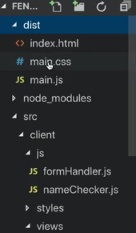

# Broken Project

As we have gone along setting up this project, we have let all functionality slide. We just got our styles to show up again, but now, what about our click events? What if we wanted to make an API call or add pages to this app?

Well, our app is broken:

- JS `event code` isn't running
- our `Express server` isn't doing anything
It't important that we *reset* our `Express server` beacause our `production build`, that we also haven't setup yet, is going to rely on our `Express server`. 
- out `production build` isn't setup

1. Let's dive into why our `JS code` isn't working. `Webpack` try to keep the global scope really clean! And we know that it's a good thing to keep the global scope clean. BUT what that means is that Webpack puts all of our code into encapsulated little libraries and that can be a great thing, and it is a great thing. BUT it can also mean tha we have some problems and those problems are actually what are breaking our code right now. 

If you look under the hood of what Webpack is actually doing, Webpack usese **IIFE's** to separate all of our code and keep it neatly organized into its own little chunks. That if what IIFE's are for. 

[read more about IIFE's](https://medium.com/javascript-in-plain-english/https-medium-com-javascript-in-plain-english-stop-feeling-iffy-about-using-an-iife-7b0292aba174)
[and read more about IIFE's](https://medium.com/@vvkchandra/essential-javascript-mastering-immediately-invoked-function-expressions-67791338ddc6)
[and here](https://stackabuse.com/javascripts-immediately-invoked-function-expressions/)
[and one more time here](https://tylermcginnis.com/javascript-modules-iifes-commonjs-esmodules/)

These little chunks of code *can't always talk to each other* - and that is what is breaking our `event code`.  

Let's take a look at a bit more `JS scope setup`. Webpack is dealing a lot with JS so it encapsulates each chunk of JS into a `scope layer`. You can imagine that if all of our JS code, especially if this were a large application, we could have thouthands of lines of JS, and if `Webpack` didn't encapsulate everythingwe would end up with just all of our stuff thrown into one huge `global scope` and we we would have to make sure that `variable names` didn't conflict with other `variable  names` and it would be chaos like we see in the pickture below ('without scope' part). 


But with `scope` (the left side of the picture) we have these neatly stacked layers and the `IIFE's` are what allow `Webpack` to do that. Now, one problem with that is that sometimes we lose communication between `"function"` and `"global"` scope layers. The `browser events` like our "form submit" are happening on the `global level` but our code - the custom JS that we wrote - is happening  on the `function level`. And our problem is that we lack the communication between these two layers. 

So, what we need to do is come up with a fix that allows our `functions` to to be *callable* by the `global scope` or when a `browser event` happens. 

[MDN docks about IIFE's](https://developer.mozilla.org/en-US/docs/Glossary/IIFE)

**Some benefits of using IIFE's:**

- they keep variables out of the global scope
- they run directly after being defined, so you don't have to name them
- when you use them, you don't have to worry about variables you write overlapping with variables from third party code

---

QUESTION: 

What is wrong with this IIFE?

```js
function foo() {
...javascript
}();
```

answer: 

Potentially there are other answers, but the big one that you shouldn’t miss, is that this is an invalid IIFE because it is a named function. If I were asked this in an interview, I wouldn’t stop at saying why it is an invalid IIFE - a question like this is an opportunity to tell the interviewer everything you know about the topic. It isn’t going to far to talk about a time that you used them, or a lightbulb moment you had while learning about it.

---

# Fixing our Functionality 

If we take a look at this code, we added a new section called `"output"`. 

```js
module.exports = {
    entry: './src/client/index.js',
    mode: 'development',
    devtool: 'source-map',
    stats: 'verbose',
    output: {
        libraryTarget: 'var',
        library: 'Client'
    }
}
```

Up untill now, we've use the default settings for `output`. But to make JS work we've added the `library` and `libraryTarget` settings. You just know that our JS files, our custom JS (on the client side), is now going to be put into our own `librarly` that we've called `"Client"`. The name "client" isn't important, you can choose any name. BUT what's important to understand here is that *all of our JS code is now going to be accessable through the `client library`*. 

What does that really mean? How is Webpack going to let us use this new `client library` and how does that help us? 

First of we need to come to our `client/index.js` file that has both of our JS files being imported. 

**client/index.js**

```js
import { checkForName } from './js/nameChecker'
import { handleSubmit } from './js/formHandler'

console.log(checkForName);

alert("I EXIST")
console.log("CHANGE!!");
```

And we are going to actually *export* these files into the `client library`. 

**client/index.js**

```js
import { checkForName } from './js/nameChecker'
import { handleSubmit } from './js/formHandler'

console.log(checkForName);

alert("I EXIST")
console.log("CHANGE!!");

export {               //export to client library
    checkForName,
    handleSubmit
}
```

How it's get to the `client library` it's done by `Webpack` and we don't have to worry about it. Here we just need to know that all of our JS is being exported from the `client/index.js` file and now it's going to be a part of that `client library`. 

But how does that actually get used in our `index.html` ??? If we come to the `client/index.html` and look at the `custom handle submit function` that we've created, this is not goint to work. 

**client/index.html**

```html
 <section>
                <form class="" onsubmit="return handleSubmit(event)">
                    <input id="name" type="text" name="input" value="" onblur="onBlur()" placeholder="Name">
                    <input type="submit" name="" value="submit" onclick="return handleSubmit(event)" onsubmit="return handleSubmit(event)">
                </form>
<section>
```

Now, we can add `client.handleSubmit` and this is going to refernse our `custom function` that is now being exported to the `client library`. 

**client/index.html**

```html
 <section>
                <form class="" onsubmit="return Client.handleSubmit(event)">
                    <input id="name" type="text" name="input" value="" onblur="onBlur()" placeholder="Name">
                    <input type="submit" name="" value="submit" onclick="return Client.handleSubmit(event)" onsubmit="return Client.handleSubmit(event)">
                </form>
<section>
```

And if we make this change universally through this file and through all of our JS, we will have fixed all of our JS issues. 

If we go to our **formHandler.js** file, just know that all throughout any of the JS that you've written *it now need to referense the Client library*. In our example we need to make sure that we referense our `checkForName` function through the `client library`. 

```js
function handleSubmit(event) {
    event.preventDefault()

    // check what text was put into the form field
    let formText = document.getElementById('name').value
    
    Client.checkForName(formText)   //add client here 

    console.log("::: Form Submitted :::")
    fetch('http://localhost:8080/test')
    .then(res => res.json())
    .then(function(res) {
        document.getElementById('results').innerHTML = res.message
    })
}

export { handleSubmit }
```

2. Now let's address what's going wrong with our `Express server`.

We have been using the `webpack-dev-server` in development, which is an awesome tool because we don't have to restart our `browser` every time that we make a style change. We get to watch that update happen in live time in our browser. 
BUT when we use this in production, we can't use the `webpack-dev-server`. So, we need to make sure that our `Express server` is setup correctly so that we can use it in `production`. 

Actually we have been using `webpack-dev-server` that *doesn't rebuld* our `main.js`. So the `main.js` file in the `dist folder` that we are looking at is the same that we've built right before we added the `webpack-dev-server`. So, some work needs to be done here. 

In our `formHandler` function we were doing a fetch request. This is a good example of `fetch request` that you can put into the code of your app that could reference a local file, and could also go to an external third party API. And it's here as a reference for you, so that you can make references to an API for your project. 

**formHandler.js**

```js
function handleSubmit(event) {
    event.preventDefault()

    // check what text was put into the form field
    let formText = document.getElementById('name').value
    
    checkForName(formText)

    console.log("::: Form Submitted :::")
    fetch('http://localhost:8080/test')
    .then(res => res.json())
    .then(function(res) {
        document.getElementById('results').innerHTML = res.message
    })
}

export { handleSubmit }
```

But right now we are looking for a file at `port 8080` called `test`. This points out one thing about the `webpack-dev-server` which is *only good for `single-page-apps`*. If you need to start working with multiple pages, like if we were trying to look for a `test page on the 8080 port of the dev server`, it wouldn't work. We would have to do some extra configuration or you might have to handle your own solution if you want the `dev server` to do that. 

So, this `fetch request` simulates the fetch request you might make to another API. BUT if we go and look at our `server/index.js` file, we can see that the way we had set up at the beginning was to use `port 8080` which conflicts with our `dev server` that's also running on port 8080. And you can't run two apps on the same `port` at the same time. So that forces us to change it to be `port 8081`.

**server/index.js**

```js
var path = require('path')
const express = require('express')
const mockAPIResponse = require('./mockAPI.js')

const app = express()

app.use(express.static('dist'))

console.log(__dirname)

app.get('/', function (req, res) {
    res.sendFile('dist/index.html')
})


app.listen(8081, function () {                           //change the port here         
    console.log('Example app listening on port 8081!')  
})

app.get('/test', function (req, res) {
    res.send(mockAPIResponse)
})
```

Now we can run this `server` at the same time as we run our `webpack server`. 

---

**Interview Question**

Explain scope in javascript. It might be easier if you choose an example to walk through.

**answer:**

Scope is the accessibility of variables, functions, and objects in some particular part of your code during runtime. Scope provides some level of security to your code. 

In the JavaScript language there are two types of scopes:

- Global Scope

```js
var x = 'global!';

//inside a function
function encapsulate(){

z = 'global here, too!';

}
```

- Local Scope

```js
var func = function(){
  var local = true;
};

console.log(local); //this is outside of the scope and it will give us an error, cos there is no global variable there
```

Variables defined inside a function are in local scope while variables defined outside of a function are in the global scope. Global variables can be accessed anywhere in your application.

> This question is likely to come up in some form or another in a javascript interview. Even if they never ask about scope directly, they will most likely ask a question that revolves around your knowledge of scope. But it is a frustratingly abstract and difficult concept to answer point blank. The simplest answer is to say that scope is where a variable can be seen. But you need to go into better detail than that, so most people choose an allegory or code examples. No one expects your answer to be perfect, so just try your best to get the point across. This is also a great interview question to show off your communication skills. A big part of being a developer is being able to clearly explain complex and technical topics, especially to non-technical people.

[read detailed here](https://scotch.io/tutorials/understanding-scope-in-javascript)

---

# Webpack for Production

Now we have a usable and fairly well set up `development environment` for `webpack` with `express`. But though our `development environment` has gotten a lot of attention lately, we haven’t done much with our `production config`. So we’ll give it some love in this section. Thankfully, just by setting mode as `“production”` webpack knows to do some optimizations. For instance, have you noticed that the `main.js` file is not minified in `development`, but is minified for `production`? That’s webpack automatically knowing what we want, just because we specified the mode.

When we bundle assets for production, I like to think of it like your app is going on a camping trip and you have to pack the bag. Everything your app needs to run has to be there, but you have to make it as small and light as possible, or else your app won’t do very well on its trip.

Every `front-end developer` is concerned of how fast their `website` is going to run for `users`, and the biggest contributers to slow website are lots of styles, lots of JS and either large or many images. 

To make a website run faster, we have to make it smaller. The smaller the webpages, the fewer bytes are being sent over the internet to the user; therefore the faster that the website should be able to run. 
When it comes to making a webpage smaller, we only have *two options*. We can either making a web page smaller by taking away JS or styles or images, or we can make it smaller by *compressing* both assets into a smaller format. And our `webpack config` can actually do a lot of that minifying for us. 

**A Better Production Config:** 

The biggest contributers to slow sites are: 
- JS
- Styles
- Big images

- for a better production build, minify all JS and styles
- webpack minifies JS by default in production mode
- all of our styles are currently inline - inline styles are slow
- add the `mini CSS Extract plugin`

Right now in the `webpack dev server` it takes all of our syules and puts them into the `main.js`  and then adds them into our `HTML` via `inline styles`. The problem is that inline styles are slow, and to be most efficient, *we need to take all our styles and move them into a CSS file that can be minified*. 

So, we are going to add a `mini CSS Extract` plugin that's going to do that staeps for us. So, first we install in via npm `npm install --save-dev mini-css-extract-plugin`. And include it in our `webpack.prod.js` file. And then instantiate it in our plugins list. 

**webpack.prod.js**

```js
const path = require('path')
const webpack = require('webpack')
const HtmlWebPackPlugin = require("html-webpack-plugin")
const MiniCssExtractPlugin = require('mini-css-extract-plugin')  //include plugin

module.exports = {
    entry: './src/client/index.js',
    mode: 'production',
    module: {
        rules: [
            {
                test: '/\.js$/',
                exclude: /node_modules/,
                loader: "babel-loader"
            }
        ]
    },
    plugins: [
        new HtmlWebPackPlugin({
            template: "./src/client/views/index.html",
            filename: "./index.html",
        }),
        new MiniCssExtractPlugin({filename: '[name].css'})  //instantiate here
    ]
}
```

One of the unique things about the `mini CSS extract plugin` is that gives us a loader that we can use much like we did with the `saas` and `CSS loaders` in the previous lesson in our `dev config`. So, we are going to add a *new set of rules* that will handle all our style sheets for `production`. 

**webpack.prod.js**

```js
const path = require('path')
const webpack = require('webpack')
const HtmlWebPackPlugin = require("html-webpack-plugin")
const MiniCssExtractPlugin = require('mini-css-extract-plugin')  

module.exports = {
    entry: './src/client/index.js',
    mode: 'production',
    module: {
        rules: [
            {
                test: '/\.js$/',
                exclude: /node_modules/,
                loader: "babel-loader"
            }, 
            {
                test: /\.scss$/,            //new rules
                use: [MiniCssExtractPlugin.loader, 'css-loader', 'sass-loader' ]
            }
        ]
    },
    plugins: [
        new HtmlWebPackPlugin({
            template: "./src/client/views/index.html",
            filename: "./index.html",
        }),
        new MiniCssExtractPlugin({filename: '[name].css'})  
    ]
}
```

Here you can see that we are again looking for a `scss file extention`, but instead of the `css style-loader` that we used in the `dev config`. We actually wanna extract all of our CSS to its own file that's going to be added to the `dist folder`. Now we can run `npm build-prod` command. Now we should see a new file in our `dist folder` - which is `main.css`. 



When you look at this css file it has all of the styles from all of our style sheets concatenated together. This is easily human-readable, which means it hasn't been minified yet. All we are doing at this point is extracting this CSS that would normally go to our `main.js` file if we were running the `webpack dev server`, but now we've brought it out into our own `main.css`. 

Now, this is a file, that we're going to minify to make the file size smaller for our end users. To do that last minification step, we gonna ad a new piece to our `webpack.prod.js file`. This is the `optimisation attribute`  - and what it's gonna do is allow us to run minimizing actions on certain files. In this case we ganna use two new plugins to do our optimization work. The first one is - the `Terser` plugin and the second is `OptimizeCSSAssetsPlugin`. 

First we install all the plugins that we need:

- `$ npm install terser-webpack-plugin --save-dev`
- `npm i -D optimize-css-assets-webpack-plugin`

And we need to add the `requred statement` for both of them.

**webpack.prod.js**

```js
const path = require('path')
const webpack = require('webpack')
const HtmlWebPackPlugin = require("html-webpack-plugin")
const MiniCssExtractPlugin = require('mini-css-extract-plugin')
const OptimizeCSSAssetsPlugin = require('optimize-css-assets-webpack-plugin') //require plugin
const TerserPlugin = require('terser-webpack-plugin')   //require plugin

module.exports = {
    entry: './src/client/index.js',
    mode: 'production',
    optimization: {            //optimisation attribute
     minimizer: [new TerserPlugin({}), new OptimizeCSSAssetsPlugin({})]
    },
    module: {
        rules: [
            {
                test: '/\.js$/',
                exclude: /node_modules/,
                loader: "babel-loader"
            },
            {
                test: /\.scss$/,
                use: [MiniCssExtractPlugin.loader, 'css-loader', 'sass-loader' ]
            }
        ]
    },
    plugins: [
        new HtmlWebPackPlugin({
            template: "./src/client/views/index.html",
            filename: "./index.html",
        }),
        new MiniCssExtractPlugin({filename: '[name].css'})
    ]
}
```

The cool thing about this plugins that we are initializing them in the `optimizer attribute` and not in the `plugins list`. Now we can rerun our `npm run build-prod` and see the modified CSS file on the other side. 

---

**Interview Question**

What is the purpose of a `.map` file?

The `.map` files are for js and css (and now ts too) files that have been minified. They are called `SourceMaps`. When you minify a file, like the `index.js` file, it takes thousands of lines of pretty code and turns it into only a few lines of ugly code. Hopefully, when you are shipping your code to `production`, you are using the minified code instead of the full, unminified version. When your app is in production, and has an error, the sourcemap will help take your ugly file, and will allow you to see the original version of the code. If you didn't have the sourcemap, then any error would seem cryptic at best.

Same for `CSS` files. Once you take a `SASS` or `LESS` file and compile it to `CSS`, it looks nothing like it's original form. If you enable sourcemaps, then you can see the original state of the file, instead of the modified state.

- What is it for? : To de-reference uglified code
- How can a developer use it? : You use it for debugging a production app. In development mode you can use the full version of Angular. In production, you would use the minified version.
- Should I care about creating a `js.map` file?:  If you care about being able to debug production code easier, then yes, you should do it.
- How does it get created? : It is created at build time. There are build tools that can build your .map file for you as it does other files. [read](https://github.com/gruntjs/grunt-contrib-uglify/issues/71)

So, Map files keep track of which source files the code in your bundled file comes from. This is incredibbly handy when debugging. Without a map file, you would get an error that says it is coming from like 1783 of bundle.js - which isn’t very helpful, but with a source map turned on it would tell you the file name and line where the error is occuring. Much better!

---

**A real life example**

Just as a bit of extra for how knowing all of this about `production` builds can be useful, take this example. Imagine you just took on a new client, and want to give them a report of their current site before starting on any `development` work (that is a great thing to do for all your clients, by the way). `Minimizing assets` can be an easy win. You might be able to bump a client's page speed considerably, just by minimizing their `stylesheets`, if they aren't being minimized already. You can also check if styles are being loaded that are never used on the page.

`Webpack` allows us to do some really powerful optimizations for `production`, and we have only scratched the surface here, but we have done probably the most important tasks. If you want to delve more into production optimizations, webpack has its [own documentation](https://webpack.js.org/guides/production/) for this and reading `plugin documentation` like Terser’s will have lots of ways to help you.

> If you feel comfortable with `webpack` and what we've done so far, you might have noticed that our `webpack config` files don't exactly follow the `DRY principle`. There is definitely going to be some overlap between our `prod` and `dev` configs. `Webpack` recognizes this and has actually created a `webpack merge plugin` that allows you to create a `webpack config file` that is generic across all your `configs`, that can be merged with another `config` to contain exactly the settings you need. Create a new branch on your repo, then see if you can get it working.

# What are Service Workers

`Service Wokers` is a piece of JS that runs between our app and the Internet, and runs in the background to allow us to do some really cool things like `push notifications` or even offline content. 

`Google Workbox` makes working with basic `Service Workers` incredibly convenient. We are going to follow their setup instructions, the steps are going to feel very familiar by now, because `Google Workbox` created a `webpack plugin` for us.

So, we do our three steps:

- Install the plugin: `npm install workbox-webpack-plugin --save-dev`
- Require the plugin in `prod`: `const WorkboxPlugin = require('workbox-webpack-plugin');`
- Add the plugin: `new WorkboxPlugin.GenerateSW()`

We are going to add `service workers` to `prod`, because to **allow offline access**, what the `service workers` actually do is create a `cached version` of your website that they can supply if the `server` can’t be reached. But we don’t want that caching around our `dev` site, so we won’t add this to our `dev config` at all.

Like we’ve learned with most `plugins`, when we call the generate `service workers function`, we have the ability to pass in some `options`. There are lots of cool `options` you can choose from, to do things like `cache images` at runtime, limit the max size of your `cache`, etc. For now, we are going to stick with the default settings.

If you follow along with the documentation, there’s one more step. *We need to register a Service Worker with our app*. To do this, we will add a `script` to our `html file` and call the `register service worker function` if the `browser` supports `service workers`.

Add this code to the bottom of your html file, just above the closing body tag.

```html
<script>
    // Check that service workers are supported
    if ('serviceWorker' in navigator) {
        // Use the window load event to keep the page load performant
        window.addEventListener('load', () => {
            navigator.serviceWorker.register('/service-worker.js');
        });
    }
</script>
```

[Google Workbox PWA tutorial](https://codelabs.developers.google.com/codelabs/workbox-lab/#0). Your knowledge of webpack and service workers will put you in a good place to get started.


> to turn off the server in the terminal  use Control+C or "Close App" below, or else your app window will close.

If you want some more advanced webpack topics to research next, might I suggest these:

- [Code splitting/lazy loading](https://webpack.js.org/guides/code-splitting/) (spoiler - they're the same thing in webpack)
- [Tree shaking or dead code elimination](https://webpack.js.org/guides/tree-shaking/)
- [A list of plugins and tutorials for more webpack fun](https://github.com/markerikson/react-redux-links/blob/master/webpack-advanced-techniques.md)
- If you want to hear someone who works for Webpack explain webpack, [here’s a video](https://www.netlify.com/blog/2017/01/03/4-key-concepts-of-webpack/)

---

**Interview Question**

- What excites or interests you about coding? Tell us about what you've build recently and why you enjoyed it.
- What is a recent technical challenge you experienced and how did you solve it?

---


