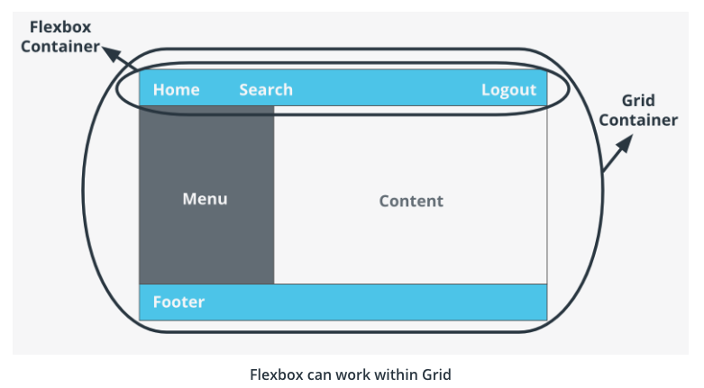

# Grid

## Grid vs Flexbox

`Flexbox` is for how content flows, `Grid` is for how content is placed - i.e. grid works nicely for page layouts, flex works nicely for regions within the grid.

## An Example of Grid vs Flexbox

An excellent way to use `flexbox` and `grid` together is by creating the `layout` of a webpage with `grid` and then organizing the `flow of the content` with `flex`. 

To use CSS `Grid` set the `display` property of the container element to `grid`.



**Recap**

CSS Grid v. Flexbox

- Grid is two dimensional, while Flex is one
- Grid is layout first, while Flexbox is content first
- Flex is for components of an app, Grid is for the app layout itself

CSS Grid does not replace Flexbox. Each can achieve things that the other is not capable of, and in fact a true master can use Flexbox and CSS Grid together in harmony to create the ultimate webpage layout.

At the highest level CSS Grid excels at creating layouts for a webpage, while Flexbox is a master of content flow for each element that makes up the page layout.

**Further Research**

For more information on CSS Grid and Flexbox together see the articles below:

- [Beginner’s Guide to choosing between CSS Grid and Flexbox](https://medium.com/youstart-labs/beginners-guide-to-choose-between-css-grid-and-flexbox-783005dd2412)
- [The Ultimate CSS Battle: Grid vs. Flexbox](https://hackernoon.com/the-ultimate-css-battle-grid-vs-flexbox-d40da0449faf)
- [Does CSS Grid Replace Flexbox?](https://css-tricks.com/css-grid-replace-flexbox/)

## Rows and Columns

CSS Grid is a two-dimensional - which means you can organise your content layout in rows and columns. 

Rows and columns come together to make areas, which can be named. 

After setting the display property of your container `div` to `grid`, the next step is to set the rows and columns in your grid which can be done with the CSS properties:

- grid-template-columns
- grid-template-rows

And to define gutters between rows and columns you can use the property grid-gap (to find the distanse inbetween each row and column) on the parent container that has the `display` property set to `grid`.

**Rows & Columns in Action**

`grid-template-columns` is the property that defines the column layout of your grid - that is how many sections the page should be divided into vertically. The values for this property are the explicit value for each column and the number of columns is defined implicitly by the number of values entered. For example:

```css
grid-template-columns: 60px 60px;
```
would create two columns of 60px each. If you had two items inside your grid and didn't set their position explicitly, the first item would be placed in the first column and the second item in the second. 

`grid-template-rows` follows the same logic, so that:

```css
grid-template-columns: 60px 60px;
grid-template-rows: 160px 60px;
```

would create a `grid` with two `columns` and two `rows`.

The layout of a grid is defined using `grid-template-columns` and `grid-template-rows`.

**Further Research**

To explore grid setup deeper, you can check out this cool [grid visualizer and generator](https://cssgrid-generator.netlify.com/).

## Grid Areas

The grid-area property specifies a particular area or set of rows and columns that a grid item occupies. It is applied to the grid item itself with CSS. Here is an example:

```css 
.item{
  grid-area: 1/2/3/3
}
```
Because `grid-area` is shorthand for the properties: `grid-row-start`, `grid-column-start`, `grid-row-end` and `grid-column-end`, the code above places the item from rows 1-3, and columns 2-3.

**Working with Grid Areas**

The `grid-area` property defines the space an element takes up in the grid by setting values for the row it starts and ends in, and the column it starts and ends in. In practice it could look like this:

  ```css
  #one { 
    /* row start/column start/ row end/ column end */
    grid-area: 1/2/3/3;
  }
  ```

In this example the element with the `id`, `one` would start at the first row and the first column, and end at the third row (which is the end of the second row if there is no third row) and the third column.

Grid Areas Summary
grid-template-areas is the property used to name the rows and columns of a grid and to set its layout. It could look like this:

```css
  .container {
      display:grid;
      grid-template-columns: 300px 300px 300px;
      grid-template-rows: 250px 600px;
      grid-template-areas: 
      "hd hd hd hd hd hd hd hd"
      "sd sd sd main main main main main"
      "ft ft ft ft ft ft ft ft";
  }
  ```
The named areas in the grid are then assigned to each element according to where you want them to be displayed in the grid:

```css
.header {
  grid-area: hd;
}
```
In the example above the element with the class header will stretch across the entire first row of columns because we have assigned it the grid-area hd, and we have defined the area hd with the value for grid-template-areas in the parent element.

**Further Research**

There is so much flexibility with CSS grid! To learn even more about what you can do with grid-areas see the [Complete Guide to Grid, from CSS-Tricks here](https://css-tricks.com/snippets/css/complete-guide-grid/).

## Advanced Grid

CSS Grid includes advanced capabilities for creating large and complex grids. These are algorithmic values and powerful tools for creatind dynamic layouts on the web. Some of these are:

- the `fr` Unit - allow us to take up the rest of the available space
- Track listings with `repeat()` notation
- Track sizing and `minmax()` - lets us set ranges for our rows and columns so that they don't have to be set.

