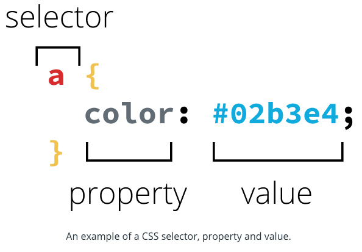
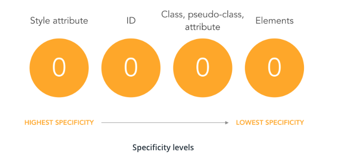
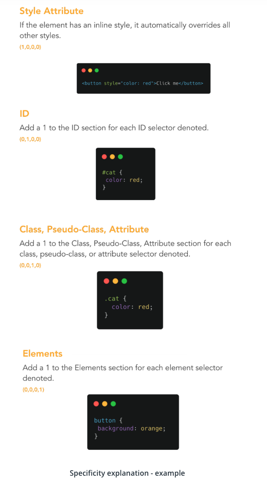
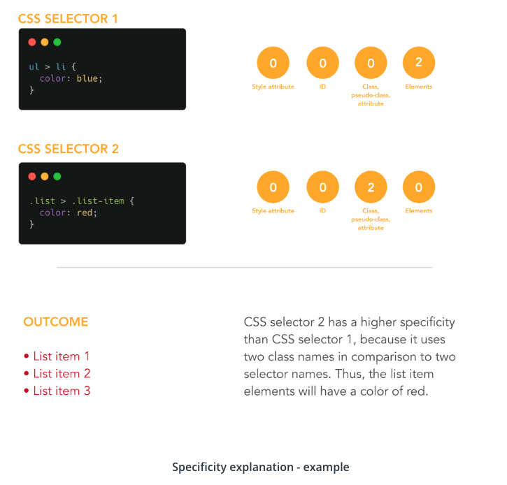
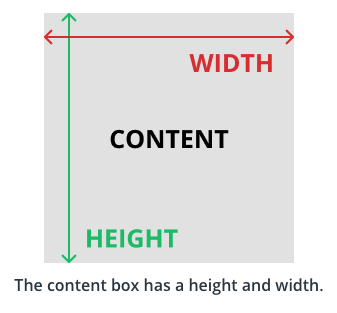
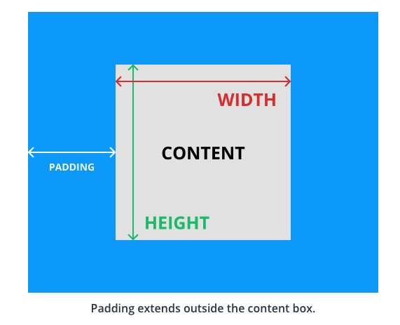
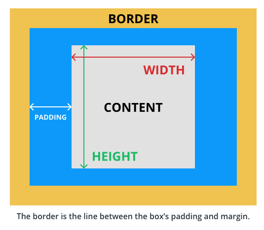
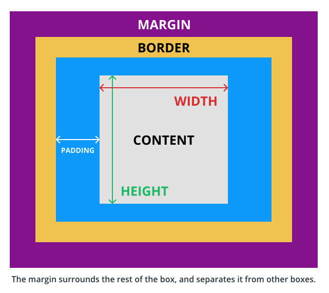

# CSS

## CSS Selectors

**Tags**

In this section, you'll learn how to use different visual CSS guidelines to style elements individually and by group.

CSS can select HTML elements by using an element’s tag name. A tag name is the word (or character) between HTML angle brackets.

For example, in HTML, the tag for a paragraph element is <p>. The CSS syntax for selecting <p> elements is:

```css
p {
  color: red;
}
```

In the example above, all paragraph elements will be selected using a CSS selector. The selector in the example above is p. Note that the CSS selector matches the HTML tag for that element, but without the angle brackets.

In addition, two curly braces follow immediately after the selector (an opening and closing brace, respectively). Any CSS properties will go inside of the curly braces to style the selected elements.



**Classes**

CSS is not limited to selecting elements by tag name. HTML elements can have more than just a tag name; they can also have attributes. One common attribute is the class attribute. It’s also possible to select an element by its class attribute.

For example, consider the following HTML:

`<p class="brand">Sole Shoe Company</p>`

The paragraph element in the example above has a class attribute within the <p> tag. The class attribute is set to "brand". To select this element using CSS, we could use the following CSS selector:

```css
.brand {

}
```
To select an HTML element by its class using CSS, a period (.) must be prepended to the class’s name. In the above case, the class is “brand”, so the CSS selector for it is .brand.

**Ids**

For situations where you need more specificity in styling, you may also select elements for CSS using an id attribute. You can have different ids associated with a class (although a class is not required). For example, consider the following HTML:

`<p id=”solo” class="brand">Sole Shoe Company</p>`

The id attribute can be added to an element, along with a class attribute. On the CSS side, the delineation is made by using # to represent an id, the same way . is used for class. The CSS to select and style the HTML element above could look like this:

```css
#solo {
  color: purple;
}
```

**Pseudo-classes**

A CSS pseudo-class is a keyword added to a selector that specifies a special state of the selected element(s). For example, :hover can be used to change a button's color when the user's pointer hovers over it.

```css 
selector:pseudo-class {
  property: value;
}
```

**Attributes**

Attribute selectors are a special kind of selector that will match elements based on their attributes and attribute values.

Their generic syntax consists of square brackets ([]) containing an attribute name followed by an optional condition to match against the value of the attribute.

Attribute selectors can be divided into two categories depending on the way they match attribute values:

Presence and value attribute selectors and
Substring value attribute selectors.
These attribute selectors try to match an exact attribute value:

- [attr] This selector will select all elements with the attribute attr, whatever its value.
- [attr=val] This selector will select all elements with the attribute attr, but only if its value is val.
- [attr~=val] This selector will select all elements with the attribute attr, but only if val is one of a space-separated list of words contained in attr's value. (This one is a bit more complex, so checking some (documentation)[https://developer.mozilla.org/en-US/docs/Web/CSS/Attribute_selectors] might be helpful.)

**Multiple Selectors**

What if we want to add some styles to all our headings? We don’t want to have redundant rules, since that would eventually become a nightmare to maintain and is not scalable at all.

```css 
h1 {
  font-family: "Helvetica", "Arial", sans-serif;
}

h2 {
  font-family: "Helvetica", "Arial", sans-serif;
}

h3 {
  font-family: "Helvetica", "Arial", sans-serif;
}

h4 {
  font-family: "Helvetica", "Arial", sans-serif;
}

h5 {
  font-family: "Helvetica", "Arial", sans-serif;
}

h6 {
  font-family: "Helvetica", "Arial", sans-serif;
}
```

Instead, we can select multiple HTML elements in the same CSS rule by separating them with commas. Add this to our styles.css file:

```css
h1,
h2,
h3,
h4,
h5,
h6 {
  font-family: "Helvetica", "Arial", sans-serif;
}
```

This defines the font to use for all of our headings with a single rule. That’s great, because if we ever want to change it, we only have to do so in one place. Copying and pasting code is usually a bad idea for web developers, and multiple selectors can help reduce that kind of behavior quite a bit.

## Linking CSS

**Inline**

Although CSS is a different language than HTML, it’s possible to write CSS code directly within HTML code using inline styles.

To style an HTML element, you can add the style attribute directly to the opening tag. After you add the attribute, you can set it equal to the CSS style(s) you’d like applied to that element.

`<p style="color: red;">I'm learning to code!</p>`

The code in the example above demonstrates how to use inline styling. The paragraph element has a style attribute within its opening tag. Next, the style attribute is set equal to color: red;, which will set the color of the paragraph text to red within the browser.

You might be wondering about the syntax of the following snippet of code: color: red;. At the moment, the details of the syntax are not important; you’ll learn more about CSS syntax in other exercises. For now, it’s important to know that inline styles are a quick way of directly styling an HTML element.

If you’d like to add more than one style with inline styles, simply keep adding to the style attribute. Make sure to end the styles with a semicolon (;).

`<p style="color: red; font-size: 20px;">I'm learning to code!</p>`

You can also stick CSS rules in the style attribute of an HTML element. In dummy.html, we have a link that doesn’t actually go anywhere. Let’s make it red via an inline style so we remember it’s a dead link:

```html
<p>
  Want to try crossing out an
  <a href="nowhere.html" style="color: #990000; text-decoration: line-through;">obsolete link</a>
  ? This is your chance!
</p>
```

Like page-specific styles, this is the same CSS syntax we’ve been working with. However, since it’s in an attribute, it needs to be condensed to a single line. Inline styles are the most specific way to define CSS. The color and text-decoration properties we defined here trump everything. Even if we went back and added a text-decoration: none to our <style> element, it wouldn’t have any effect.

Inline styles should be avoided at all costs because they make it impossible to alter styles from an external stylesheet. If you ever wanted to re-style your website down the road, you can’t just change a few rules in your global styles.css file—you’d have to go through every single page and update every single HTML element that has a style attribute. It’s horrifying.

That said, there will be many times when you need to apply styles to only a specific HTML element. For this, you should always use CSS classes instead of inline styles.

**Style Tag**

Inline styles are a fast way of styling HTML, but they also have limitations. If you wanted to style, for example, multiple <h1> elements, you would have to add inline styling to each element manually. In addition, you would also have to maintain the HTML code when additional <h1> elements are added.

Fortunately, HTML allows you to write CSS code in its own dedicated section with the <style> element. CSS can be written between opening and closing <style> tags. To use the <style> element, it must be placed inside of the <head> element.

```html
<head>
  <style></style>
</head>
```
After adding a <style> tag in the head section, you can begin writing CSS code.

```html
<head>
  <style>
    p {
      color: red;
      font-size: 20px;
    }
  </style>
</head>
```

The CSS code in the example above changes the color of all paragraph text to red and also changes the size of the text to 20 pixels. Note how the syntax of the CSS code matches (for the most part) the syntax you used for inline styling. The main difference is that you can specify which elements to apply the styling to.


Linking CSS
Linking CSS
Play Video
Inline
Although CSS is a different language than HTML, it’s possible to write CSS code directly within HTML code using inline styles.

To style an HTML element, you can add the style attribute directly to the opening tag. After you add the attribute, you can set it equal to the CSS style(s) you’d like applied to that element.

<p style="color: red;">I'm learning to code!</p>
The code in the example above demonstrates how to use inline styling. The paragraph element has a style attribute within its opening tag. Next, the style attribute is set equal to color: red;, which will set the color of the paragraph text to red within the browser.

You might be wondering about the syntax of the following snippet of code: color: red;. At the moment, the details of the syntax are not important; you’ll learn more about CSS syntax in other exercises. For now, it’s important to know that inline styles are a quick way of directly styling an HTML element.

If you’d like to add more than one style with inline styles, simply keep adding to the style attribute. Make sure to end the styles with a semicolon (;).

<p style="color: red; font-size: 20px;">I'm learning to code!</p>
You can also stick CSS rules in the style attribute of an HTML element. In dummy.html, we have a link that doesn’t actually go anywhere. Let’s make it red via an inline style so we remember it’s a dead link:

<p>
  Want to try crossing out an
  <a href="nowhere.html" style="color: #990000; text-decoration: line-through;">obsolete link</a>
  ? This is your chance!
</p>
Like page-specific styles, this is the same CSS syntax we’ve been working with. However, since it’s in an attribute, it needs to be condensed to a single line. Inline styles are the most specific way to define CSS. The color and text-decoration properties we defined here trump everything. Even if we went back and added a text-decoration: none to our <style> element, it wouldn’t have any effect.

Inline styles should be avoided at all costs because they make it impossible to alter styles from an external stylesheet. If you ever wanted to re-style your website down the road, you can’t just change a few rules in your global styles.css file—you’d have to go through every single page and update every single HTML element that has a style attribute. It’s horrifying.

That said, there will be many times when you need to apply styles to only a specific HTML element. For this, you should always use CSS classes instead of inline styles.

Style Tag
Inline styles are a fast way of styling HTML, but they also have limitations. If you wanted to style, for example, multiple <h1> elements, you would have to add inline styling to each element manually. In addition, you would also have to maintain the HTML code when additional <h1> elements are added.

Fortunately, HTML allows you to write CSS code in its own dedicated section with the <style> element. CSS can be written between opening and closing <style> tags. To use the <style> element, it must be placed inside of the <head> element.

<head>
  <style></style>
</head>
After adding a <style> tag in the head section, you can begin writing CSS code.

<head>
  <style>
    p {
      color: red;
      font-size: 20px;
    }
  </style>
</head>
The CSS code in the example above changes the color of all paragraph text to red and also changes the size of the text to 20 pixels. Note how the syntax of the CSS code matches (for the most part) the syntax you used for inline styling. The main difference is that you can specify which elements to apply the styling to.

**External Stylesheets**

When HTML and CSS code are in separate files, the files must be linked. Otherwise, the HTML file won’t be able to locate the CSS code, and the styling will not be applied.

You can use the <link> element to link HTML and CSS files together. The <link> element must be placed within the head of the HTML file. It is a self-closing tag and requires the following three attributes:

- href — like the anchor element, the value of this attribute must be the address, or path, to the CSS file.
- type — this attribute describes the type of document that you are linking to (in this case, a CSS file). The value of this attribute should be set to text/css.
- rel — this attribute describes the relationship between the HTML file and the CSS file.
Because you are linking to a stylesheet, the value of rel should be set to stylesheet.

When linking an HTML file and a CSS file together, the <link> element will look like the following:

```html
<link href="https://udacity.com/style.css" type="text/css" rel="stylesheet" />
```
Specifying the path to the stylesheet using a URL is one way of linking a stylesheet.

If the CSS file is stored in the same directory as your HTML file, then you can specify a relative path instead of a URL, like so:

```html
<link href="./style.css" type="text/css" rel="stylesheet" />
```

Using a relative path is very common way of linking a stylesheet.

```html
<link rel="stylesheet" href="styles.css" />
```
Note that in `HTML5`, you actually don’t have to specify `type="text/css"` here.

## Specificity

Specificity is about the way that the browser puts different commands above each other.

Because elements can have multiple CSS selectors, there is a hierarchy for the weight given to each type of selector. Here is the logical order of selectors from least to most weight assigned:

- Type selectors (e.g., h1) and pseudo-elements (e.g., ::before).
- Class selectors (e.g., .example), attributes selectors (e.g., [type="radio"]) and pseudo-classes (e.g., :hover).
- ID selectors (e.g., #example).

This concept can help you understand why your styles aren't being applied in the way you expect.

There is a way to escape or override the specificity evaluation of elements using the `!important` keyword after an individual CSS property rule, but a couple important reminders:

Always look for a way to use specificity before even considering `!important`. Never use `!important` on site-wide CSS.








## The Box Model

Just like CSS, HTML and JS are the three basic building blocks of the web, the box model is one of the basic building blocks for CSS.

Every beginner should first start with the basics. In case of CSS, the basics are learning the box model. Before proceeding with learning any other CSS concepts, this is the one you should master first!

The box model is the basic building block of CSS.

When a browser renders (draws) a webpage each element, for example a piece of text or an image, is drawn as a rectangular box following the rules of the CSS Box Model.

Before you dive deeper, you should understand that every element in web design is a rectangular box. You have probably heard this multiple times before, but this is an important concept that every developer should be aware of.

According to the box model concept, every element on a page is a rectangular box and may have width, height, padding, borders, and margins.

Now, let’s see what the mysterious box model is all about.

**Content**

First, we have the content of the box itself, which has a height and width.



**Padding**

Next is padding - the space between the box’s content and its border. Note that padding is in addition to the content’s height and width, and is considered to be inside the element itself.



**Border**

Continuing our journey outward from the center of the CSS box model, we have the border: a line drawn around the content and padding of an element. The border property requires a new syntax that we’ve never seen before. First, we define the stroke width of the border, then its style, followed by its color.

This tells the browser to draw a thin gray line around our heading. Notice how the border bumps right up next to the padding with no space in between. And, if you shrink your browser enough for the heading to be split over two lines, both the padding and the border will still be there.

Drawing a border around our entire heading makes it look a little 1990s, so how about we limit it to the bottom of the heading? Like padding, there are -top, -bottom, -left, and -right variants for the border property:

`border-bottom: 1px solid #5D6063;`

Borders are common design elements, but they’re also invaluable for debugging. When you’re not sure how a box is being rendered, add a border: 1px solid red; declaration to it. This will clearly show the box’s padding, margin, and overall dimensions with just a single line of CSS. After you figured out why your stuff is broken, simply delete the rule.

If you've ever used a table in a word processor or spreadsheet, then you should be familiar with borders. With CSS, you can add a border to just about anything.



**Margin**

Last is the margin, which surrounds the rest of the box. It is the space between the box and surrounding boxes.



## Display and Positioning: Inline & Block

- display: inline; // no width and height - because it just occupies the space it takes up with its text content
- display: inline-block; // like inline except you can add width and height
- display: block; // takes up its entire line no matter what
- display: none; // nothing is displayed -- takes up no width and height from the DOM

The biggest distinction between outside display options is whether elements occupy the entire horizontal line they are on (remember that elements are organized hierarchically on the DOM) or if they only occupy the width they need and then the following element can be placed next to them on the same horizontal line.

Imagine there were two elements with the class box created with HTML like this:

```html
<div class=”box”>Box 1</div>
<div class=”box”>Box 2</div>
```

In the CSS code if we set the box class display property to `block`, each rectangle would take up its own line and would be positioned one on top of the other. However, if we set the `display` property to `inline-block`, the rectangles would be displayed side by side on the same line. Here is what the CSS could look like:

```css
.box{
  display: inline-block;
}
```

The value `inline` is most often used to highlight specific text within a larger text element, `span` elements are a common example. Elements set to `inline` display have no width or height and only occupy the space that their text property (or `.innerHTML` property) takes up. So in our `box` class example above, the rectangles would display on the same line but only occupy as much space as their text needs to display.

## Display and Positioning: Z-index

When elements overlap, they are ordered on the z-axis (i.e., which element covers another). The z-index CSS property can be used to specify the z-order of these overlapping elements. Overlapping elements with a larger z-index cover those with a smaller one.

Elements may overlap for a number of reasons; for instance, elements positioned absolutely, or elements with negative values set for their margin property. In these instances we need a way to determine which element should be displayed on top. Without explicitly using z-index the last element written to the DOM (the last element you wrote in your code) will appear on top of all the others, and so on up the chain of your elements.

As an example, let’s say we had two rectangles, positioned absolutely and overlapping each other-- the code for that could look like this:

```css
<style>
.box {
  width: 200px;
   height: 200px;
  position: absolute;
}

#one {
  background: red;
  top: 100px;
  left: 150px;
}

#two {
  background: yellow;
  top: 80px;
  left: 100px;
}
</style>
```

```html
<html>
  <div id=”one” class =”box”> Box One </div>
  <div id=”two” class =”box”> Box Two </div>
</html>
```

By default, the element with the id `two` would be displayed on top because it comes after element `one` in the code. However, if we wanted to display the first element on top we could use `z-index`, by giving each of the elements a numeric value for `z-index` and making sure that the value for element one is higher. The updated CSS could look like this:

```css
#one {
  background: red;
  top: 100px;
  left: 150px;
  z-index:1;
}

#two {
  background: yellow;
  top: 80px;
  left: 100px;
  z-index: -1;
}
```
Notice that element `one` has been given a `z-index` value of `1`, and element `two` has been given a `z-index` value of `-1`. If more elements were involved we could use a wider range of values and the same rules would apply-- so that an element with `z-index` 100 would be displayed above an element with a `z-index` value of 99, and below.

## Absolute vs Relative Units

Many CSS properties require a unit of measurement. There’s a lot of units available, but the most common ones you’ll encounter are px (pixel) and em (pronounced like the letter m). The former is what you would intuitively call a pixel, regardless of whether the user has a retina display or not, and the latter is the current font size of the element in question.

There are broadly two types of units of measurement for CSS properties, absolute and relative.

**Absolute**

- px
- in
- mm
- cm

Absolute measurements are set values regardless of anything having to do with your program or the browser. `px` is the most common absolute unit of measurement, and many font sizes on the web for example, are set to somewhere between 12px-30px, A font size set to `16px` will appear the same size no matter how big the screen. If however, you wanted to set a CSS property value based on some dynamic value, the width of a browser window for example, there are also relative units of measurement that can be used to define CSS properties.

**Relative**

- % - percentage of something, such as screen width
- em - A unit equivalent to the current font size - if 12px font, 2em would be 24px
- vw - units of viewport width (essentially the browser’s rendering space). Each unit is 1/100th of width
- vh - the same as above but for viewport height

The em unit is very useful for defining sizes relative to some base font. For example, if you set the font-size of body to 16px, you could then set other element’s font-size value relative to that 16px. Here’s what that could look like:

```css
body {
 font-size: 16px;
}

#one {
  font-size: 1.5em
}

#two {
  font-size: 0.5em
}
```

In this example, one would have font bigger than 16px, and two would have font smaller than 16px.

## Typography

Text alignment
The aptly named text-align property defines the alignment of the text in an HTML element.

```css
p {
  text-align: left;
}
```

Other accepted values are right, center, or justify.

**Underlined Text**

The text-decoration property determines whether text is underlined or not. By setting it to none, we can remove the default underline from all of our links. We’ll discuss link styles in-depth later on.

```css
a {
  text-decoration: none;
}
```

**Deleted Text**

The other common value for text-decoration is line-through to strike out “deleted” text. But, remember that meaning should always be conveyed through HTML—not CSS. It’s better to use the `<ins>` and `<del>` elements instead of adding a line-through style to, say, an ordinary `<p>` element.

**Line Height**

Just as alignment isn’t an arbitrary decision, neither is the space between text. In this section, we’re concerned with the responsible use of three CSS properties:

- margin-top (or padding-top)
- margin-bottom (or padding-bottom)
- line-height

The first two should be pretty familiar by now, and they define the vertical space between separate paragraphs. The new line-height property determines the amount of space between lines in the same paragraph. In traditional typography, line-height is called “leading” because printers used little strips of lead to increase the space between lines of text.

## Fonts

**Font Family**

font-family is another built-in CSS property that defines the typeface for whatever element you selected. It accepts multiple values because not all users will have the same fonts installed.

When using fonts on the web, you must first consider what fonts are available to your users. Every operating system, be it Windows, OS X, or Linux, comes with a set of pre-installed fonts that you can use for customizing your website. For a complete list of "web-safe" fonts, follow this link.

The way it works is fairly simple. When using the font-family property, you specify the font(s) you want to use in your HTML.

Then, the browser, starting from left to right, looks at the font(s) you've specified and checks to see if it can render the text using the font(s) you've provided. If it can't use the first font, then the browser moves to the next font, and so-on.

The purpose for specifying multiple fonts is because not all fonts are available on every operating system. So, specifying multiple, similar fonts ensures users have a consistent experience regardless of the operating system they are using.

**Font Weight & Style**

In CSS, font weights are expressed as numeric values between 100 and 900. Fortunately, there are relatively standardized, human-friendly terms for each of these numeric values. “Black” usually means 900, “bold” is 700, “regular” is 400, etc. Most families don’t supply a face for every single weight. For example, Roboto is missing “extra light” (200), “semi bold” (600), and “extra bold” (800).

It’s worth noting that each style and weight combination is designed as an entirely distinct face. In a high-quality font family, the condensed styles aren’t simply squashed versions of the roman faces, nor is the bold face merely a thicker version. Each letter in every face is hand-crafted to ensure it provides a uniform flow to its text.

This is particularly apparent in the italic and roman faces of many serif fonts. For instance, the lowercase “a” in Century Schoolbook FS (the font you’re reading right now) takes on a completely different shape when it’s italicized.

**Emphasis & Importance**

For emphasized (usually italics) words, use the <em> tag.

```html
<p>
  We <em>have</em> to buy the latest version of the pet hair remover vacuum, the
  floor is covered with fur!
</p>
```

Which results in:

**We *have* to buy the latest version of the pet hair remover vacuum, the floor is covered with fur!**

For important words, use the <strong> tag. By default, <strong> elements are displayed in bold, but keep in mind that it is only the browser’s default behavior. Don’t use <strong> only to put some text in bold, but rather to give it more importance.

```html
<p>
  My dog is the most <strong>important</strong> creature in my life right now.
</p>
```

**External Fonts**

There are a number of ways to host fonts from external sources. One commonly used example is Google Fonts, which provides a great number of fonts free for use in web projects. If you go to the Google Fonts website linked below, you can select a font and then you will be provided with the line of code to link your font of choice. That link goes in the head section of your code like this:

```html
<head>
  <link href="https://fonts.googleapis.com/css?family=Montserrat&display=swap" rel="stylesheet">
</head>
```

In the CSS portion of your code, you could then set an elements property like this:

```css
.box{
  font-family: 'Montserrat', sans-serif;
}
```

In this example the Google font I selected was ‘Montserrat’.

## Colors

Colors in CSS can be specified by the following methods:

1. Hexadecimal colors
2. RGB colors
3. Predefined/Cross-browser color names
4. RGBA colors
5. HSL colors
6. HSLA colors

Let's talk about the first 3 since those are the most common.

**Hexadecimal Colors**

A hexadecimal color is specified with: `#RRGGBB`, where the RR (red), GG (green) and BB (blue) hexadecimal integers specify the components of the color. All values must be between 00 and FF.

For example, the `#0000ff` value is rendered as blue, because the blue component is set to its highest value (ff) and the others are set to 00.

*Example*

Define different HEX colors:

```css
#p1 {
  background-color: #ff0000;
}

#p2 {
  background-color: #00ff00;
}

#p3 {
  background-color: #0000ff;
}
```

**RGB Colors**

An RGB color value is specified with the `rgb()` function, which has the following syntax:

`rgb(red, green, blue)`

Each parameter (red, green, and blue) defines the intensity of the color and can be an integer between 0 and 255 or a percentage value (from 0% to 100%).

For example, the `rgb(0,0,255)` value is rendered as blue, because the blue parameter is set to its highest value (255) and the others are set to 0.

Also, the following values define equal color: `rgb(0,0,255)` and `rgb(0%,0%,100%)`.

*Example*

Define different RGB colors:

```css
#p1 {
  background-color: rgb(255, 0, 0);
}

#p2 {
  background-color: rgb(0, 255, 0);
}

#p3 {
  background-color: rgb(0, 0, 255);
}
```

**Predefined/Cross-browser Color Names**

140 color names are predefined in the HTML and CSS color specification.

There's quite a few of these - check out (this list)[https://developer.mozilla.org/en-US/docs/Web/CSS/color_value] to see more.