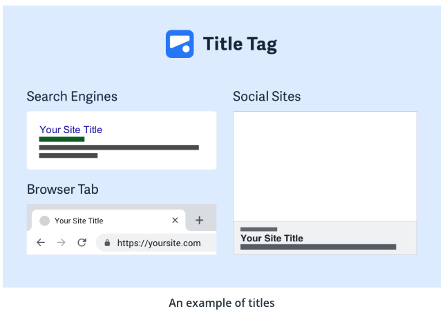
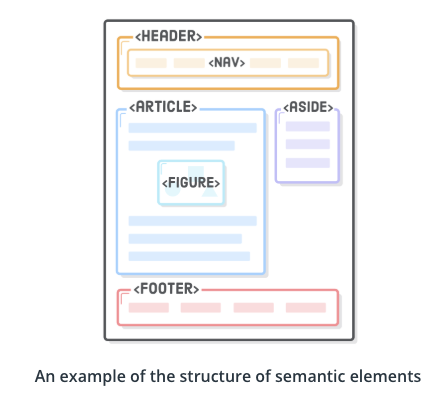
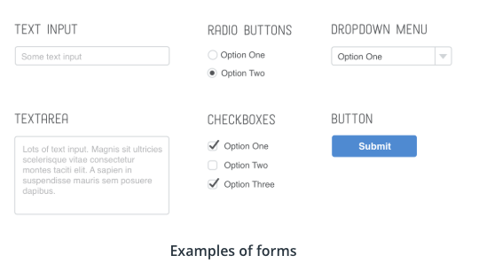
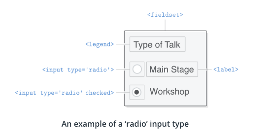

# HTML

`HTML` is a standart markup language for creating web pages and web apps. You can put `HTML` with two other programming languages: `CSS` and `JavaScript` to create full stack interactive web experiences.

## A Few Early HTML Tags

Let’s quickly take a look at some early `HTML tags`. With `HTML`, `tags` help tell the browser how to render different `elements` on the `page`, especially once you get into the styling with `CSS` later, where the `tags` will point to specific `styles` to use throughout your `webpage`.

`<!DOCTYPE html>`

Nearly every `web document` using `HTML` will start with this. This just tells the browser it is rendering an `HTML document`.

`<html> and </html>`

The first of these will likely be right after the `doctype tag`, while the second will “close” this `tag`, and won’t be present until the end of the `HTML document`. These note that everything in between is `HTML code`.

`<body> and </body>`

The `body` is where most of the `content` you will actually see on your `webpage` goes. It is closed with a `</body> tag`. Note that in basic examples, it is not actually required, as the page assumes other content is within the `body`, but by the end of this lesson you should be using this regularly. There is actually a `<head> section` that can come before the `body`, but we will skip that for now.

```html
<!DOCTYPE html>
<html>
  <body>
    <!-- Page content would go here -->
  </body>
</html>
```

**HTML** - sceleton
**CSS** - skin or clothes
**JavaScript** - brain (functionality that might be done)

OR

**HTML** - foundation
**CSS** - style
**JS** - functionality & behaviour

## Text Editors

The progr`am used to open `HTML documents` is a `browser`.

The `program` used to create `HTML documents` is a `text editor`. `Text editors` are used to both create and modify many types of `documents`, among them `HTML`. There is also a set of more advanced text editors, called `Integrated Development Environments` (IDEs), with more extensive features.

The tool you choose as your `text editor` is pretty important, since it allows you to take advantage of modern technologies and code faster.

**Hello World Example**

```html
<p>Hello World!</p>
```

This `code` is written with a `text editor`.

You can see the tags `<p>` and `</p>` that stand for `paragraph`.

When opened by a `browser`, these `tags` are not displayed but rather interpreted by the `browser`.

The `browser` sees the `<p>` and `</p>` tags and understands that **Hello World** is a `paragraph`.

Remember that an `HTML document` can be opened in 2 ways:

1. by a `text editor` who sees the `source code`
2. by a `browser` who interprets the `source code`

**Options**

- Visual Studio Code
- Atom
- Sublime Text
- JetBrains
- NotePad++

**Visual Studio Code**

- to open a file we want to work in we can just drag and drop the file in the VS Code environment
- one of the ways to create a new file we can use the `Command N shortcut`, or we can do it on the sidebar just add a new file to the existing folder. 
- VS Code has some plugins - these are the extantions that are available, they are things from `Themes` that can make  your syntax highlights look different, to `Linters` that will help you `debug` your `code`.

## Text Elements 1

**Text Element Structures**

An `HTML element` is a `unit of content` in an `HTML document` that is formed using `HTML tags`. The basic structure of an `element` is composed of `4 key items`, one of which is `optional`.

```html
<p class="dog-breed">Labrador Retriever</p>
```

1. The `opening tag` is the first `HTML tag` used to start an `element`.
2. The `content` is the `info` contained between the `opening` and `closing tags`. Only this `content` inside the `opening` and `closing body tags` is displayed to the `screen`.
3. The `closing tag` is the second `tag` used to define the end of a single `element`. Closings tags have a forward slash `/` inside of them, always after the left `angle bracket`.
4. (Optional) The attribute `name` and `value`.

Notice both `tags` are always surrounded by opening and closing `angle brackets`` <>`.

| Note: developers use the terms "left bracket" and "opening bracket" interchangeably. SImilarly, you can use either "right bracket" or "closing bracket".

There are over 100 different types of `HTML tags` that each serve a specific use case.

In `HTML`, you’ll mainly come across 2 types of `HTML elements`.

**Block elements** are meant to structure the main parts of your `page`, by dividing your `content` in coherent blocks.

**Block elements** are:

- paragraphs `<p>`
- lists:
  - unordered (with bullet points) `<ul>`, or
  - ordered - lists (with numbers) `<ol>`
- headings: from 1st level `<h1>` to 6th level headings - `<h6>`
- articles `<article>`
- sections `<section>`
- long quotes `<blockquote>`

**Inline elements** are meant to differentiate part of a text, to give it a particular function or meaning. `Inline elements` usually comprise a single or few words.

**Inline elements** are:

- links `<a>`
- emphasized words `<em>`
- important words `<strong>`

## Text Elements 2

**Headings**

Headings in HTML are comparable to headings in other media types. In journals, for instance, big headings are typically used to catch the attention of a reader. Other times, headings are used to define material, such as a film's title or an instructional article.

Headings are the primary way to outline the content of your webpage. They define the outline of your web page as both humans and search engines see it, which makes selecting relevant headings essential for a high-quality web page.

There are six distinct headings or heading components in HTML. Headings can be used for a multitude of reasons, such as titling segments, journals, or other types of content.

One way to think about headings on a web page is like headings in a book..

The `<h1>`, like the book title, introduces the topic that the web page is all about.
The `<h2>`, like book chapters, describe the main topics covered on the web page

Smaller headers like the `<h3>` to `<h6>` serve as other sub-headings that can be used within each section, just like a book chapter can be as a book chapter may be split up by multiple sub-topics.

Headings are ordered from the biggest to the smallest size. There are 6 levels of headings available, ranging from `<h1>` to `<h6>`, 1 being the most important one.

`H1` is used for the primary headings. For subheadings, all other lower headings are used.

**Accessibility with Headers**

For people who are blind or visually impaired, screen reading software is used to parse through text on a web page. A common technique these folks will use to navigate the page is to jump from heading to heading to determine the overall content of the page more easily. That's why it's best practice to not skip one or more heading levels. If you did skip headings and went from `<h1>` to `<h3>`, you may cause confusion since the user has to deal with a missing heading. Don't bum out any of your users - structure your headings properly.

**Paragraphs**

Paragraphs `<p>` are the most used HTML element, as they act as the default block-level element and are quick to write.

Below is the HTML code, as well as the “paragraphs” of text - note that there is nothing particularly special with the formatting of these.

**Spans**

The HTML `<span>` element is like a generic wrapper that is used to group text, mostly for styling purposes. Consider the following code:

```html
<style>
p {
  color: black;
}
.red {
  color: red;
}
</style>
<p>
  This sentence needs some <span class=”red”>visual emphasis</span> to really bring home the point.
</p>
```

In this code, the words *visual emphasis* have been put inside the span with the class red, so that those individual words can be styled separately from the rest of the p element. In this instance, the span words would be red, while the rest of the words would be black.

**Blockquotes**

Blockquotes are used to identify a citation.

```html
<blockquote cite="https://www.wikiwand.com/en/Scooby-Doo_(character)">
  <p>Ruh-roh--RAGGY!!!</p>
  <footer>—Scooby Doo, <cite>Mystery Incorporated</cite></footer>
</blockquote>
```


**Line Breaks**

The spacing between code in an HTML file doesn’t affect the positioning of elements in the browser.

If you are interested in modifying the spacing in the browser, you can use HTML’s line break element.

```html
<p>
  I jump in delight<br />
  I run off in frenzy<br />
  For now I have just realized<br />
  that the fun has arrived<br />
  the fun has begun<br />
  jumping all on one piece<br />
  almost feeling like I can't breathe<br />
  blood rushing through me<br />
  a second, a beat<br />
  I feel the air on my face<br />
  My fur rising up<br />
  Free as free as it can be<br />
  That's what you feel<br />
  When your owner has arrived<br />
</p>
```

## HTML Lists

You can also organize content in list format.

Although I noted 2 lists in HTML, there are actually 3 total types of lists in HTML:

1. unordered - lists in no specific order
2. ordered - lists in a specific order
3. description - lists with name/value pairs

Depending on the use case, you may want to use one over the other. Just then, I used an ordered list because there was a specific number of lists I wanted to showcase.

**Unordered Lists**

If you want items in no particular order, like with a shopping list, you use the unordered list HTML tag - `<ul>`.

An unordered list outlines individual list items with a bullet point with each individual bullet added using the list item or `<li>` tag.

```html
<p>New puppy shopping list</p>
<ul>
  <li>Treats</li>
  <li>Dog food</li>
  <li>Leash</li>
  <li>Collar</li>
  <li>Dishes</li>
  <li>ID tag</li>
</ul>
```

**Ordered Lists**

Ordered lists `<ol>` are like unordered lists, except that each list item is numbered.

They are useful when you need to list different steps in a process or rank items for first to last given the order of items is relevant.

Just like with unordered lists, you can add individual list items to the list using `<li>` tags.

```html
<p>Steps after adopting a puppy</p>
<ol>
  <li>Spoil the puppy</li>
  <li>Be happy with your puppy</li>
  <li>Repeat</li>
</ol>
```

Ordered lists are automatically numbered by the browser, so the numbers don’t need to be included in your HTML.

## Attributes

All HTML elements can have attributes. Attributes provide additional information about an element, and are always specified in the start tag. Attributes usually come in name/value pairs like `name="value"` Here are some popular ways attributes are used that we'll be covering in the sections to come!

**Images**

The “source” (URL or file location) from where an image is taken through the `src` attribute
The image’s alternative text (often a description for those with accessibility needs) is provided through the `alt` attribute
The image size can be adjusted through the `width` and `height` attributes
Images are self-closing - you add a slash at the end, instead of another `</img>` tag as we have seen before.

```html

```

**Links**

Links are essential in HTML, as the Web was initially designed to be an information network of documents “linked” between each other - you navigate from one document to another by clicking on links.

The “HyperText” part of HTML defines what kind of links we use: hypertext links, a.k.a hyperlinks.

In HTML, links are inline elements written with the `<a>` tag. The href attribute (hypertext reference) is used to define the destination of the link (where you navigate to when you click).

There are 3 types of destinations you can define:

- anchor targets, to navigate within the same page
- relative URLs, usually to navigate within the same website
- absolute URLs, usually to navigate to another website

You can also use additional attributes besides `a` and `href`:

- specify the relationship between the current and linked document with the `rel` attribute
- specify where to open the linked document with the `target` attribute

In the example below, we are setting the URL destination to *The Labrador Club* website, preventing this website from being able to access the `window.opener` property and ensuring it runs in a separate process with the noopener `rel` value. Finally we are requesting that the link open in a new window instead of the same one with the `_blank target` value.

```html
<a href="https://thelabradorclub.com" rel="noopener" target="_blank"
  >Join The Labrador Retriever Club</a>
```

**Comments**

If you write something in your code without changing how your website will be displayed by the browser, you're writing comments.

Comments will be ignored by the browser and are only helpful to us people who write the code. They can help with readability both for yourself in the future, as well as others who are looking at your code, such as teammates and managers.

A comment starts with `<!-- and ends with -->`.

**Self-Enclosing Elements**

Some HTML elements only have an opening tag:

```html
<!-- line-break -->
<br />
<!-- image -->

<!-- text input -->
<input type="text" />
```

Because they don’t have a closing tag and consequently can’t contain anything inside them, self-enclosing elements usually carry a few attributes, to provide them with additional information.

## The DOM

DOM - Document Object Model, it's the Model that our web document is being presented as. DOM represents a document with a logic tree, each brunch of the tree ends in a node (tag) and each node contains objects. DOM method allows programmatic access to the tree, and then you can change the document's style, stusture or content. 

Understanding HTML hierarchy is important because child elements can inherit behavior and styling from their parent element.

Now that you’ve learned about some of the most common HTML elements, it’s time to learn how to set up an HTML file. HTML files require certain elements to set up the document properly. You can let web browsers know that you are using HTML by starting your document with a document type declaration. The declaration looks like this:

`<!DOCTYPE html>`

This declaration is an instruction, and it must be the first line of code in your HTML document. It tells the browser what type of document to expect, along with what version of HTML is being used in the document. For now, the browser will correctly assume that the html in `<!DOCTYPE html>` is referring to HTML5, as it is the current standard.

In the future, however, a new standard will override HTML5. To make sure your document is forever interpreted correctly, always include `<!DOCTYPE html>` at the very beginning of your HTML documents.

**The Head**

So far you’ve done two things to set up the file properly:

Declared to the browser that your code is HTML with <!DOCTYPE html>
Added the HTML element (<html>) that will contain the rest of your code.
Remember the <body> tag? The <head> element is part of this HTML metaphor. It goes above our <body> element.

**Metadata**

The <head> element contains the metadata for a web page.

Metadata is information about the page that isn’t displayed directly on the web page.

Unlike the information inside of the <body> tag, the metadata in the head is information about the page itself.

**Title**

A browser’s tab displays the title specified in the <title> tag. The <title> tag is always inside of the <head>.

```html
<!DOCTYPE html>
<html>
  <head>
    <title>My Coding Journal</title>
  </head>
</html>
```
If we were to open a file containing the HTML code in the example above, the browser would display the words “My Coding Journal” in the title bar (or in the tab’s title).



**The Body**

`<body></body>`

Once the file has a body, many different types of content – including text, images, and buttons – can be added to the body.

**Hierarchy**

HTML is organized as a collection of family tree relationships. As you saw in the last exercise, we placed `<p>` tags within `<body>` tags. When an element is contained inside another element, it is considered the child of that element. The child element is said to be nested inside of the parent element.

```html
<body>
  <p>This paragraph is a child of the body</p>
</body>
```
In the example above, the `<p>` element is nested inside the `<body>` element. The `<p>` element is considered a child of the `<body>` element, and the `<body>` element is considered the parent. You can also see that we’ve added two spaces of indentation (using the space bar) for better readability.

Since there can be multiple levels of nesting, this analogy can be extended to grandchildren, great-grandchildren, and beyond. The relationship between elements and their ancestor and descendent elements is known as hierarchy.

Let’s consider a more complicated example that uses some new tags:

```html
<body>
  <div>
    <h1>Sibling to p, but also grandchild of body</h1>
    <p>Sibling to h1, but also grandchild of body</p>
  </div>
</body>
```

In this example, the `<body>` element is the parent of the <div> element. Both the `<h1>` and `<p>` elements are children of the `<div>` element. Because the `<h1>` and <p> elements are at the same level, they are considered siblings and are both grandchildren of the `<body>` element.

Again, understanding HTML hierarchy is important because child elements can inherit behavior and styling from their parent element. You’ll learn more about webpage hierarchy when you start digging into CSS.

**Semantic Elements**

Structure elements allow you to organize the main parts of your page. They usually contain other HTML elements.

Here’s what a typical webpage could include:

- `<header>` as the first element of the page, that can include the logo and the tagline.
- `<nav>` as a list of links that go to the different pages of the website.
- `<h1>` as the title of the page.
- `<article>` as the main content of the page, like a blog post.
- `<footer>` as the last element of the page, located at the bottom.



## Forms

Forms are a part of everyday life. When we use a physical form in real life, we write down information and give it to someone to process. Think of the times you’ve had to fill out information for various applications like a job, or a bank account, or dropped off a completed suggestion card — each instance is a form!

Just like a physical form, an HTML `<form>` element is responsible for collecting information to send somewhere else. Every time we browse the internet we come into contact with many forms and we might not even realize it. There’s a good chance that if you’re typing into a text field or providing an input, the field that you’re typing into is part of a `<form>`!

In this lesson, we’ll go over the structure and syntax of a `<form>` and the many elements that populate it.

HTML form elements let you collect input from your website’s visitors. Mailing lists, contact forms, and blog post comments are common examples for small websites, but in organizations that rely on their website for revenue, forms are sacred and revered.

Forms are the “money pages.” They’re how e-commerce sites sell their products, how SaaS companies collect payment for their service, and how non-profit groups raise money online. Many companies measure the success of their website by the effectiveness of its forms because they answer questions like “how many leads did our website send to our sales team?” and “how many people signed up for our product last week?” This often means that forms are subjected to endless A/B tests and optimizations.

There are multiple types of HTML forms, such as text input, text areas, radio buttons, checkboxes, dropdown menus, and buttons.



**Input Types, Select and Textarea**

Text, checkbox and radio button forms are specified by an input type.

```html
<!-- A text input -->
<input type="text" />
<!-- A checkbox -->
<input type="checkbox" />
<!-- A radio button -->
<input type="radio" />
```



Separately, a dropdown menu can be created using select.

```html
<label for="color-select">Choose a color:</label>

<select id="color-select">
  <option value="">--Please choose an option--</option>
  <option value="blue">Blue</option>
  <option value="red">Red</option>
  <option value="green">Green</option>
  <option value="yellow">Yellow</option>
  <option value="orange">Orange</option>
  <option value="pink">Pink</option>
</select>
```

Last is textarea, which creates a more free-form text field for the user to enter information.

```html
<label for="learn">What do you hope to learn today?</label>

<textarea id="learn" name="learn" rows="5" cols="30">
I hope to learn about...
</textarea>
```

