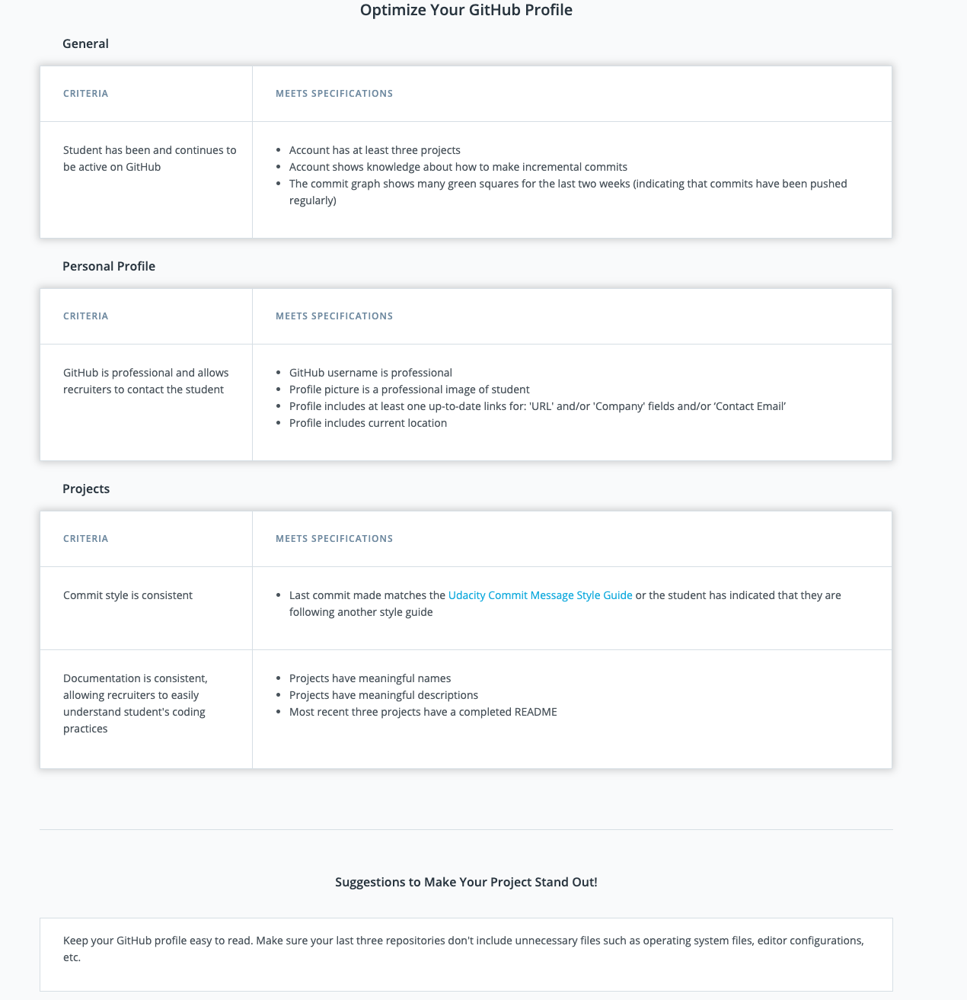

# Prove Your Skills With Github

**The Tech World Has Adopted GitHub**

In 2017, GitHub saw:

- 1.5 million organizations using the platform
- 24 million users across 200 countries, from entrepreneurs to open source contributors to company employees
- 25.3 million active repositories
- 47 million pull requests, which means people and organizations are working together

Software engineers, developers, and data scientists at most companies use GitHub daily to house their work, read each other's documentation, and collaborate across teams and organizations.

*Recruiters, hiring managers, and senior engineers search through GitHub for potential job candidates. Your GitHub profile - activity, repos, commits, documentation - provides evidence that you're a skilled engineer.*

> Udacity graduate Ryan Waite was [hired](https://blog.udacity.com/2016/03/student-success-ryan-waite-goes-to-nasa-and-beyond.html) based on the strength of his GitHub profile.

**No Resubmission Required**

Unlike other Nanodegree projects, you submit to a Career Service once to get feedback and do not need to meet specifications to continue on in your program. We highly encourage you to take advantage of this guidance; most Alumni who report jobs and other opportunities (such as collaboration) attribute their success to networking.

**Career Review Requirement**

Your Nanodegree program was designed to ensure your long-term success in the field, and to pursue a successful career you must showcase the skills you’ve learned to employers effectively. Therefore, this is a requirement for graduation, unless you opt-out.

**Opting Out**

If improving your GitHub profile does not currently align with your Nanodegree goals, you may opt-out of this graduation requirement.

**Resources**

We recommend you review these resources to ensure your profile is ready for feedback.

1. [Rubric](https://review.udacity.com/#!/rubrics/52/view). Your project will be reviewed by a Udacity Career Reviewer against this rubric.



2. [Checklist](https://docs.google.com/document/d/1a9AKnNyqfGgdQV5ohPCN5H9ntnEUhMptWMwVBWURCN0/pub?embedded=true). Based on the project rubric, this is a handy checklist on GitHub best practices.


3. [Career Resource Center](https://career-resource-center.udacity.com/linkedin-github-profiles). Find additional tips and guides on developing your GitHub Profile.

If you'd like more guidance, continue on to the lesson to learn more about GitHub best practices on commit style, forking and starring, READMEs, and more!

# Introduction

Here are some FREE Udacity cources on Github

- [Version Control with Git](https://www.udacity.com/course/version-control-with-git--ud123)
- [GitHub & Collaboration](https://www.udacity.com/course/version-control-with-git--ud123)

# Github Profile important items

- personal information. Better to have a pickure of yourself that somehow captures your personality. 

- general information and a link to `Twitter account`. Recruiters can look through your tweets to get a sense of the things you're interested in. 


You can also link to your `personal blog` 

- make sure your `user name` is smth professional. 


- a list of your `most popular repositories`. These are ranked by the number of stars, which are given by other Github users that like the repo. The descriptions should be nice, so that we know what these repositories are for. 


- to the right is a list of other *repos, that you are contributed to*. This is a clear indication that you're involved in `collaborationg` with others on `open source software`


Employers can look at your contribution to judje how well you work on a team. 

- contributin chart 


This is one of the first things a hiring manager is going to look at. 

# Good Github Repository

**Checklist**


# Udacity Git Commit Message Style Guide

### Introduction

This style guide acts as the official guide to follow in your projects. Udacity evaluators will use this guide to grade your projects. There are many opinions on the "ideal" style in the world of development. Therefore, in order to reduce the confusion on what style students should follow during the course of their projects, we urge all students to refer to this style guide for their projects.

### Commit Messages

**Message Structure**

A commit messages consists of three distinct parts separated by a blank line: the title, an optional body and an optional footer. The layout looks like this:

```html
type: subject

body

footer
```

The title consists of the type of the message and subject.

**The Type**

The type is contained within the title and can be one of these types:

- feat: a new feature
- fix: a bug fix
- docs: changes to documentation
- style: formatting, missing semi colons, etc; no code change
- refactor: refactoring production code
- test: adding tests, refactoring test; no production code change
- chore: updating build tasks, package manager configs, etc; no production code change

**The Subject**
Subjects should be no greater than 50 characters, should begin with a capital letter and do not end with a period.

Use an imperative tone to describe what a commit does, rather than what it did. For example, use change; not changed or changes.

**The Body**
Not all commits are complex enough to warrant a body, therefore it is optional and only used when a commit requires a bit of explanation and context. Use the body to explain the what and why of a commit, not the how.

When writing a body, the blank line between the title and the body is required and you should limit the length of each line to no more than 72 characters.

**The Footer**
The footer is optional and is used to reference issue tracker IDs.

**Example Commit Message**

```html
feat: Summarize changes in around 50 characters or less

More detailed explanatory text, if necessary. Wrap it to about 72
characters or so. In some contexts, the first line is treated as the
subject of the commit and the rest of the text as the body. The
blank line separating the summary from the body is critical (unless
you omit the body entirely); various tools like `log`, `shortlog`
and `rebase` can get confused if you run the two together.

Explain the problem that this commit is solving. Focus on why you
are making this change as opposed to how (the code explains that).
Are there side effects or other unintuitive consequenses of this
change? Here's the place to explain them.

Further paragraphs come after blank lines.

 - Bullet points are okay, too

 - Typically a hyphen or asterisk is used for the bullet, preceded
   by a single space, with blank lines in between, but conventions
   vary here

If you use an issue tracker, put references to them at the bottom,
like this:

Resolves: #123
See also: #456, #789
```

# Writing README

Technical documentation exists for helping us make sense of code. Without it developers won't know how to use other people's code.  Unlike your code which is written for computers documentation is written for humans. Documentation exists to help us make sense of the code that we've written, which may not always be quite as intuitive as we'd like it to be.

For instance if you're working a large open source library that other people can use, good documentation is absolutely essential for acquiring both users and contributors. If your documentation is good, people will want to use your library in their projects. If your documentation is great, people might even chip in and help you with your library.


**Resources**

- [Choose A License](https://choosealicense.com/) - Helpful website for picking out a license for your project.
- [Github flavored markdown reference](https://help.github.com/en/github/writing-on-github) - Github's own documentation about documentation.

**Sample READMEs**

- [Udacity Feedback Chrome Extension](https://github.com/udacity/frontend-grading-engine) - A front-end grading engine built by Cameron Pittman, a content developer at Udacity. The documentation is thorough and complete, so anybody can use it!
- [factory_bot](https://github.com/thoughtbot/factory_bot) - An open source project maintained by thoughtbot. Great example of simple instructions to get you set up, which then links to external documentation.
- [can.viewify](https://github.com/zkat/can.viewify) - Awesome example of someone documenting her personal projects concisely.
- [create-your-own-adventure](https://github.com/udacity/create-your-own-adventure) - This README for Udacity's Git and Github course.

**How to Contribute**

Find any typos? Have another resource you think should be included? Contributions are welcome!

1. First, fork this repository.


2. Next, clone this repository to your desktop to make changes.

```js
$ git clone {YOUR_REPOSITORY_CLONE_URL}
$ cd ud777-writing-readmes
```

Once you've pushed changes to your local repository, you can issue a pull request by clicking on the green pull request icon.


Instead of cloning the repository to your desktop, you can also go to `README.md` in your fork on GitHub.com, hit the `Edit` button (the button with the pencil) to edit the file in your browser, then hit the `Propose file change` button, and finally make a pull request.

**License**

The contents of this repository are covered under the [MIT License](https://github.com/udacity/ud777-writing-readmes/blob/master/LICENSE).