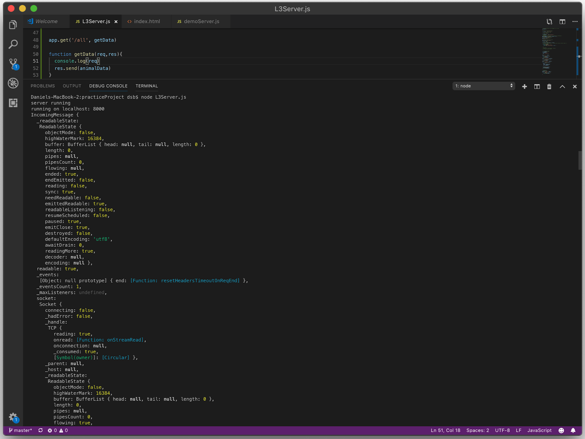

# HTTP Request & Routes

## Routes: GET Requests

`Get request` gets data. `Express` provides `methods` that define `routing` and these methods correspond directly to HTTP methods. 

**Express Route Example**

```js
const express = require('express');
const app = express();


// respond with "hello world" when a GET request is made to the homepage
app.get('/', function(req, res){
    res.send('hello world');
});
```

**or the syntax can be:**

```js
app.get('/', sendData);


function sendData (request, response) {
  response.send('hello world');
};
```

**Or even with an arrow function like this:**


```js
app.get('/', (request, response)=> {
  response.send('hello world');
});
```


In the example, `app.get()` is an express method to handle the HTTP GET request. The first `parameter` is the particular `URL` -- in this case our project home page, and `a callback function` to execute. Inside the `callback function` a `response` is sent using `.send()`, and in this case the `response` is a `string` that says 'hello world'. The real life execution of this code would mean that whenever the project `home URL` is visited in the browser, there will be a `GET request` made to the server, and the `response` will be shown in the browser, so the words `'hello world'` would appear on the screen.

## More Powerful GET Requests

Hello world is all well and good, but suppose we wanted to make a GET request for some more useful data. GET requests can return all kinds of data, for example, imagine we wanted a JavaScript object to hold user data for us.

- At the top of the demo code, we could create an `empty JavaScript object` with the code `const appData = {}`. The variable `appData` now acts as the `endpoint` for all our app data. Later we will learn how to POST data to the app endpoint, but first let's add the line of code that will return our `JavaScript object` when the GET request is made.

```js
var express = require('express');

var app = express();

// Create JS object
const appData = {}

// Respond with JS object when a GET request is made to the homepage
app.get('/all', function (req, res) {
  res.send(appData)
})
```

In this example, we created a new route named `'/all'`, so that the route `'localhost:3000/all'` will now trigger the GET request, which will return the `JavaScript object` as laid out in the server code above.

Notice, the `callback function` of the GET request takes two parameters, arbitrarily named `req` and `res` in this example. Every GET request produces a request, which is `the data provided by the GET request`, and a response, which is `the data returned to the GET request`. Below, you can see the long list of information that comes with each GET request:

**a portion of the data returned by the `req` (request) parameter of a Get route**




**More on Express routing and GET requests**

In this lesson we learned how Express methods can be used to define routes and handle GET requests made to a server created with Node and Express. For more on Express routing methods and GET requests you can visit the ['Routing' guide](https://expressjs.com/en/guide/routing.html) in the Express documentation.

## Routes: POST Request

One way to collect and store user data so that you can access it later is through making an HTTP POST request. Analogous to the `.get()` Express method, there is also a `.post()` method to handle HTTP POST requests. An HTTP POST request sends data to the project's endpoint, where it is stored and can be accessed through a GET request, which we covered in the last lesson. Here is what a simple POST request could look like using the Express method `.post()`:

```js
// POST method route
app.post('/', function (req, res) {
  res.send('POST received')
})
```

Here is how you could setup a basic POST route *in the server side code*.

- First, Create an array to hold `data`:

```js
const data = []
```

- Then, create `post()` with a `url path` and a `callback function`:

```js
app.post('/addMovie', addMovie )
```

- In the `callback function`, add the `data` received from `request.body`. This is the key piece of information we are interested in from that long stretch of data we saw previously that the request (`req`) argument returns.

```js
function addMovie (req, res){
   console.log(req.body)
   data.push(req.body)
}
```

In the next section we will cover how to execute this POST route with a request from *the client side code*.

**Recap:**

That is true about Express Routes and HTTP Requests:

- Express routes are setup in the server code

- Express provides handlers that directly correspond to HTTP requests, such as GET and POST.

- GET and POST requests are used to retrieve and save data between APIs and servers.

So how do we actually activate our POST route, and how does it know what data to process? We will learn the answer to those questions in the next lesson, when we learn about connecting client and server code. So far we have just been working on the server side, but next we will learn how to POST and GET data from the browser.

## Client Side, Server Side

- Servers are set up at the beginnig to handle anything outside of what browsers can do. One example of this is to save data produced while someone is within the app. 

- Client code on the other hand, represents all the code that the browser executes, and all the code that the users will see the end product of.

How it l

Assuming we have set up a POST route in the file server.js file, we will move into the website folder and start writing client side code in a file named app.js. Here is the code we could use to make a POST request to our route:


```js
const postData = async ( url = '', data = {})=>{
    console.log(data);
      const response = await fetch(url, {
      method: 'POST', //GET, POST, PUT, DELETE, etc.
      credentials: 'same-origin', //include, some-origin, omit
      headers: {
          'Content-Type': 'application/json',
      },
     // Body data type must match "Content-Type" header        
      body: JSON.stringify(data), 
    });

      try {
        const newData = await response.json();
        console.log(newData);
        return newData;
      }catch(error) {
      console.log("error", error);
      }
  }

postData('/add', {answer:42});
```

Here inside of the `async` function we've set up a `post route`, with `const response`, we've asked it to fetch a URL which is where we wanna to make the `post` to,  under `method` is where we sat the `type of request` we wanna make. On the `header` we've set that we wanna our application to run on `JSON data`. 

> The really important thing is to make sure that the `body` of any `request` matches that `type of data`.

So, because `servers` naturally deal with that as `strings`, but we wanna deal with it as `JSON`, we've used the method `JSON.stringify()` to turn our data into `JSON data`.

## Client Side & Server Side Example

Let's focus in on the actual POST request, which is an object passed as the second parameter to `fetch().` The First parameter is the URL we want to make the POST request to.

 ```js
 {
      method: 'POST', 
      credentials: 'same-origin',
      headers: {
          'Content-Type': 'application/json',
      },
      body: JSON.stringify(data),
 }
```

The credentials and headers are pretty boilerplate, but necessary for a successful POST request. The most important thing to notice is that `Content-Type` is set to json because we will be handling our data with `JSON`, for the most part.

Now we get to the juicy parts: the `method` is set to `POST` because we are accessing the POST route we setup in `server.js`. If we wanted to make a `GET` request from the client side, the `method` would be `GET`. The `body` of the request is the part we are most interested in because this is how we will access the data on the server side. When sending data to a web server, the data has to be a string. We can convert a JavaScript object into a string using the JavaScript method `JSON.stringify()`, which turns JavaScript objects and JSON data into a string for our server to receive the information. In this example, we are turning the JavaScript object passed in the `data` parameter into a string.

**All that are true about server side and client side programming:**

- Server code and client side code belong in separate files at different levels of your project hierarchy on the browser

- A route created on the server side can be accessed through a GET or POST request made on the client side

- Server code manages routing of data separate from the browser

---

**Exercise**

**TASK:**

In this exercise you will start to understand how a route setup on the server side, is used on the client side with a request.

1) In the file named `app.js`, which is located in the `website` directory of this project, call the function `postData` with the url `/addAnimal` and the name of your favorite animal to create a POST request that uses the POST route you setup in `server.js`.

**SOLUTION:**

***app.js***

```js
/* Function to POST data */
const postData = async ( url = '', data = {})=>{
  console.log(data)
    const response = await fetch(url, {
    method: 'POST', // *GET, POST, PUT, DELETE, etc.
    credentials: 'same-origin', // include, *same-origin, omit
    headers: {
        'Content-Type': 'application/json',
    },
    body: JSON.stringify(data), // body data type must match "Content-Type" header        
  });

    try {
      const newData = await response.json();
      // console.log(newData);
      return newData
    }catch(error) {
    console.log("error", error);
    // appropriately handle the error
    }
}

// TODO-Call Function

postData('/addAnimal', {animal: 'cat'})
```

***server.js***

```js
/* Empty JS object to act as endpoint for all routes */
projectData = {};

/* Express to run server and routes */
const express = require('express');

/* Start up an instance of app */
const app = express();

/* Dependencies */
const bodyParser = require('body-parser')
/* Middleware*/
app.use(bodyParser.urlencoded({ extended: false }));
app.use(bodyParser.json());
const cors = require('cors');
app.use(cors());

/* Initialize the main project folder*/
app.use(express.static('website'));

const port = 3000;
/* Spin up the server*/
const server = app.listen(port, listening);
 function listening(){
    // console.log(server);
    console.log(`running on localhost: ${port}`);
  };

// GET route
app.get('/all', sendData);

function sendData (request, response) {
  response.send(projectData);
};

// POST route
app.post('/add', callBack);

function callBack(req,res){
  res.send('POST received');
}

// POST an animal
const data = [];

app.post('/animal', addAnimal);

function addAnimal (req,res){
    data.push(req.body);
};

```

## Processing the POST request

So now that we know how to send a POST request from the client side, let's return to the server code and learn how to process the data we receive with our POST request. Remember, the last line of code in our previous example called our `postData` function, passing in the URL of the POST route, and an object containing the data to be posted. That line of code looked like this: `postData('/add', {answer:42})`

Back on the server side code we should now be able to receive the data `answer:42`. Remember in the last example, we attached our data to the `body` of our POST request, so to receive that data and make it actionable we can use `request.body`.

Here is an example where we set a variable named `data` to hold the value of `request.body`, and then print `data` to see what we received.

```js
app.post('/add', function (request, response) {
    let data = request.body;
    console.log(data);
});
The output of this would display in ther terminal: {answer:42}
```

But we don't just want to see the data we received, to complete our POST request we must assign the data we received to our project endpoint, the JS object in our server code named `projectData`. We can simply make a new entry in our JS object using the syntax:

```js
projectData["x"] = y
```

This code would create a new entry in our JS object API endpoint where the value of a string `"x"` is `y`. So if the data received from the POST request was `{intelligence:100}`, we could create a new entry in our endpoint with the code: 

```js
let data = request.body; projectData["intelligence"]= data.intelligence;
```

Notice that we manually set the string for the key of the new JS object entry as `"intelligence"`, and then to access the property we want to set as its value we use `data.intelligence`. For more on JS dot notation see [the MDN Web Docs entry on Property accessors](https://developer.mozilla.org/en-US/docs/Web/JavaScript/Reference/Operators/Property_accessors).

---

**QUESTION 1:** 

```js
const data = [{animal:"elephant", score: 10},{animal:"kangaroo",score:3}]

function makeData(request){

}

makeData({body:{animal:"turtle", score:7}})
```

Given the above code, which code block inside the function `makeData` would correctly use the input data to add a new JS object to the `data` array, following the same structure as the entries already present?

**OPTIONS:**

1. 

```js
let newData = request;
let newEntry = 
animal: newData.animal,
score: newData.score
data.push(newEntry)
```

2. 

```js
let newData = request.body;
let newEntry = {
animal: newData.animal,
score: newData.score
}
data.push(newEntry)
```

**ANSWER:** 

```js
let newData = request.body;
let newEntry = {
animal: newData.animal,
score: newData.score
}
data.push(newEntry)
```

---

--- 

**QUESTION 2:** 

Let's say there's a client side POST request written in a function, `postData()`. Assume `postData()` sent a POST request to your server with the data: `{answer:42}`. Complete the following server side code to add the body of the request directly to the project endpoint, named `projectData`.

```js
...
projectData = [];
app.post('/add', function(request, response){
  // Your code goes here   
}) 
```

**ANSWER: **

```js
projectData.push(request.body);
```
---

In this lesson we have learned how server side and client side code work together to route data through a web app. We learned how to setup a POST request in the server side code, and then execute a POST request via that path on the client side code. We also covered how to structure and add POST request data to a project API endpoint. In the next lesson we will learn more about asynchronous functions in JavaScript and you will learn more in depth about some of the syntax used in these demos, including `async`, `await`, `try`, and `catch` .

For more details on server side and client side programming see this [Stack Overflow post](https://stackoverflow.com/questions/1404376/what-is-client-side-javascript-and-what-is-server-side-javascript).
