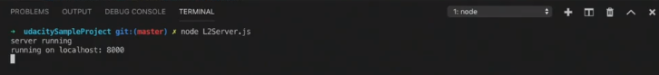
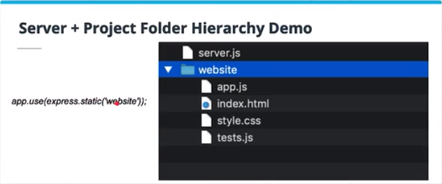

# Introduction

how to setup:
- a Node
- Express development environment, which is the essential combo for making many web applications. 

## Introduction: HTTP Routes & Requests

After setting up our `development environment` and installing all the necessary `project dependencies`, we'll cover how to set up `routes`,  that handle passing data through the app with `HTTP post requests`. 

We'll cover alse the difference between `client-side` code and `server-side` code. And how *to write them in harmony* with one another to create a complete app that passes data back and forth between the `server endpoint` and `the UI of the application`. 

- HTTP requests
  - get
  - post
- Client-side vs. server-side

## Introduction: Asynchronous JavaScript

We'll unlock the hidden potential of asynchronous JS. We'll cover how to setup and dynamically access `Web API data` and how to use the `Fetch API` to easily and elegantly make `HTTP` **get** and **post** request from the `client-side code` and seamlesly process that `data` from the `server-side code`. We'll cover `promises`, we'll rely heavily on promises through `Fetch API` and will able to use the new elegant syntax to create seamless async web apps. 

**Recap**

you will be able to:

- Set up a `Node` and `Express environment` to develop a web application on your local machine
- Set up a `server` and `route data` through a web app
- Integrate an `external API` into a web app and `data routes`
- Use `HTTP POST & GET` requests to create persistent data in your app
- Use the `JavaScript Fetch API` to update the `UI` based on `HTML input forms` and `external API data`.

**Additional Research** 

- [Express routing documentation](https://expressjs.com/en/guide/routing.html)
- [MDN fetch API documentation](https://developer.mozilla.org/en-US/docs/Web/API/Fetch_API)
- [JavaScript Promises Introduction](https://developers.google.com/web/fundamentals/primers/promises)


# Node & Express Environment

## Node.js

The first step to using Node.js is to install it on your computer. You can do so by following the link below and installing the Windows or Mac version, depending on what type of operating system you are using.

[Node.js Download Page](https://nodejs.org/en/download/)

If you’ve previously installed Node and need to update to a newer version, check out [this article](https://www.hostingadvice.com/how-to/update-node-js-latest-version/).

> *-**Node**  is an open-source, cross-platform, JS server environment that allows you to execute code outside of the browser in addition to within the browser.* 

It allows you easily create *real-time applications* that run across distributed devices. One of the most powerful thing that it allows is for developers to write `the server-side scripts`. `Server-side code` produces *dynamic* webpage content. 

One example of the *dynamic* webpage content is - **persistense**. **Persistence** describes a web app being able to maintain `created data` across visits from the webpage. 

It allows to easily `create a server` for `local web development` without needing an `FTP server` or my own domain and it lets to install packages that are `dependancies` for the project very easily from the command line. 

## Using Node

One of *the most useful features* of `Node` is that it comes *pre-installed* with a standard `package manager` called `NPM`. `NPM` started as an easier way to download and manage dependencies of `Node.js` packages, but now it is also used as a tool in front-end JavaScript as well.

A package in `Node.js` contains all the files you need for a `module`. **Modules** are `JavaScript libraries` you can include in your project. There are hundreds of thousands of `Node.js` packages and `NPM` gives you easy access to all of them! For the purposes of this course we will make heavy use of the Node package called **Express**, as well as packages called **CORS** which allows for communication across the web, and **Body-Parser** (which is considered in the category of Middleware) which will allow us to parse the data we eventually will be passing through `routes` on our `server`. Let’s take a look at how to install and include these last two packages from the command line using `NPM`:

1. install some dependancies (`npm install package-name`)
  - `npm install express`

2. install some middleware 
  - `npm install body-parser`

3. And then in a file named `Server.js` the installed package is included and made available in the code with: 
`var bodyParser = require('body-parser')`

`Node` invokes that `require()` function with a local file path as the function’s only argument.

**So, to recap:**

- `Node` allows developers to write `server-side code`

- `NPM` is a *package manager* for `Node` that allows for easy inclusion of dependencies in a project

- To include a `Node` package already installed via the terminal, the `require()` function is used

**More on Node**

- For more information about Node.js, you can r[ead their website and documentation](https://nodejs.org/en/), or follow [@node.js on Twitter](https://twitter.com/nodejs).
- You can learn more about NPM from their [website](https://www.npmjs.com/).

## Express

To install `express`, we use the `npm install express` command in the terminal. Using `Express` we set up an instance of our web app like this:

```js
// Express to run server and routes
const express = require('express');

// Start up an instance of app
const app = express();
```

`Express` is a simple web framework for `Node.js` that offers powerfull tools for web applications. `Express` gives easy access to `common web application settings` like the *port* to use for connecting a `Local Server`. Also allows to use `HTTP routes` and `requests` with easy `handlers`. 

`Middleware` - is one of the hardest part of bringing any big project together. It's kind of the glue that holds the different parts together. 

One of the most simple but powerful applications of `Express` is the `.use` method - this allows us to instrust our application to use the necessary Middleware such as `body-parser`.

- First we include `express` in our project and then we instantiate an `instance` of the app we are going to build in a file called `server.js`. 
- Once we have created an `instance` of our app using Express, we can connect the other packages we have installed on the `command line` to our app in our code with the `.use()` method. 
- Express version 4 and above require extra `middle-ware layer` to handle a `POST request`. This `middle-ware` is called as **bodyParser**. This used to be an internal part of Express framework, but now you have to install it separately.

Below is an example of how the `body-parser` and `cors` packages discussed earlier could be connected to the `app instance`.

```js
/* Dependencies */
const bodyParser = require('body-parser')
/* Middleware*/
//Here we are configuring express to use body-parser as middle-ware.
app.use(bodyParser.urlencoded({ extended: false }));
app.use(bodyParser.json());
// Cors for cross origin allowance
const cors = require('cors');
app.use(cors());
```

---
QUESTION:

Assume you have installed a package `amazing.js` from the terminal, and included it in your project using `require()`. Assuming you have an instance of an express app running with the name `app`, what line of code would you write to connect the app to the 'amazing.js' package?

ANSWER:

`app.use(amazing());`

---

So far we have just seen how `Express` can be used to create an `instance` of a web app, and to include other `Node packages` in that web app, but the real fun of `Express` is unleashed with `Routes`. Before we can work with `routes` however, there are a couple other topics we need to cover. Next we'll learn what a `server` is, and how to create one locally to develop web projects on our own machines.

**More on Express**

You can learn more about `Node` and `Express` by reading the Express/Node introduction on the [MDN web docs page](https://developer.mozilla.org/en-US/docs/Learn/Server-side/Express_Nodejs/Introduction).

**What about `cors`, `urlencoded` and `json`?**

While we won’t cover `cors`, `urlencoded` and `json` in-depth here, if you want to read about more on each, see the following links:

- [Cross-origin resource sharing (CORS)](https://en.wikipedia.org/wiki/Cross-origin_resource_sharing) and related [Express documentation for CORS](https://expressjs.com/en/resources/middleware/cors.html)
- [URL Encoding](https://en.wikipedia.org/wiki/Percent-encoding) and related [Express documentation for `bodyParser`’s `urlencoded` functionality](https://github.com/expressjs/body-parser#bodyparserurlencodedoptions)
- [JavaScript Object Notation (JSON)](https://en.wikipedia.org/wiki/JSON) and related [Express documentation for `bodyParser`’s `json` functionality](https://github.com/expressjs/body-parser#bodyparserjsonoptions)


---

**starter.js**

```js
/* Empty JS object to act as endpoint for all routes */
projectData = {};

// TODO-Express to run server and routes

const express = require('express');


// TODO-Start up an instance of app
const app = express();

/* Dependencies */
const bodyParser = require('body-parser')
app.use(bodyParser.urlencoded({ extended: false }));
app.use(bodyParser.json());

// TODO-Cors for cross origin allowance

const cors = require('cors');
app.use(cors());

/* Initializing the main project folder */
app.use(express.static('website'));

const port = 3000;
```

---


## Creating a Local Server - Part 1

A `server` receives requests, processes those requests and then returns a response. 
For our purposes, we'll be using  `server` to run our website locally without any `FTP servers` or other `hosting` solutions and to create `routes` to *dynamically* pass data between different parts of our apps.

The code we'll use to actually write the server: 

1. first thing is to set our `variables` 

```js
//set a "port" variable
const port = 8000;

// set a variable named "server" and pass the "listen" method, two arguments
// - the first argument is the port, which tells our server which port to run on, and we'll go to that address in the web browser
// - the second argument is a callback functioning, named "listening"
//when our code runs server will start listening at port 8000, and will run the function "listening"
const server = app.listen(port, listening);

function listening(){
    console.log('server running?');
    console.log(`running on localhost: ${port}`);
}
```

Another way you might see this same server code written is with an `arrow function`. Here is an example of the same code using an arrow function:

```js
const server = app.listen(port, ()=>{console.log(`running on localhost: ${port}`)})
```

## Creating a Local Server - Part 2

> *Because we are writing server-side code, the console.log code **will execute in the terminal**, instead of the browser where you may be used to.* 

We can tell the node to run our `server file`, by saying `node and the name of the file`. 



Think about the steps to setting up a server and make sure you understand the logic:

- Install the Express package from the terminal (make sure you have pointed the terminal to the directory where you are creating your server code)
- Include the Express package in your code
- Write the code to start the server
- Check the terminal for confirmation that the server is working ro any error messages for issues with the code
- Open your browser and got o the port specified in your code


## Servers-File Structure Hierarchy

Web projects that don't include a `server` they generally have all their files included in the same folder, that the web knowa to just look at the file  called "index.html" to get all its directions from. You would also have any CSS or JS files in that same folder. 

However, when developing web projects that include an `Express Server`, there needs to be an additional file created that is *outside and at the same level* as the folder that includes the index HTML. 

So, one file is for node, and the other folder has all the files for the browser. 



In our `server.js` file, we would put the code `app.use(express.static('website'));`, which a string representing `the name of the folder` we wanna point the `server` to. This line of code connects our `server-side code` (the code in the `server.js` file) to our `client-side code` (the browser code written in the files housed in the `website` folder).

**More on Express servers**

For more information on Express you can visit their [website](https://expressjs.com/), or see this basic [example of an Express server](https://expressjs.com/en/starter/hello-world.html).


