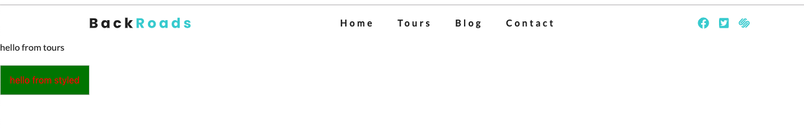

# Styled Components Basics

[official docs](https://www.styled-components.com/)

The main purpose of the `styled components` is a simple fact that we can create pur `component` then we do need to use this default export of `style`, that we are getting from `styled components`, then we gonna setup what kind of html element we gonna creating, and the really cool thing is that we can place here, within the template literals, everything that we'll write here will be just regular `css`, and also it will be `scoped` to that particular component. 

We don't need to worry about specific naming, and second - `styked components` are really powerful, we can use the bunch of things that we can do with `java script`, like `variables`, `calculations` and that kind of things. 

The basic example with `styled components` will be creating a `button`. 

What is really interesting about `styled components` is that we have `two routes`. We can create in fact `Ract component` and then use `styled component` within that component, or if it's just a simple component where we are not gonna have any kind of rendering logic, or we are not gonna be passing the `React component props` (by the way there are props special for styled components too),  - so if we have a really simple component - we don't really need `React` for that. 

So, what we would need - import `styled components` 

```js
import styled from 'styled-components'

const Button = styled.button`
   color: red;
   background: green;
   font-size: 1rem; 
   padding: 1rem;
`

export default Button;
```

> Note - whenever we are gonna be using `styled components` it would be very beneficial if we are also using the extention - `vscode-styled-components`. The reason is very simple - if we are not using this particular extention all the `code` will be orange - so we don't have destinction between the `property` and the `value` for the property; and if we have some error it will not point to that error. 

Now, let's import our `Button component` that we've just created to our `Tours react componnet`.

```jsx
import React from 'react'
import Layout from '../components/Layout'
import Button from '../examples/Button'

const Tours = () => {
    return (
        <Layout>
            <p>hello from tours</p>
            <div>
            <Button>hello from styled</Button>
            </div>
           
        </Layout>
    )
}

export default Tours
```


