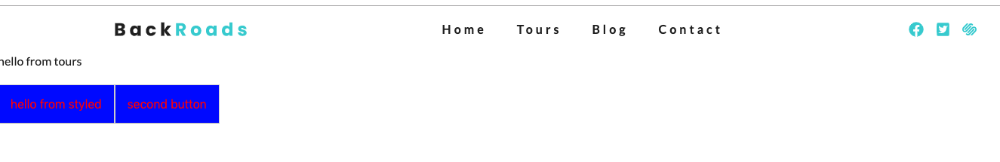
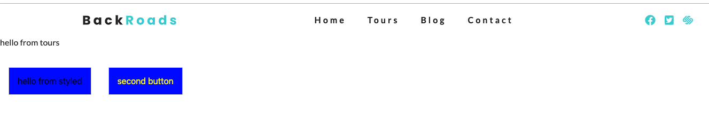

# Props with Styled Componenets

Well, we can make `styled component` dynamic. 

```jsx
import React from 'react'
import Layout from '../components/Layout'
import Button from '../examples/Button'

const Tours = () => {
    return (
        <Layout>
            <p>hello from tours</p>
            <div>
            <Button>first button</Button>
            <Button>second button</Button>
            </div>
           
        </Layout>
    )
}

export default Tours
```

If we now look at our `styled component` we know that we use tempalte literals there. Abd we know fro JS that if I would want to access some kind of variable in template litearls I would need to use the followig syntax - `${}`. In our case we could come up with the `variable` let's say "color" and add any value we want. 

```js
import styled from 'styled-components'
const color  = 'blue'

const Button = styled.button`
   color: red;
   background: green;
   font-size: 1rem; 
   padding: 1rem;
`

export default Button;
```

Now, if we would like to access this color - our background won't be a hardcoded value, but the "color" variable. 

```js
import styled from 'styled-components'
const color  = 'blue'

const Button = styled.button`
   color: red;
   background: ${color};
   font-size: 1rem; 
   padding: 1rem;
`

export default Button;
```


That would be the first way how we can access the `variable` in our `template literals`. 

We also have an option of using the `props`. And this `prop` would be specific for the `styled component`. Also there gonna be cases where passing down the `prop` from our actual `React component` into the `styled component` - and that will be a little bit different. 

The `styled component` prop example: 

If we pass the prop for the `button` (second button), we have the access to it in the `styled component`. 

```jsx
import React from 'react'
import Layout from '../components/Layout'
import Button from '../examples/Button'

const Tours = () => {
    return (
        <Layout>
            <p>hello from tours</p>
            <div>
            <Button>hello from styled</Button>
            <Button color="yellow">second button</Button>
            </div>
           
        </Layout>
    )
}

export default Tours
```
The way we access the `prop` in the `styled component`  - instead of just writing the `variable` name we would need to pass a `function` and as an `argument` we'll gonna be getting the `prop`. 

```js
import styled from 'styled-components'

const color = "blue"

const Button = styled.button`
   color: ${props => props.color};
   background: ${color};
   font-size: 1rem; 
   padding: 1rem;
   margin: 1rem;
`

export default Button;
```



How we can manipulate the `value` depending on that `prop`? Let's for our first `button` add the `prop` by the name of "big". 

```jsx
import React from 'react'
import Layout from '../components/Layout'
import Button from '../examples/Button'

const Tours = () => {
    return (
        <Layout>
            <p>hello from tours</p>
            <div>
            <Button big>hello from styled</Button>
            <Button color="yellow">second button</Button>
            </div>
           
        </Layout>
    )
}

export default Tours
```

And now instead of just using the function where we grab the `value` that we are gitting back from the `props`, we can instad setup the condition. So, in the `function` we access the `props` then the name of the `prop` ("big") and then we gonna check, if that `prop` there our font-size be "3rem", let's say. 

```js
import styled from 'styled-components'

const color = "blue"

const Button = styled.button`
   color: ${props => props.color};
   background: ${color};
   font-size: ${props => (props.big?"3rem":"1rem")}
   padding: 1rem;
   margin: 1rem;
`

export default Button;
```


