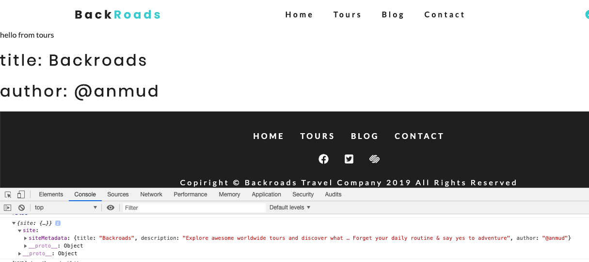

# useStaticQuery Hook

So, let's start using `useStaticQuery`. Let's say we have some `Header` component which we wanna render in our `tours page`.

**Header.js**
```jsx
import React from 'react'

const Header = () => {
    return (
        <div>
            <h1>title: </h1>
            <h1>author: </h1>
        </div>
    )
}

export default Header; 
```

**tours.js**

```jsx
import React from 'react'
import Layout from '../components/Layout'
import Header from '../examples/Header'


const Tours = () => {
    return (
        <Layout>
            <p>hello from tours</p>
           
            <Header/>
        </Layout>
    )
}

export default Tours
```

First in our `Header component` we need some import from Gatsby: `useStaticQuery` hook and `qraphql`. 

**Header.js**

```jsx
import React from 'react'
import {useStaticQuery, qraphql} from 'gatsby'

const Header = () => {
    return (
        <div>
            <h1>title: </h1>
            <h1>author: </h1>
        </div>
    )
}

export default Header; 
```

Then in the `Header` component we first need to setup a `variable` - the `variable` will hold our response. Then we would use our `useStaticQuery` hook, since this is a function we would pass in `graphql` and the syntax then will use two backticks - within we'll be passing our `qraphql query`. 

**Header.js**

```jsx
import React from 'react'
import {useStaticQuery, qraphql} from 'gatsby'

const Header = () => {

    const data = useStaticQuery(qraphql`
    {
        site{
          siteMetadata{
            title
            description
            author
          }
        }
      }
    `)

    return (
        <div>
            <h1>title: </h1>
            <h1>author: </h1>
        </div>
    )
}

export default Header; 
```

We can look at this `data` using `console.log`. And we can `render` this `data`.

**Header.js**
```jsx
import React from "react"
import {useStaticQuery} from "gatsby"
import { graphql } from "gatsby"

const Header = () => {

    const data = useStaticQuery(graphql`
    {
        site{
          siteMetadata{
            title
            description
            author
          }
        }
      }
    `)

    console.log(data)
    return (
        <div>
            <h1>title: {data.site.siteMetadata.title} </h1>
            <h1>author:  {data.site.siteMetadata.author} </h1>
        </div>
    )
}


export default Header; 
```



We can also do `destructuring` when we are getting the response. If we are destructuring we need to make sure that the `property` is available on the `object` that we are getting back. 

**Header.js**
```jsx
import React from "react"
import {useStaticQuery} from "gatsby"
import { graphql } from "gatsby"

const Header = () => {

//use destructuring
    const {site} = useStaticQuery(graphql` 
    {
        site{
          siteMetadata{
            title
            description
            author
          }
        }
      }
    `)

    console.log(site)
    return (
        <div>
            <h1>title: {site.siteMetadata.title} </h1>
            <h1>author:  {site.siteMetadata.author} </h1>
        </div>
    )
}


export default Header; 
```

If we would like to destructure more further  we need to follow js syntax.
> Remember the property we get using destructuring  needs to refer everywhere else in the component where we are trying to access this data.   

**Header.js**
```jsx
import React from "react"
import {useStaticQuery} from "gatsby"
import { graphql } from "gatsby"

const Header = () => {

//use detailed destructuring
    const {site: {siteMetadata}} = useStaticQuery(graphql` 
    {
        site{
          siteMetadata{
            title
            description
            author
          }
        }
      }
    `)

    return (
        <div>
            <h1>title: {siteMetadata.title} </h1>
            <h1>author:  {siteMetadata.author} </h1>
        </div>
    )
}


export default Header; 
```

### External Variables

If we don't wanna run our `queries` within our `component`, we can setup the `external variable`. And within the `useStatcQuery` hook we can use this `external variable`. The same it would work with regular `StaticQuery`. 

**Header.js**

```jsx
import React from "react"
import {useStaticQuery} from "gatsby"
import { graphql } from "gatsby"

//setup an external variable here
const siteData = graphql`
{
    site{
      siteMetadata{
        title
        description
        author
      }
    }
  }
`

const Header = () => {

    const {site} = useStaticQuery(siteData)

  
    return (
        <div>
            <h1>title: {site.siteMetadata.title} </h1>
            <h1>author:  {site.siteMetadata.author} </h1>
        </div>
    )
}


export default Header; 
```

### Query Keyword

We'll also come across the `syntax` where we are adding the `query keyword`. And optionally we can come up with the `name` of the query.  So, depending on the situation you may add or scip the name. 

**Header.js**

```jsx
import React from "react"
import {useStaticQuery} from "gatsby"
import { graphql } from "gatsby"

//add query keyword and the name
const siteData = graphql`
query FirstQuery{
    site{
      siteMetadata{
        title
        description
        author
      }
    }
  }
`

const Header = () => {

    const {site} = useStaticQuery(siteData)

  
    return (
        <div>
            <h1>title: {site.siteMetadata.title} </h1>
            <h1>author:  {site.siteMetadata.author} </h1>
        </div>
    )
}


export default Header; 
```

