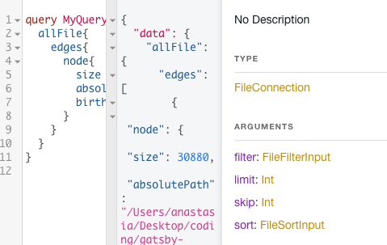
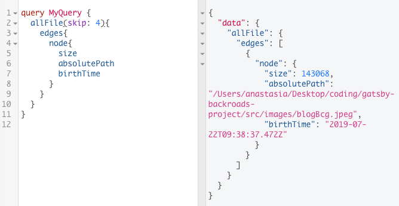
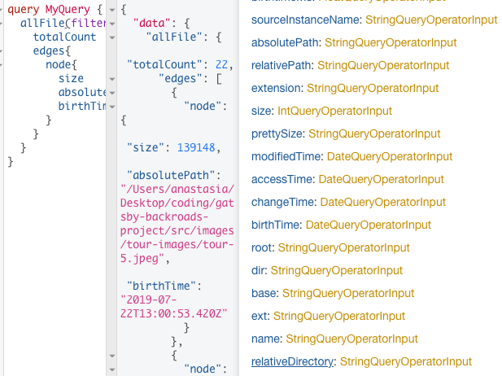
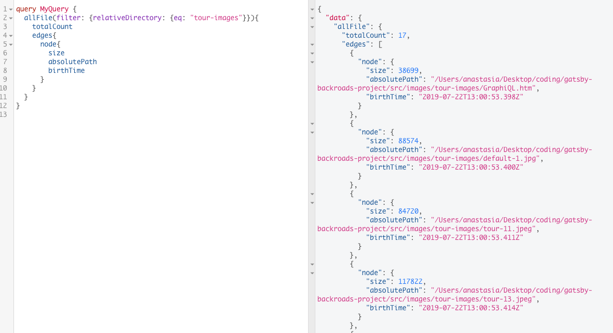

# Arguments

The `arguments` allow us to get our respose based on smth. In our case with `allFile` we have an option whether we: filter, sort, skip or limit our response. 

Concerning the syntax - we need to add parenthesis after the field. 

- Let's say we wanna `limit responce`. `Limit` will expect an integer  - what would be the limit of the files (`nodes`) you would like to recieve. 

- `skip` - skips nodes from our response. Let's say we wanna skip 4 nodes - so in response we'll get just one. 

- `filter` - let's say we only want the images from the `tour images` folder  -  this is the reason why we can use `filter`. With the `filter` we have more options how we can filter our response (filter based on what?). In our case we'll use `relativeDirecttory`. 

So, `relativeDirectory` also has many options, we'll choose `eq` - equals, and set it to the basic `string` - the name of our directory what we are looking for, in our case `"tour-images"`.

> By the way, we can use several arguments together, e.g `skip` and `filter` 