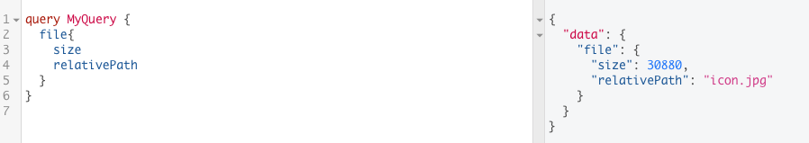
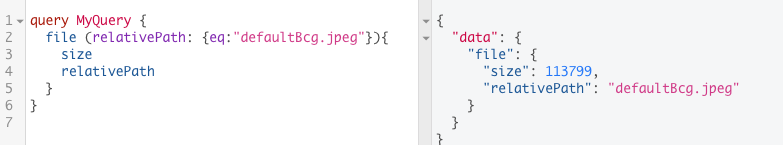

# File Field

Let's use `file` filed. In the `file` field we are checking the information about that file. What is interesting in this particular filed - it is returning a single file. However, as we are working with the `file` filed we will gonna have to use the `arguments`. 

If we need a specific file we need to tell `qraphql` what exactly file we are looking for - to do this we need to use `arguments`. If we have `relativePath` as an argument - it will look for the `images` folder and then  everything started from that `images` folder will be our relative path.  

