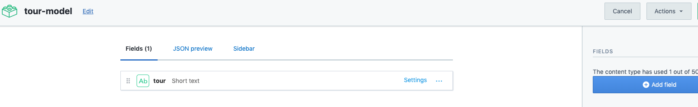

# Content Model

Let's first setup our `content-model`. In order to do this just push the `add content type` button. And after it was created we just need to add a bunch of fields. For the name we'll start with a text.

For the `text` we have two options: short or long. The difference with the `graphql` is that for the long text there will be one more field to look for informarion. In our case for the name of the `tour` we'll choose the short variant. 
Then we have two more options: `create` text or `create and configure`. We'll choose `create and configure`, once we create we can look at `validations`.  

It actually gets easier if you set all the fields as required. We'll save it and we have our `name` as a short text. 

Now we can just continue adding more fields. 

1. Let's go on with the `number` that will be our `price for the tour`. 
2. "slug"(the last element in the browser path that shows the exact tour) - `short text`
3. "country" - `short text`
4. "start" - `date&time`
5. "description" - `long text`
6. "featured" - `boolean` - If we go to our `Home` page we'll notice that we'll be able to basically filter depending on whether that tour has a field of `featured` - ture or false - that's the reason why we gonna set this up as a boolean. The same way as the `arguments in gaphlq` how we are looking for the specific image we'll gonna be able to setup the `argument` that looks just for the tours that have this field ("featured")
7. "days" - `integer`
8. "images" - `media`. In this field we have two options: one file or many files. In our case we'll choose many files. 
9. "journey" - `JSON object` - in our page we'll have "daily schedule" of different activities during the journey, several dropdowns with info. And we'll setup this info as a JSON object. 

Now we've setup our `content-model`. 

Once we are ready we can save it. 
> Note one thing: the `Content Type ID` that will allow us to retrieve the `data` 

In our case `Gatsby` will provide us with awesome `plugin`, and that plugin will have access to the fields. However if you are using e.g javaScript SDK you'll gonna be looking for that particular content type id. 

