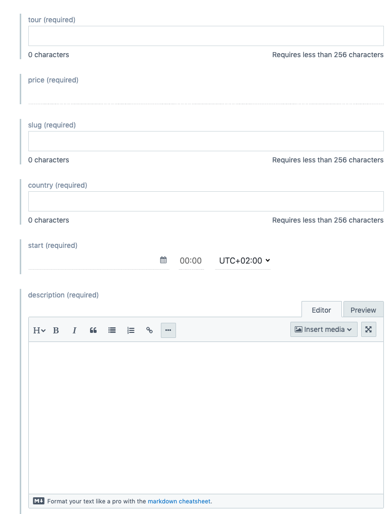
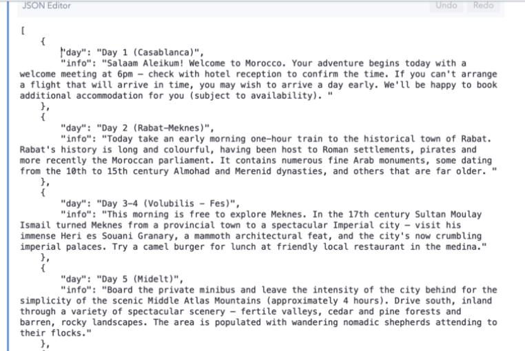

# Content 

Let's setup the `entry` - we need to add `data` for our `tour-model`. We need to fill in the fileds. 

Concerning the filed which requires JSON - it will be a typical JSON syntax. In our case we'll have an `array` with the `objects` inside with the JSON syntax. 

For the images we'll gonna have few options - `create new asset and link` (add new image) and `link exsiting assets` (pick from the existing ones).

> Note. As far as we add assets we should `publish` them. 

