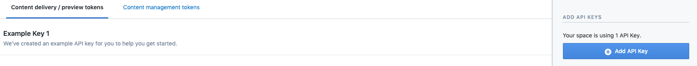

# Connect to Contentful

Well, we wanna render our tours in the `Tours page`, but in order to access the info about the tour we gonna use the `grapnql`. We would need to have specific fields regarding the `Contentful`. To deal with it we need to setup a plugin - `gatsby-source-contentful`. 

`npm install --save gatsby-source-contentful`, configure it in the `gatsby-config` file. 
 We need to add in the config the `space id` as well as the `access token`. 
How we can get them? In the `Contenful interface`, `settings` => `API keys` and we can add a new API key. 

> Note the API keys as the access token should be your `secret information` and it's not the best idea to publish it to Github!!!!! SO, don't share it wit the rest of the world!!!

After aading these fields in the `config` file we should restart the `dev server`. Once we did it we can update our `QraphiQL` interfase and the needed fields will be available for us.

Now we'll have `ContentfulTour` - filed for the singe tour; `allContentfulTour` - for all teh tours  and so on, so we can access the `data` from `Contentful`. 