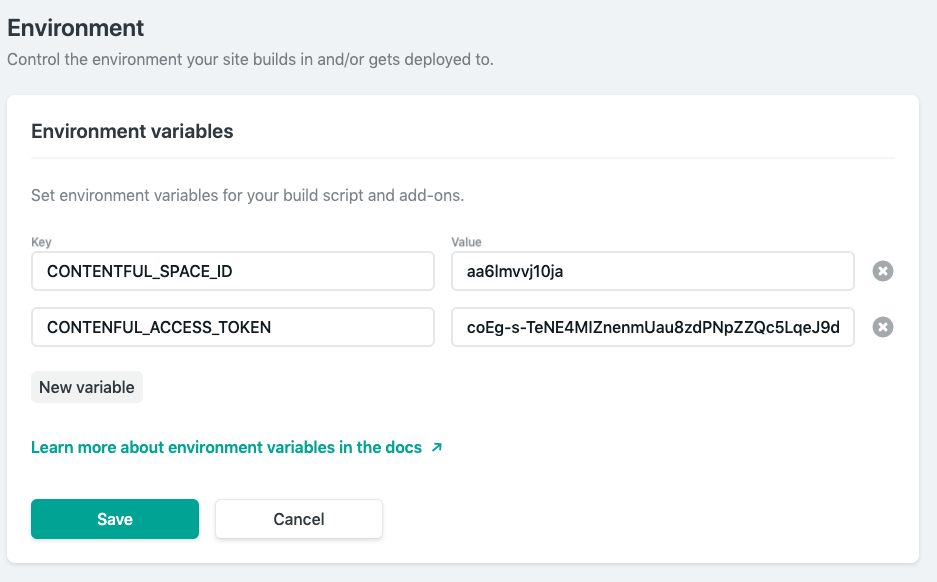

# Environment variables

> Note the API keys as the access token should be your `secret information` and it's not the best idea to publish it to Github!!!!! SO, don't share it wit the rest of the world!!!

Let's setup the `environment variables` to make this information secret.

By default `gatsby` supports only 2 environments:

- If you run gatsby develop, then you will be in the `‘development’` environment.
- If you run gatsby build or gatsby serve, then you will be in the `‘production’` environment.

In our case we are interested in installing the package -  `npm install --save dotenv`. Now we need to update our `config file`. 

**gatsby-config**

```jsx
require("dotenv").config({
  path: `.env.${process.env.NODE_ENV}`,
})

module.exports = {
  siteMetadata: {
    title: "Backroads",
    description: "Explore awesome worldwide tours and discover what makes each of them unique. Forget your daily routine & say yes to adventure",
    author: '@anmud',
  
  },
  plugins: [
    {
      resolve: `gatsby-source-filesystem`,
      options: {
        name: `images`,
        path: `${__dirname}/src/images`,
      },
    },
    `gatsby-plugin-styled-components`,
    `gatsby-transformer-sharp`, 
    `gatsby-plugin-sharp`,
    `gatsby-plugin-transition-link`,
    {
      resolve: `gatsby-source-contentful`,
      options: {
        spaceId: `aa6lmvvj10ja`,
        // Learn about environment variables: https://gatsby.dev/env-vars
        accessToken: 'coEg-s-TeNE4MIZnenmUau8zdPNpZZQc5LqeJ9dW6qU',
        
      },
    },
  ],
}
```

Once we are ready, we would need to create a file, the `dotenv` file, and that file would be hidden. We also need to make sure that we add it to `gitignore`. 
Well, within the root of our project folder let's create a new file - `.env.development` - we are creating `development` cos we gonna use it locally, later we gonna setup the `environment variables` in the `Netlify`. Now we need to come up with the `variable names` 

**.env.development**

```js
CONTENTFUL_SPACE_ID=aa6lmvvj10ja
```
Now we'll need to change our `config` file again, and type there the name of our `variable`

**gatsby-config.js**

```jsx
{
      resolve: `gatsby-source-contentful`,
      options: {
        spaceId: process.env.CONTENTFUL_SPACE_ID,
        accessToken: 'coEg-s-TeNE4MIZnenmUau8zdPNpZZQc5LqeJ9dW6qU',
        
      },
    },
```

And now we gonna have to do the same thing with the `access token`. 

**.env.dvelopment**
```js
CONTENTFUL_SPACE_ID=aa6lmvvj10ja
CONTENFUL_ACCESS_TOKEN=coEg-s-TeNE4MIZnenmUau8zdPNpZZQc5LqeJ9dW6qU
```

**gatsby-config.js**

```jsx
{
      resolve: `gatsby-source-contentful`,
      options: {
        spaceId: process.env.CONTENTFUL_SPACE_ID,
        accessToken: process.env.CONTENFUL_ACCESS_TOKEN,
        
      },
    },
```

> Now we still are able to access `Contentful`, but now we won't share our secret `API keys` or `token`. 

Now we need also add our `env` file to `gitignore` which will ignore the particular file we wanna not to show and don't wanna push to the `Git`. 

**gitignore**

```js
# Logs
logs
*.log
npm-debug.log*
yarn-debug.log*
yarn-error.log*
.env.development
# Runtime data
pids
*.pid
*.seed
*.pid.lock
```
And finally we need to restart the server. 
Concerning `Netlify` - actually `Netlify` will not gonna be aware of these `variables`. So, in the Netifiy we should find our project => go to the `site settings` =>  `build&deply` tab => `environment variables`. 



Now we are ready to push this up to the `Github`. 