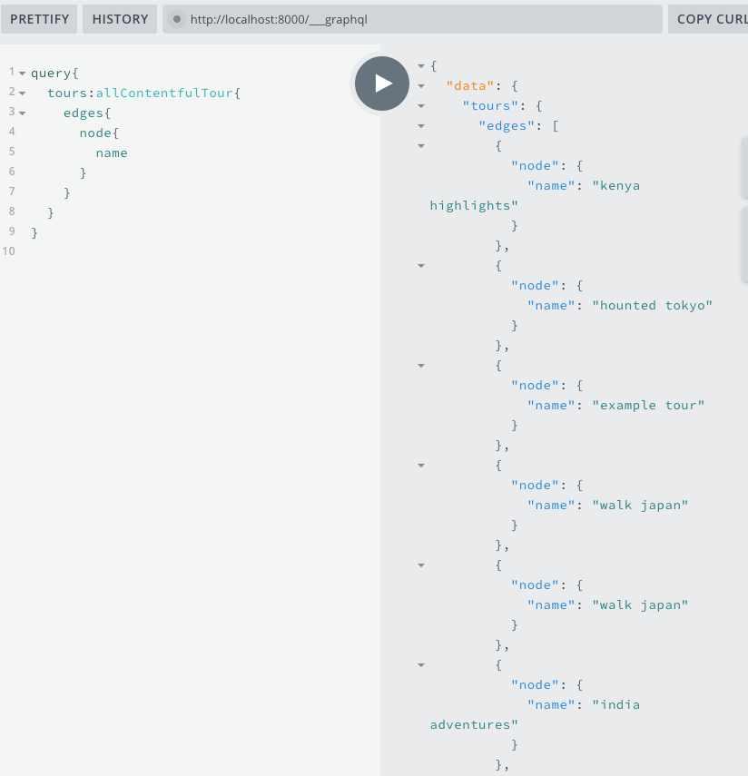

# Setup Tours Queries

What are our `queries` are gonna be looking for? First we have two sections where we gonna be rendering the `tours`: in the `Home page` there will be `featured tours` section, where we gonna be looking for those tours that have the particular field by the name of "featured"; as wellas we would like to render all tours within the `Tours page`, where they will be a tours component. Since we have for both of them the same `data` from tours we might have setup both queries, cos the only difference for the `home page` query  - is the fact that we just gonna add few more `arguments` when looking for those particulat tours. 

Well, to get all our tour we need `allContentfulTour` field => since it will return a bunch of items we need the `edges` => `node`(it will represent an object for that particular tour) => then whatever fieldes we have been added to our `content model` in the `Contentful` will be dispalyed here, and we can just grab the `fields` we are interested in. 



So, the final queries will be:

**tours**

```js
query{
  tours:allContentfulTour{
    edges{
      node{
        name
        price
        slug
        country
        contentful_id
        days
        images{
          fluid{
            src
          }
        }
      }
    }
  }
}
```

**featuredTours**

```js
query{
  featuredTours:allContentfulTour(filter:{featured:{eq:true}}){
    edges{
      node{
        name
        price
        slug
        country
        contentful_id
        days
        images{
          fluid{
            src
          }
        }
      }
    }
  }
}
```

