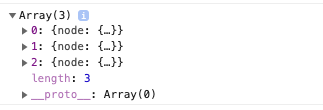
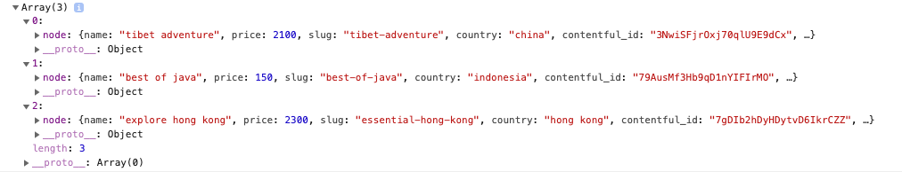

# Featured Tours Component

Let's create the components that will render our queries. First within the `components` folder we'll create a new folder by the name of `Tours`. It will contain some components: `Tours.js`, `TourList.js`, `Tour.js`. Then within the `Home` folder we'll create `FeaturedTours.js` component. 

Let's create `FeaturedTours.js` component as a functional component, and `Tour.js` component which we'll place inside the `FeaturedTours` so it could render it. And we import our `FeaturedTours` in the `index` page. 

**FeaturedTours**

```jsx
import React from 'react'
import Tour from '../Tour/Tour'

const FeaturedTours = () => {
    return(
      <div>
          hello from featured tours
          <Tour/>
      </div>
    )
}

export default FeaturedTours;
```

**Tour**

```jsx
import React from 'react'

const Tour = () => {
    return(
        <div>
            this is a single tour
        </div>
    )
}
```
Now we need to add some more imports to our `FeaturedTours`.

**FeaturedTours**

```jsx
import React from 'react'
import Tour from '../Tour/Tour'
import {useStaticQuery, graphql} from 'gatsby'
import Title from '../Title'
import styles from '../../css/items.module.css'
import AniLink from 'gatsby-plugin-transition-link/AniLink'

const FeaturedTours = () => {
    return(
      <div>
          hello from featured tours
          <Tour/>
      </div>
    )
}

export default FeaturedTours;
```
Now, let's continue working on the component. 

**FeaturedTours**

```jsx
import React from 'react'
import Tour from '../Tour/Tour'
import {useStaticQuery, graphql} from 'gatsby'
import Title from '../Title'
import styles from '../../css/items.module.css'
import AniLink from 'gatsby-plugin-transition-link/AniLink'

const getTours = graphql`
query{
    featuredTours:allContentfulTour(filter:{featured:{eq:true}}){
      edges{
        node{
          name
          price
          slug
          country
          contentful_id
          days
          images{
            fluid{
              ...GatsbyContentfulFluid_tracedSVG
            }
          }
        }
      }
    }
  }
`

const FeaturedTours = () => {

    const response = useStaticQuery(getTours);
    const tours = response.featuredTours.edges;
    console.log(tours)

    return(
      <section className={styles.tours}>
          <Title title="featured" subtitle="tours"/>
          hello from featured tours
          <Tour/>
          <AniLink fade to="/tours" className="btn-primary">all tours</AniLink>
      </section>
    )
}

export default FeaturedTours;
```

When we setup our `query` we successfuly get the `data`, which is an `array` of `nodes`.






What we gonna do right now - we gonna pass down into a `Tour` component the `node` property, cos within this object we have all the information we are looking for. Let's render our tours. 

So, we'll map the tours we getto show them in the list, and pass `node` to the `Tour` component as a prop, named "tour". 

**FeaturedTours**

```jsx
import React from 'react'
import Tour from '../Tour/Tour'
import {useStaticQuery, graphql} from 'gatsby'
import Title from '../Title'
import styles from '../../css/items.module.css'
import AniLink from 'gatsby-plugin-transition-link/AniLink'

const getTours = graphql`
query{
    featuredTours:allContentfulTour(filter:{featured:{eq:true}}){
      edges{
        node{
          name
          price
          slug
          country
          contentful_id
          days
          images{
            fluid{
                ...GatsbyContentfulFluid_tracedSVG
            }
          }
        }
      }
    }
  }
`

const FeaturedTours = () => {

    const response = useStaticQuery(getTours);
    const tours = response.featuredTours.edges;
  

    return(
      <section className={styles.tours}>
          <Title title="featured" subtitle="tours"/>
         
          <div className={styles.center}>
          {tours.map(({node}) => {
              return <Tour key={node.contentful_id} tour={node}/>
          })}
          </div>
          
          <AniLink fade to="/tours" className="btn-primary">all tours</AniLink>
      </section>
    )
}

export default FeaturedTours;
```


