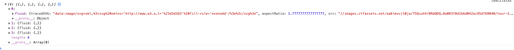

# Tour Component

First of all we need to do a bunch of imports. As well as destructure the items we get from the `tour prop`. 

**Tour.js**

```jsx
import React from 'react'
import Image from 'gatsby-image'
import styles from '../../css/tour.module.css'
import {FaMap} from 'react-icons/fa'
import AniLink from 'gatsby-plugin-transition-link'


const Tour = ({tour}) => {

const {name, price, country, days, slug, images} = tour

    return(
        <article>
            this is a single tour
        </article>
    )
}

export default Tour;
```
Let's look at `images array` we get from `tour prop`.



Since we are using `gatsby-image` plugin we need to supply the particular property (fluid in our case). So, to choose th eimage we want we do the following: 

`let mainImage = images[0].fluid` - we are accessing the first image in the `array` and use the `fluid` prop. 

**Tour.js**

```jsx
import React from 'react'
import Image from 'gatsby-image'
import styles from '../../css/tour.module.css'
import {FaMap} from 'react-icons/fa'
import AniLink from 'gatsby-plugin-transition-link'


const Tour = ({tour}) => {

const {name, price, country, days, slug, images} = tour
let mainImage = images[0].fluid

    return(
        <article className={styles.tour}>
             <div className={styles.imageContainer}>
                 <Image fluid={mainImage} className={styles.img} alt="single tour"/>
             </div>
        </article>
    )
}

export default Tour;
```

We also wanna use the link for the spacific tour - that we get from our `slug`, and we wanna show the `slug` in our `url` to the page. 

**Tour**

```jsx
import React from 'react'
import Image from 'gatsby-image'
import styles from '../../css/tour.module.css'
import {FaMap} from 'react-icons/fa'
import AniLink from 'gatsby-plugin-transition-link'


const Tour = ({tour}) => {

const {name, price, country, days, slug, images} = tour
let mainImage = images[0].fluid

    return(
        <article className={styles.tour}>
             <div className={styles.imageContainer}>
                 <Image fluid={mainImage} className={styles.img} alt="single tour"/>
                 <AniLink fade className={styles.link} to={`/tours${slug}`}>details</AniLink>
             </div>
        </article>
    )
}

export default Tour;
```

What is next? We also want to have a footer for our image.

**Tour.js**

```jsx
import React from 'react'
import Image from 'gatsby-image'
import styles from '../../css/tour.module.css'
import {FaMap} from 'react-icons/fa'
import AniLink from 'gatsby-plugin-transition-link'


const Tour = ({tour}) => {

const {name, price, country, days, slug, images} = tour
let mainImage = images[0].fluid

    return(
        <article className={styles.tour}>
             <div className={styles.imageContainer}>
                 <Image fluid={mainImage} className={styles.img} alt="single tour"/>
                 <AniLink fade className={styles.link} to={`/tours${slug}`}>details</AniLink>
             </div>
             <div className={styles.footer}>
              <h3>{name}</h3>
              <div className={styles.info}>
                  <h4 className={styles.country}>
                      <FaMap className={styles.icon}/>
                      {country}
                  </h4>
                  <div className={styles.details}>
                      <h6>{days} days</h6>
                      <h6>from ${price}</h6>
                  </div>
              </div>
             </div>
        </article>
    )
}

export default Tour;
```

