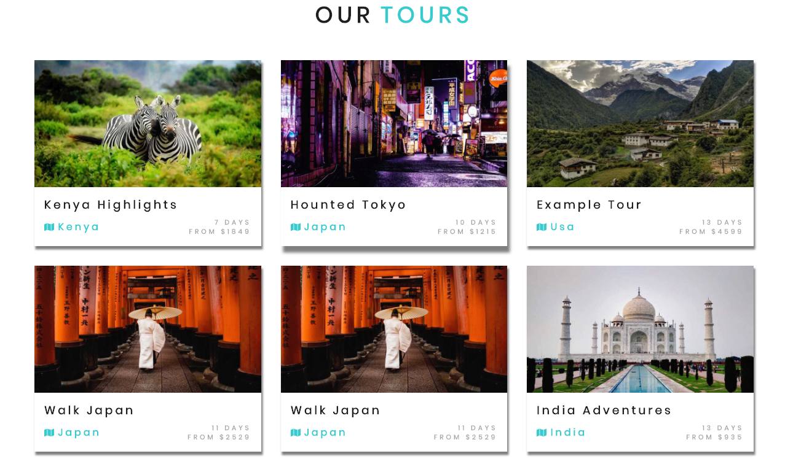

# Tours Component

This component will render all our tours. Actually we'll create two components, namely `Tours` (functional component) and `TourList`- which will be class based component. And we'll import our `TourList` to the `Tours`.

**TourList.js**

```jsx
import React, {Component} from 'react'

export default class TourList extends Component {
    render(){
        return(
            <div>
                hello from tour list
            </div>
        )
    }
}
```

**Tours**

```jsx
import React from 'react'
import TourList from '../Tour/TourList'

const Tours = () =>{
    return(
        <div>
         <TourList/>
        </div>
    )
}

export default Tours;
```
Now our newly created `Tours.js` component we'll import to our `tours.js` page. 

**pages/tours.js**

```jsx
import React from 'react'
import Layout from '../components/Layout'
//import Header from '../examples/Header'
import RegularHeader from '../examples/RegularHeader'
import StyledHero from '../components/StyledHero'
import {graphql} from 'gatsby'
import ToursComponent from '../components/Tour/Tours'


const Tours = ({data}) => {

    const image = data.defaultBcg.childImageSharp.fluid

    return (
        <Layout>
            <StyledHero image={image}>
            

           {/* <RegularHeader/> */}

           {/* <Header/> */}
            </StyledHero>
            <ToursComponent/>
        </Layout>
    )
}

export default Tours;

export const query = graphql`
query{
  defaultBcg: file(relativePath: {eq:"defaultBcg.jpeg"}){
    childImageSharp{
      fluid(maxWidth:4160, quality: 90){
        ...GatsbyImageSharpFluid_withWebp
      }
    }
  }
}
`
```

Let's continue working on the `Tours.js` component, setup the `query` and pass the `data` as a prop to the `TourList`. 

**Tours.js**

```jsx
import React from 'react'
import TourList from '../Tour/TourList'
import {useStaticQuery, graphql} from 'gatsby'

const getTours = graphql`
query{
    tours:allContentfulTour{
      edges{
        node{
          name
          price
          slug
          country
          contentful_id
          days
          images{
            fluid{
              ...GatsbyContentfulFluid_tracedSVG
            }
          }
        }
      }
    }
  }
`

const Tours = () =>{

const {tours} = useStaticQuery(getTours)

    return(
       
         <TourList tours={tours}/>
       
    )
}

export default Tours;
```

Since our `TourList` is a class based component we ganna setup our `state. Actually we did it this way cos in the future we'll have an oppotrunity to filter.

**TourList.js**

```jsx
import React, {Component} from 'react'
import setyles from '../../css/items.module.css'
import Tour from './Tour'
import Title from '../Title'


export default class TourList extends Component {

state={
    tours:[],
    sortedTours:[]
}

componentDidMount(){
    this.setState({
        tours: this.props.tours.edges,
        sortedTours: this.props.tours.edges
    })
}

    render(){
        return(
            <div>
                hello from tour list
            </div>
        )
    }
}
```

And let's render the tours.

**TourList.js**

```jsx
import React, {Component} from 'react'
import styles from '../../css/items.module.css'
import Tour from './Tour'
import Title from '../Title'


export default class TourList extends Component {

state={
    tours:[],
    sortedTours:[]
}

componentDidMount(){
    this.setState({
        tours: this.props.tours.edges,
        sortedTours: this.props.tours.edges
    })
}

    render(){
        return(
            <section classNme={styles.tours}>
                <Title title="our" subtitle="tours"/>
                <div className={styles.center}>
                 {
                     this.state.sortedTours.map(({node}) => {
                         return <Tour key={node.contentful_id} tour={node}/>
                     })
                 }
                </div>
            </section>
        )
    }
}
```



