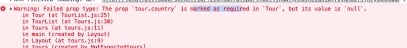

# Simple Default Props

Let's look at the typical mistakes: 

-  when you create the `content model` in the `Contentful` you can eventyally forget to type some `data` in the `field` - then you surely won't see this needed data in your project. To solve this use `required configuration` when creating `fields` for the `content model`. 

What are the ways we can catch these kind of errors in our `Gatsby` application? Well, we can e.g simple console.log the `data` we get from `Contentful` with the `query`. The better way is to setup `prop types` that will inform you about the fact that that particular `prop` is missing. 

First we need to import that from React, and then setup => the `name of the component` => dot => `propTypes` that we've just imported => and  set this equal to the syntax of curly braces ({}) => within them we'll have the `tour prop` which is by itself an `object` - `tour:PropTypes.shape` we are looking for the `method` by the name of `shape()`. This `shape()` method will allow us to check the `props` if it is in fact an `object`. Than we would like to check what exactly `props` we have within the `tour` object => let's say `name prop` => name:PropType.string (what type of prop it should be) and then we add `.isRequired`. And the same thing we gonna do with the rest of the props. 
Concerning the `images` the `type` of the `prop` will be here => `images:PropTypes.arrayOf(PropTypes.object).isRequired`

**Tour.js**

```jsx
import React from 'react'
import Image from 'gatsby-image'
import styles from '../../css/tour.module.css'
import {FaMap} from 'react-icons/fa'
import AniLink from 'gatsby-plugin-transition-link'

import PropTypes from 'prop-types'  //import prop types here 


const Tour = ({tour}) => {

const {name, price, country, days, slug, images} = tour
let mainImage = images[0].fluid

    return(
        <article className={styles.tour}>
             <div className={styles.imageContainer}>
                 <Image fluid={mainImage} className={styles.img} alt="single tour"/>
                 <AniLink fade className={styles.link} to={`/tours${slug}`}>details</AniLink>
             </div>
             <div className={styles.footer}>
              <h3>{name}</h3>
              <div className={styles.info}>
                  <h4 className={styles.country}>
                      <FaMap className={styles.icon}/>
                      {country}
                  </h4>
                  <div className={styles.details}>
                      <h6>{days} days</h6>
                      <h6>from ${price}</h6>
                  </div>
              </div>
             </div>
        </article>
    )
}

//setup prop types here 

Tour.propTypes = {
    tour:PropTypes.shape({
        name:PropTypes.string.isRequired,
        country:PropTypes.string.isRequired,
        price:PropTypes.number.isRequired,
        days:PropTypes.number.isRequired,
        images:PropTypes.arrayOf(PropTypes.object).isRequired,
    })
}
export default Tour;
```

Now in the console we would see the warning if some prop is missing. 



What if we wanna fix it with some `default value` that way that if we are looking at the tour we'll see that e.g the `country prop` is missing. In our JSX where we are rendering e.g our `country`  - we could say here "is the country is there => render the country, if not render 'default country' " - so, to use `"or operator"` (||) which looks for the first `truthy value`. 

```jsx
 <h4 className={styles.country}>
   <FaMap className={styles.icon}/>
    {country || 'default country'}
</h4>
```

This way when we look at our `data` and see 'default country` we'll know that there is a mistake and we need to fix it.  