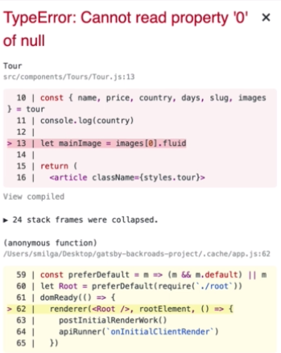

# Image Default Props

How can we use the `default props` with the `images`? 

In case you forgot to set `images` in the `Contentful` `content model field` and didn't setup it as a required fileld - how we can catch this error. 



In this case it's a bit more complicated - we cant't just use the `default string value`. So, our images are missing now => we actually get the `array` of images and we are looking for that particular item in the array (in our case the first item) - `let mainImage = images[0].fluid` - but this is not there, cos we don't have the images array (cos we don't have this image in the Contentful content model). 

In this case it's not just as simple as doing the `or operator`, cos we are looking for `fluid property` which is necessary for the `Gatsby Image` in order to get the image.  Well, in this case we would have to setup a `static query` (with useStaticQuery hook in our case) as well as we would need to query for one of the `default images` from or local files (not from the Contentful) and actually place it within our tour. And using the ternary operator we can check if there is the right image or not. 

Tour.js
```jsx
import React from 'react'
import Image from 'gatsby-image'
import styles from '../../css/tour.module.css'
import {FaMap} from 'react-icons/fa'
import AniLink from 'gatsby-plugin-transition-link'
import {useStaticQuery, graphql} from 'gatsby'

import PropTypes from 'prop-types'

//set the query for the default image

const getDefaultImage = graphql`    
query{
    file(relativePath: {eq: "defaultBcg.jpeg"}){
      childImageSharp{
        fluid{
          ...GatsbyImageSharpFluid_tracedSVG
        }
      }
    }
  }
`
const Tour = ({tour}) => {
//get the data with the default image 
const data = useStaticQuery(getDefaultImage)
const img = data.file.childImageSharp.fluid 

const {name, price, country, days, slug, images} = tour

//check if the right image is there or use the default image 
let mainImage = images ? images[0].fluid : img 

    return(
        <article className={styles.tour}>
             <div className={styles.imageContainer}>
                 <Image fluid={mainImage} className={styles.img} alt="single tour"/>
                 <AniLink fade className={styles.link} to={`/tours${slug}`}>details</AniLink>
             </div>
             <div className={styles.footer}>
              <h3>{name}</h3>
              <div className={styles.info}>
                  <h4 className={styles.country}>
                      <FaMap className={styles.icon}/>
                      {country || 'default country'}
                  </h4>
                  <div className={styles.details}>
                      <h6>{days} days</h6>
                      <h6>from ${price}</h6>
                  </div>
              </div>
             </div>
        </article>
    )
}


Tour.propTypes = {
    tour:PropTypes.shape({
        name:PropTypes.string.isRequired,
        country:PropTypes.string.isRequired,
        price:PropTypes.number.isRequired,
        days:PropTypes.number.isRequired,
        images:PropTypes.arrayOf(PropTypes.object).isRequired,
    })
}
export default Tour;
```

We can do the same procedure with our `StyledHero` image. 

**StyledHero.js**

```jsx
import React from 'react'
import styled from "styled-components"
import BackgroundImage from "gatsby-background-image"
import {useStaticQuery, graphql} from 'gatsby'

const getImage = graphql`
query{
  defaultBcg: file(relativePath: {eq:"defaultBcg.jpeg"}){
    childImageSharp{
      fluid(quality:90, maxWidth: 4160){
        ...GatsbyImageSharpFluid_withWebp
      }
    }
  }
}
`

const StyledHero = ({image, className, children, home}) => {

  const data = useStaticQuery(getImage)
 

  return(
    <BackgroundImage className={className} fluid={image || data.defaultBcg.childImageSharp.fluid} home={home}>
    {children}
    </BackgroundImage>
  )
}

export default styled(StyledHero)`
 min-height: ${props => (props.home ? "calc(100vh - 62px)" : "50vh")};
 background: ${props => (props.home ? "linear-gradient(rgba(63, 208, 212, 0.7), rgba(0, 0, 0, 0.7))" : "none")};
 background-position: center;
 background-size: cover;
 opacity: 1 !important;
 display: flex;
 justify-content: center;
 align-items: center; 
 `
```