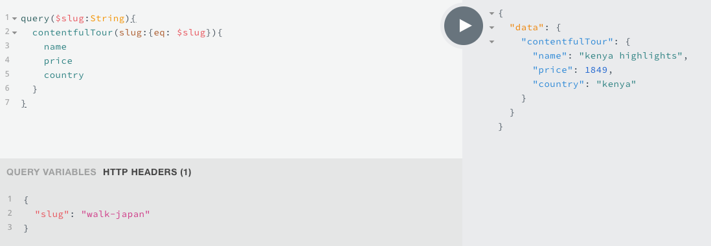

# Query Variables

Let's setup our specific query where we are looking for the one particular item.

Having this query we are getting the specific `data` about the specific tour. However, we are passing in the static data (in the slug), but the case is that we wanna make it dynamic. And the way we do that - is settign up the `variables`.  There gonna be three thing we have to do: 
- replace the `static value` with the `variable name`
- declare the `variable name`
- setup the `variable` in the `playground` (or GraphiQL)

Later in the `template` we'll gonna use the `variable` we are passing in the `context` in our `gatby-node.js` file. 