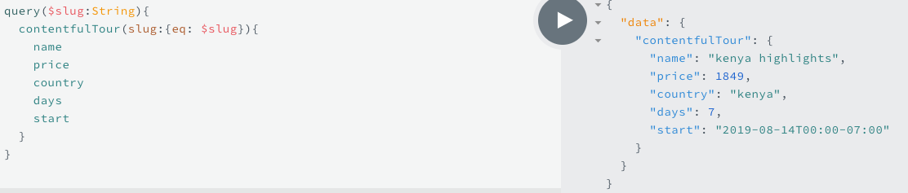
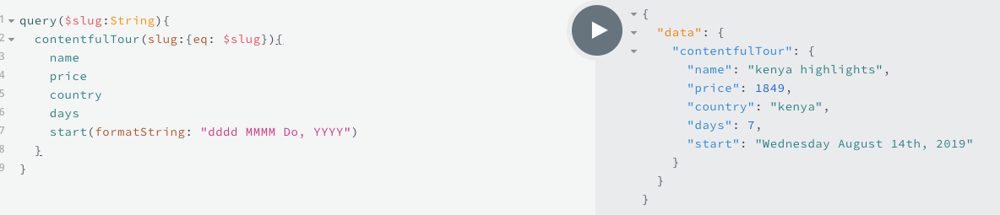
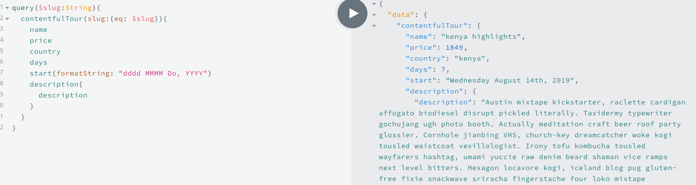
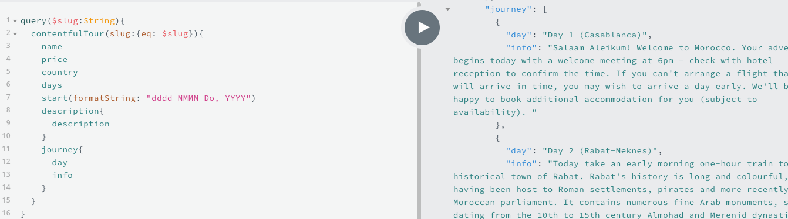
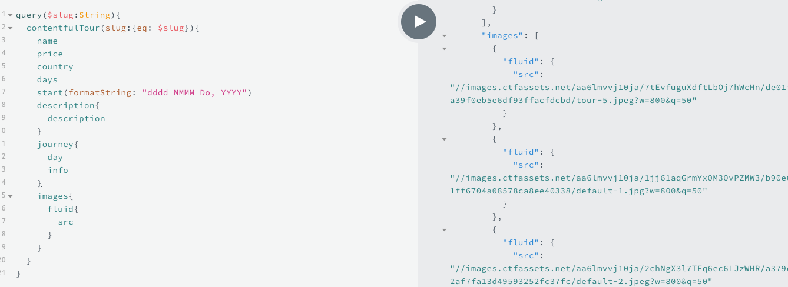

# Single Tour Query

When writing the `query` for the single tour we also need to get the `date`, but the response is actually not very friendly. 

If we look at the docs in `Prisma playground` and find our `field`, namely "start" - and then we can see that we can in fact pass the `argumenets`, and one of them is very useful - `formatString`. Gatsby in fact behind the scenes is using the `Moment.js` and if we pass `formatString` as an `argument`, we can format our start date as we want. 

Next, we need to get the `description` and it was the long-text format in the Contentful content-model, so in the query it should be actually an `object` - `description{description}`.

Next - the journey - it is a JSON format. To be specific with the journey - we'll add two subfields - day and info (we have them in the content-model)

Lats thing - images. 

