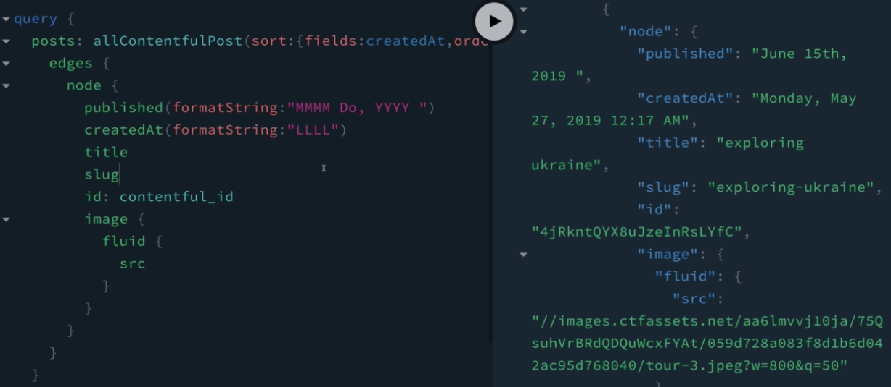

# Post Query

The query to render all the posts that we currently have.

```
query{
  posts: allContentfulPost{
    edges{
      node{
        published(formatString: "MMM Do, YYYY")
        title
        slug
        id: contentful_id
        image{
          fluid{
            src
          }
        }
      }
    }
  }
}
```

There is one more thing that we need to add. We actually need to sort the response that we are getting. The argument that we gonna be using is - sort. 

```
query{
  posts: allContentfulPost( sort: {fields: published, order: DESC }){
    edges{
      node{
        published(formatString: "MMM Do, YYYY")
        title
        slug
        id: contentful_id
        image{
          fluid{
            src
          }
        }
      }
    }
  }
}
```

> Note that we can sort by the fields that we haven't created ourselves - one of these fields is - `createdAt`. 



