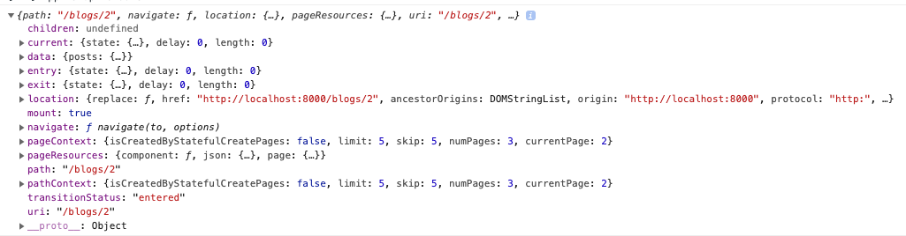

# Numbering

Next we wanna page numbering where we can click and navigate to the page we need. First we need to get two variables from our `pageContext`:  number of pages and current page.  



To get them we first need to destructure them - `const {currentPage, numPages} = props.pageContext`.
Next step - section with the numbering. Here we'll use `array.from()` method - actually we are creating array with three items in that array (length: numPages); the second thing that we can pass in `array.from()` is a `function` that will be applied for every item in that `array`. 

**blog-list-template**

```js
import React from "react"
import { graphql } from "gatsby"
import Layout from "../components/Layout"
import styles from "../css/blog.module.css"
import AniLink from "gatsby-plugin-transition-link/AniLink";
import BlogCard from '../components/Blog/BlogCard'
import Title from '../components/Title'


const BlogList = (props ) => {
 
const {data} = props

const {currentPage, numPages} = props.pageContext 


  return (
    <Layout>
       <section className={styles.blog}>
     <Title title="latest" subtitle="posts"/>
     <div className={styles.center}>
         {data.posts.edges.map(({node}) => {
           return <BlogCard key={node.id} blog={node}/>
         })}
     </div>
     <section className={styles.links}>
          {Array.from({length: numPages}, (_,i) => {
            return <AniLink fade key={i} to={`/blogs/${i === 0 ? "" : i+1}`} className={i + 1 === currentPage? `${styles.link}${styles.active}` : `${styles.link}`}>{i+1}</AniLink>
          })}
     </section>
    </section>
    </Layout>
   
  )
}

export const query = graphql`
query getPosts($skip: Int!, $limit: Int!) {
  posts: allContentfulPost(
    skip: $skip
    limit: $limit
    sort: { fields: published, order: DESC }
  ) {
    edges {
      node {
        slug
        title
        id: contentful_id
        published(formatString: "MMMM Do, YYYY")
        image {
          fluid {
            ...GatsbyContentfulFluid
          }
        }
      }
    }
  }
}
`

export default BlogList;
```

