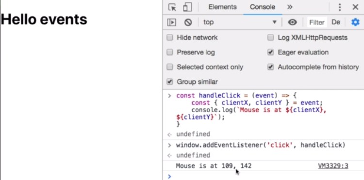

# Review: Event Listners

**An event** -  is smth. that happens as the `user` is viewing a `web page`, e.g `user clikcs` or `mouse movements` or `mouse presses` or `keyboard presses`. Each one of this triggeres what's called `an event`. To any `event` we can assign `event handler`. 

**An event object** is provided automatically by the `browser` to the `function` and consists of a whole bunch of `properties` that are gonna discribe details about the `event`. 

**An event handler** - is just a `js function` that runs whenever the `event` occurs. 
On every `DOM node` in our `browser` we can invoke a `method` called **event listner** and this is, actually, allows us to add an `event handler` to a given `event`.
And the name of the `event listner` makes sense cos we want to tell the `browser` to listen for a specific `event` to keep its ears open and then to execute a `function` whenever that `event` occurs. 



And there is a way to remove the `event listner`, this is going to accept the exact same argument as the `addEventListner` : the name of the `event` and the `event handler function`. Why do we need to porvide the `event handler` for removing an `event`?  We can have multiple `event handlers` for the `single event`, so we han have five (or any number) different independent `functions` be invoked whenever the `user` clicks and we have to speicfy which specific `fucntion` we wanna remove.  

```js
const handleClick = event => {
    const {clientX, clientY} = event
    console.log(`Mouse is at ${clientX}, ${clientY}`)
}

window.removeEventListner('click', handleClick)


[official reddit discussion on the inefficiencies of subscribing with adEventListner and removeEventListner on each around](https://www.reddit.com/r/reactjs/comments/9zupzn/why_would_i_use_react_hooks_where_the_seteffect/)