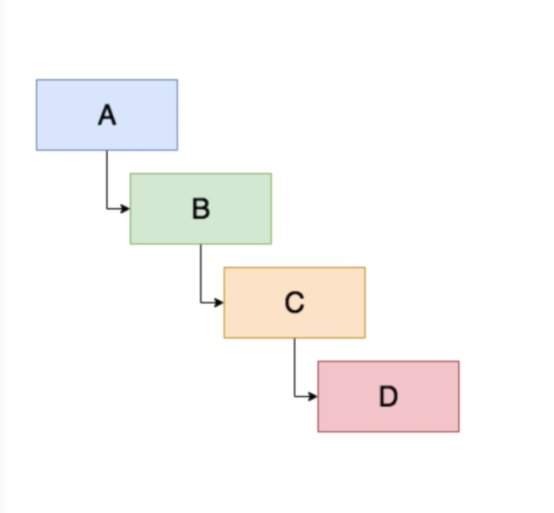

# Review: React Context

What is `Context`? **React Context** is a feature introduced in React 16.3 which first released in march 2018 and it's designed to solve a specific problem which is - passing `data` down  from the top of the component tree` to a more `nested component` further down that tree. 

Imagine you have a `component` called "A", which nests a `component` called "B", => which nests a `component` called "C", => which nests a `component` called "D".  



Let's say you wanna pass down a part of `component A's state` all the way down to `component` "D".
One way to do it is to simply pass `data` down as `props`. Unfortunately, this means that `props` need to be passed down to every `component` between "A" and "D" and that's absolutely inefficient and useless cos the `components` in the middle "B" and "C" dont' need that information. 
So, the more `component` are between the `parent` and ` child` that needs to recieve some kind of `props` - the more complex and prone the error the app can get. 

`React Context` acts like a bridge between the `component` that has the `data` and any `component` tha needs the `data`. The `component` that provides the `data` is called - **the provider**; and the `component` (or components) that recieves the `data` are called - **the consumer**, cos they consume the information provided for them by the provider.  

The first thing we need to do is to import a `createContext` function that React exposes to us. `createContext` is a plain `function` so we can invoke it below, and when invoked it's going to return us a `Context object`. `Context` is just related to a piece of information, we can think of it like a piece of `global state`. 

Let's say this `context` is designed to represent the concept of a `name` or store the idea of a `state` of a "name". So, we gonna give this `context` a name "NameContext". The `object` that it returned from `createContext` includes two `properties`, both of which store `react components`. These two properties are `provider` and `consumer`. The `provider component` is going to be in charge of sending our `data` to our `child components`. 

So, we'll have `App component` which nests `Child componet` => `Child component` nests `GrandChild component` and finally `GrandChild component` will nes `Button component`. Our goal is to use `react context` to allow `App component` to provide the `context` that `Button component` needs, and `Button` consume it without going through `Child` or `GrandChild`. 

Let's see how it works with `class-based-components`. 

##### App component
```jsx
import React, {createContext} from 'react'

const NameContext = createContext()

class App extends React Component {
  constructor(props){
    super(props);
    this.state = {
      name: "Billy Shakespere",
    }
  }

  render(){
    return (
      <Child/>
    )
  }
}

class Child extends React Component {}
class Grandchild extends React Component {}
class Button extends React Component {}

export default App;
```

So, we know we have `NameContext` which is an `object` that we got back from `createContext()` and this is gonna have two `properties` : `consumer` and `provider`. To render this we'll use JSX syntaxt - `<NameContext.Provider>`. The only `prop` that we need to pass to this `provider component` is a `value`. A `value` is going to be whatever `value` we wanna pass down, that our `consumers` are going to have acces to. 
In our case we gonna pass the `value` of our `name property` - `<NameContext.Provider value={this.state.name}/>`. And the way this works - whenever the `value` of state is updated, every our `consumers/children` of our `component tree` that are subscribed or consuming our `provider` will have access to the `value` if it changes. And we nest `Child component` within our `Provider component`. To other our `components` (Child, Grandchild, Button) let's give some basic `render methods`, and return some `jsx`. 

##### App component
```jsx
import React, {createContext} from 'react'

const NameContext = createContext()

class App extends React Component {
  constructor(props){
    super(props);
    this.state = {
      name: "Billy Shakespere",
    }
  }

  render(){
    return (
      <NameContext.Provider value={this.state.name}>
               <Child/>
      </NameContext.Provider>
 
    )
  }
}

class Child extends React Component {
  render(){
    return(
      <section className="child">
        <Grandchild/>
      </section>
    )
  }
}
class Grandchild extends React Component {
  render(){
    return(
      <div className="grandchild">
         <Button/>
      </div>
    )
  }
}
class Button extends React Component {}

export default App;
```

Now we need our `Button component` consume the information provided to it by the `Provider` that we established in our `App component`. In our `App component` we need to use our `NameContext` object but only with the `consumer property`. And we need to provide a `function`, that's going to return `jsx`. In order to write a `function` here we need to use curly braces syntax (`{}`). The way this works - the `function` is going to recieve the `argument`, and this `argument` is going to be the `value` of the `context`. 
So, actually the `value` that we provide on the `Provider` - `<NameContext.Provider value={this.state.name}>` - is the `argument` that we provide for the `function` in the `Consumer`, that is going ot return `jsx`. In our case this is "name" and inside the `function` we'll return `<button>` element where we can interpolate the `value` of "name" state variable. 

##### App component
```jsx
import React, {createContext} from 'react'

const NameContext = createContext()

class App extends React Component {
  constructor(props){
    super(props);
    this.state = {
      name: "Billy Shakespere",
    }
  }

  render(){
    return (
      <NameContext.Provider value={this.state.name}>
               <Child/>
      </NameContext.Provider>
 
    )
  }
}

class Child extends React Component {
  render(){
    return(
      <section className="child">
        <Grandchild/>
      </section>
    )
  }
}
class Grandchild extends React Component {
  render(){
    return(
      <div className="grandchild">
         <Button/>
      </div>
    )
  }
}
class Button extends React Component {
  render(){
    return (
    <NameContext.Consumer>
     { name => <button>{name}</button>
     }
    
    </NameContext.Consumer>
    );
  }
}

export default App;
```

So, that is a beautiful part about the feature of React `Context` - we can declare some piece of information (some global state), and then in any nested component, no matter how deep we go, we don't have to pass all this information down as `props` through every layer.

Rather by simply using `ContextAPI`, we use `Provider component`, that's going to send the information, and any `component` that needs to recieve that information we just need the `Consumer component` from that `Context` and we pass there a `function`, where the `argument` present the information that we age going to get from the `Provider`. 

What happens with our code when we have multiple `Providers` and `Consumers`. Let's say we are going ot build the app with three `Contexts`. We can nest the `Consumers` within each other. Each of the nested `Consumers` needs to have a `function` passed to it. And within this `function` we can get acces to one more nested `Consumer`. But surely tis way of using it is very complicated. Actually, the `useContext` hook was created to solve this problem.

##### App component
```jsx
import React, {createContext} from 'react'


<ThemeContext.Consumer>
{
theme => {
  <LanguageContext.Consumer>
  {
    language => {
      <Timezone.Consumer>
       {
         timezone => {
              return <div style={{color: theme}}>{language} {timezone}</div>
         }
       }
        </Timezone.Consumer>
    }
  }
  </LanguageContext.Consumer>
}

}

</ThemeContext.Consumer>


export default App;
```