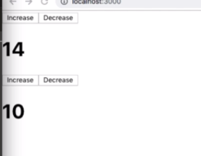

# Another Custom Hook Example (Counter)

We have simple `counter app`. 

##### App

```jsx
import React, {useState} from 'react';
import Counter from './Counter'


const App = () => {
  
  const [count, setCount] = useState(0)
 
  const increaseCount = ({count, setCount}) => setCount(count + 1)
  const decreaseCount = ({count, setCount}) => setCount(count - 1)
  const resetCount = ({count, setCount}) => setCount(0)
  
  return (
    <div>
      <h1>Welcome to the app</h1>
     
      <Counter 
      count={count}
      setCount={setCount}
      increaseCount={increaseCount}
      decreaseCount={decreaseCount}
      resetCount={resetCount}
      color={color}
      setColor={setColor}
      handleColorChange={handleColorChange}
      />
     
    </div>
  );
}

export default App;
```

##### Counter

```jsx
import React from 'react';

const Counter = (props) => {
 
  return (
    <div>
     
      <h1>{props.count}</h1>
      <button onClick={()=>props.increaseCount({count: props.count, setCount: props.setCount}) }>Increase</button>

      <button onClick={() =>props.decreaseCount({count: props.count, setCount: props.setCount})}>Decrease</button>

      <button onClick={() =>props.resetCount({count: props.count, setCount: props.setCount})}>Reset</button>
   
    </div>
  );
}

export default Counter;
```

Let's say we wanna extract `counter functionality` to use outside of `App` component. So, let's create custom `useCounter` hook. 

##### App

```jsx
import React, {useState} from 'react';
import Counter from './Counter'

const useCounter = () => {
  const [count, setCount] = useState(0)
 
  const increaseCount = ({count, setCount}) => setCount(count + 1)
  const decreaseCount = ({count, setCount}) => setCount(count - 1)
  const resetCount = ({count, setCount}) => setCount(0)
}

const App = () => {
  
  const Counter = useCounter()
  
  return (
    <div>
      <h1>Welcome to the app</h1>
     
      <Counter 
      count={count}
      setCount={setCount}
      increaseCount={increaseCount}
      decreaseCount={decreaseCount}
      resetCount={resetCount}
      color={color}
      setColor={setColor}
      handleColorChange={handleColorChange}
      />
     
    </div>
  );
}

export default App;
```

`jsx` that we are returning from our `App` function relies on some `constants` which are not yet defined within `App` component, as well as `increment`, `decrement`, and `reset` functions. How can we get all these values from inside the `useCount` customised hook to our `App` component? We can simply return them within the body of `useCounter` hook.

Then, how can we make them available? We can destructure the `properties` of the `object` we return from within `useCounter` inside the `App`

##### App

```jsx
import React, {useState} from 'react';
import Counter from './Counter'

const useCounter = () => {
  const [count, setCount] = useState(0)
 
  const increaseCount = ({count, setCount}) => setCount(count + 1)
  const decreaseCount = ({count, setCount}) => setCount(count - 1)
  const resetCount = ({count, setCount}) => setCount(0)

  return {
    count,
    increaseCount,
    decreaseCount,
    resetCount
}
}

const App = () => {
  
  const {count, increaseCount, decreaseCount, resetCount} = useCounter()
  
  return (
    <div>
      <h1>Welcome to the app</h1>
     
      <Counter 
      count={count}
      setCount={setCount}
      increaseCount={increaseCount}
      decreaseCount={decreaseCount}
      resetCount={resetCount}
      color={color}
      setColor={setColor}
      handleColorChange={handleColorChange}
      />
     
    </div>
  );
}

export default App;
```

Well, we've simplified the `App` component cos it's only responsible for rendering thr actual view, and the logic of keeping track of the `count` is now stored in our `useCounter` custom hook. 
We can also customise how our `useCounter` works. Let's say we wanna specify the current value of the `count`. We can add `startingValue` as a parameter to `useCounter`. 

##### App

```jsx
import React, {useState} from 'react';
import Counter from './Counter'

const useCounter = (startingValue) => {
  const [count, setCount] = useState(startingValue)
 
  const increaseCount = ({count, setCount}) => setCount(count + 1)
  const decreaseCount = ({count, setCount}) => setCount(count - 1)
  const resetCount = ({count, setCount}) => setCount(0)

  return {
    count,
    increaseCount,
    decreaseCount,
    resetCount
}
}

const App = () => {
  
  const {count, increaseCount, decreaseCount, resetCount} = useCounter(10)
  
  return (
    <div>
      <h1>Welcome to the app</h1>
     
      <Counter 
      count={count}
      setCount={setCount}
      increaseCount={increaseCount}
      decreaseCount={decreaseCount}
      resetCount={resetCount}
      color={color}
      setColor={setColor}
      handleColorChange={handleColorChange}
      />
     
    </div>
  );
}

export default App;
```
Let's say now we wanna our `App` to render two `components`. Let's copy the logic with the `counter` to the separate `component`, called "Display". Then inside our `App` component we can render `Display component` two times. And both of them are relying on the `useCounter` hook. 

And these two `Displays` are completely independent, even though they are relying on the same `custom hooks`, their values are completely independent. In case we e.g increase one `count` the other `count` of the other `Display` component still starts with "10". They both have access to their separate `count state variable`. 

##### App

```jsx
import React, {useState} from 'react';
import Counter from './Counter'

const useCounter = (startingValue) => {
  const [count, setCount] = useState(startingValue)
 
  const increaseCount = ({count, setCount}) => setCount(count + 1)
  const decreaseCount = ({count, setCount}) => setCount(count - 1)
  const resetCount = ({count, setCount}) => setCount(0)

  return {
    count,
    increaseCount,
    decreaseCount,
    resetCount
}
}

const App = () => {
  return (
      <div>
      
      <Display/>
      <Display/>
      
      </div>
  )
  
}

const Display = () => {
const {count, increaseCount, decreaseCount, resetCount} = useCounter(10)
  
  return (
    <div>
      <h1>Welcome to the app</h1>
     
      <Counter 
      count={count}
      setCount={setCount}
      increaseCount={increaseCount}
      decreaseCount={decreaseCount}
      resetCount={resetCount}
      color={color}
      setColor={setColor}
      handleColorChange={handleColorChange}
      />
     
    </div>
  );
}
export default App;
```



Let's say we wanna each of these `components` to start of a `custom count`. To customise the functionality of our `Display` components we can do smth. like passing `props`.

```jsx
 <Display start={10}/>
 <Display start={20}/>
```

Well, `Display` is an actuall `react component`, this is a `functional component` which means: if we want to accept `props`, we make `props` the first and the only `argument` that we pass to the `component`  - `const Display = (props) => {...}`. Now we can access to the `"start" props` (props.start), cos `props` is an `object` and `start` is a property on it. And what we can do is take this `start prop` and simply pass it in to our `useCounter` custom hook =>

```jsx
const Display = (props) => {
  const {count, increaseCount, decreaseCount, resetCount} = useCounter(props.start)
...
}
```
So, we are rendering a `Display react component`, we are giving it a `prop` called "start" which is a `number` => we are taking the `value` of that "start" `prop` => and we are passing it to our `useCounter` hook => which is using it as a `startingValue` for `count state variable` for that `component`. 

##### App

```jsx
import React, {useState} from 'react';
import Counter from './Counter'

const useCounter = (startingValue) => {
  const [count, setCount] = useState(startingValue)
 
  const increaseCount = ({count, setCount}) => setCount(count + 1)
  const decreaseCount = ({count, setCount}) => setCount(count - 1)
  const resetCount = ({count, setCount}) => setCount(0)

  return {
    count,
    increaseCount,
    decreaseCount,
    resetCount
}
}

const App = () => {
  return (
      <div>
      
      <Display start={10}/>
      <Display start={20}/>
      
      </div>
  )
  
}

const Display = (props) => {
const {count, increaseCount, decreaseCount, resetCount} = useCounter(props.start)
  
  return (
    <div>
      <h1>Welcome to the app</h1>
     
      <Counter 
      count={count}
      setCount={setCount}
      increaseCount={increaseCount}
      decreaseCount={decreaseCount}
      resetCount={resetCount}
      color={color}
      setColor={setColor}
      handleColorChange={handleColorChange}
      />
     
    </div>
  );
}
export default App;
```

Finally, let's look at `reusability` of `hooks`. Now we are currently rendering a single `component` called "Display", but maybe we wanna use this `counter functionality` in a totally different `component` that has a different `UI`. Now we'll copy our `Display component` and change it a bit (let's name it FancyDisplay) - the point is that we now rendering a totally different `view`, different `section of the DOM`. And we can still reuse the `counter functionality`, that we get from our `useCounter` hook, cos all we need to do is invoke it inside the `FancyDisplay` component, and get access to `count`, `increaseCount`, `decreaseCount` and `reset`. And then we can simply use these `properties` or not use some of these `properties` 

##### App

```jsx
import React, {useState} from 'react';
import Counter from './Counter'

const useCounter = (startingValue) => {
  const [count, setCount] = useState(startingValue)
 
  const increaseCount = ({count, setCount}) => setCount(count + 1)
  const decreaseCount = ({count, setCount}) => setCount(count - 1)
  const resetCount = ({count, setCount}) => setCount(0)

  return {
    count,
    increaseCount,
    decreaseCount,
    resetCount
}
}

const App = () => {
  return (
      <div>
      
      <Display start={10}/>
      <Display start={20}/>
      <FancyDisplay start={30}/>
      
      </div>
  )
  
}

const Display = (props) => {
const {count, increaseCount, decreaseCount, resetCount} = useCounter(props.start)
  
  return (
    <div>
      <h1>Welcome to the app</h1>
     
      <Counter 
      count={count}
      setCount={setCount}
      increaseCount={increaseCount}
      decreaseCount={decreaseCount}
      resetCount={resetCount}
      color={color}
      setColor={setColor}
      handleColorChange={handleColorChange}
      />
     
    </div>
  );
}


const FancyDisplay = (props) => {
const {count, increaseCount, decreaseCount, resetCount} = useCounter(props.start)
  
  return (
    <div>
      <h1>Welcome to the app</h1>
     
      <Counter 
      count={count}
      setCount={setCount}
      increaseCount={increaseCount}
      decreaseCount={decreaseCount}
      resetCount={resetCount}
      color={color}
      setColor={setColor}
      handleColorChange={handleColorChange}
      />
     
    </div>
  );
}
export default App;
```

##### Counter2 (for FancyDisplay)

```jsx
import React from 'react';

const Counter = (props) => {
 
  return (
    <div>
     
     <section>
      <h2>{props.count}</h2>
      <button onClick={()=>props.increaseCount({count: props.count, setCount: props.setCount}) }>Increase</button>
      <button onClick={() =>props.decreaseCount({count: props.count, setCount: props.setCount})}>Decrease</button>
      <button onClick={() =>props.resetCount({count: props.count, setCount: props.setCount})}>Reset</button>
      <br/>
      <button onClick={() => props.handleColorChange({color: props.color, setColor: props.setColor})}>Change color</button>
      </section>

    </div>
  );
}

export default Counter;
```